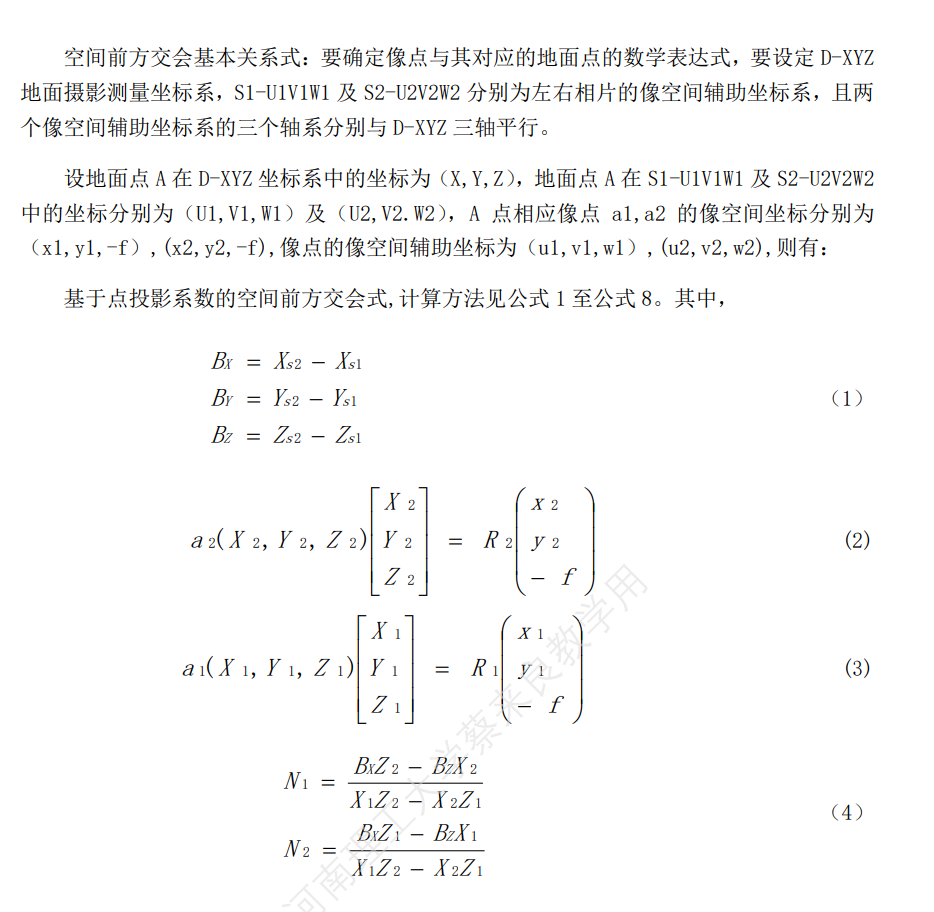
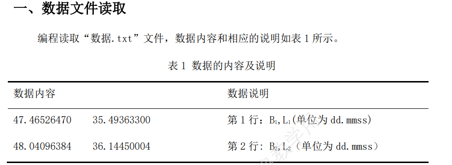
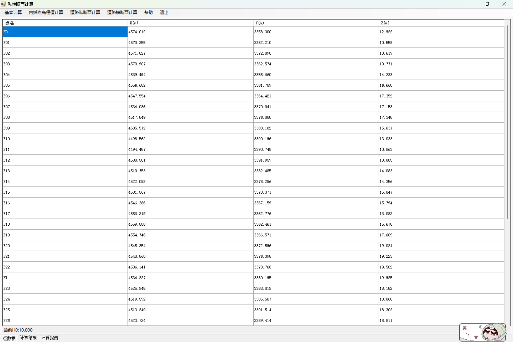
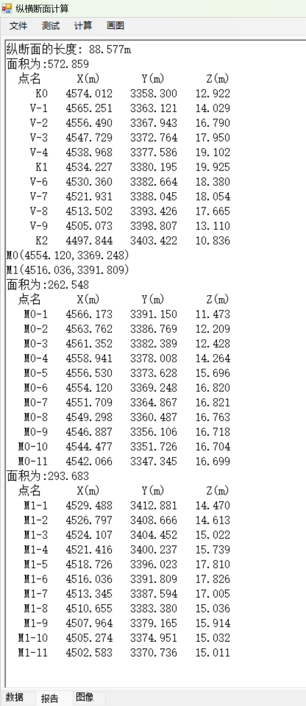
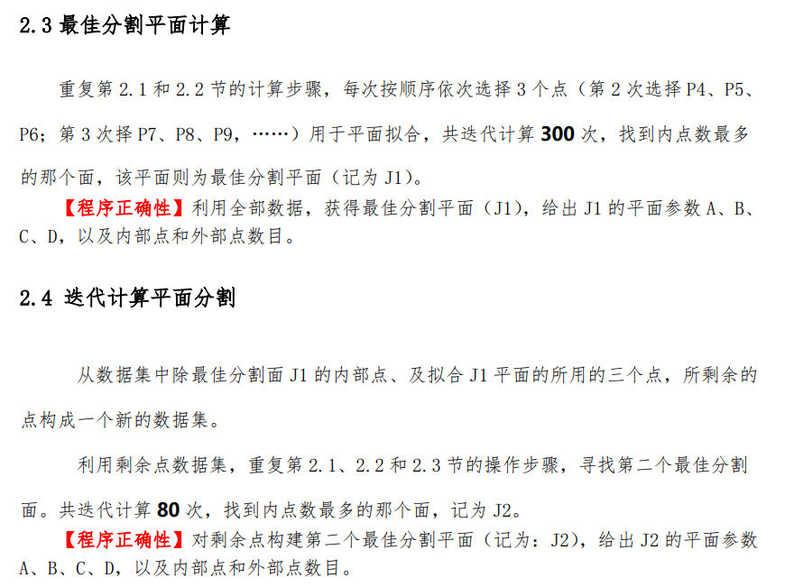

## 前言

这是第一次选拔的代码,就写了个基础,记录下变化,直接提前交了,而且还有个数学建模比赛,写俩小时赶紧溜了,没有留那浪费时间，用的C++

```c++
#include<iostream>
#include <fstream>
#include <sstream>
#include <string>
#include <vector>
#include <map>
#include <cmath>
#define PI 3.14
using namespace std;

// 将度分秒转十进制度
double convertDMStoDD(string dms) {
    istringstream iss(dms);
    double degrees, minutes, seconds;
    char ch;
    iss >> degrees >> ch >> minutes >> ch >> seconds;
    return degrees + minutes / 60.0 + seconds / 3600.0;
}

// 读取文件数据
bool readFileData(const string& filepath, map<string, double>& elevationMap, vector<vector<string>>& data) {
    ifstream file(filepath);
    if (!file.is_open()) {
        cerr << "文件无法打开" << endl;
        return false;
    }

    string line;
    // 读取第一行
    if (getline(file, line)) {
        istringstream iss(line);
        string point;
        double elevation;
        while (iss >> point >> elevation) {
            elevationMap[point] = elevation;
        }
    }

    // 读取剩余的行
    while (getline(file, line)) {
        vector<string> row;
        istringstream iss(line);
        string value;

        while (iss >> value) {
            row.push_back(value);
        }

        data.push_back(row);
    }

    file.close();
    return true;
}

// 计算高程
void calculateElevations(map<string, double>& elevationMap, vector<vector<string>>& data) {
    for (auto& row : data) {
        string from_point = row[0], to_point = row[1];
        double instrument_height = stod(row[2]);
        double target_height = stod(row[3]);
        double distance = stod(row[4]);
        double angle = convertDMStoDD(row[5]);

        double elevation_diff = distance * tan(angle * PI / 180.0);
        double new_elevation = elevationMap[from_point] + elevation_diff + instrument_height - target_height;

        //创建新列高程
        elevationMap[to_point] = new_elevation;
        row.push_back(to_string(new_elevation));
    }
}

// 计算闭合差
double calculateClosureError(const vector<vector<string>>& data, const map<string, double>& elevationMap) {
    string start_point = data[0][0];
    string end_point = data.back()[1];
    double start_elevation = elevationMap.find(start_point)->second;
    double end_elevation = elevationMap.find(end_point)->second;
    double closure_error = end_elevation - start_elevation;
    return closure_error;
}

// 分配闭合差
void distributeClosureError(vector<vector<string>>& data, double closure_error) {
    double total_distance = 0.0;
    for (const auto& row : data) {
        total_distance += stod(row[4]);
    }

    for (auto& row : data) {
        double distance = stod(row[4]);
        double correction = -closure_error * distance / total_distance;
        double new_elevation = stod(row[6]) + correction;
        row.push_back(to_string(new_elevation)); // 添加修正后的高程到行中
    }
}

// 检验闭合差分配的正确性
bool verifyClosureErrorDistribution(const vector<vector<string>>& data, double closure_error) {
    double sum_of_corrections = 0.0;
    for (const auto& row : data) {
        sum_of_corrections += stod(row[7]) - stod(row[6]); // 计算每个测段的改正数
    }

    // 检验闭合差分配后的总和是否等于负的闭合差
    return fabs(sum_of_corrections + closure_error) < 1e-6;
}

int main() {
    string filename = "数据.txt";
    string filepath = "C:/Users/Administrator/Desktop/20240413程序选拔/数据.txt";

    map<string, double> elevationMap; //点号和对应的高程
    vector<vector<string>> data; // 从文件中读取的数据

    // 读取文件数据
    if (!readFileData(filepath, elevationMap, data)) {
        return 1;
    }

    // 计算高程
    calculateElevations(elevationMap, data);

    // 计算闭合差
    double closure_error = calculateClosureError(data, elevationMap);
    cout << "闭合差: " << closure_error << endl;

    // 分配闭合差
    distributeClosureError(data, closure_error);

    // 检验闭合差分配的正确性
    bool verify = verifyClosureErrorDistribution(data, closure_error);
    cout << "闭合差分配正确性: " << (verify ? "通过" : "未通过") << endl;

    // 打印分配闭合差后的高程
    for (const auto& row : data) {
        for (const auto& val : row) {
            cout << val << " ";
        }
        cout << endl;
    }

    return 0;
}

```

## 1.c#初上手

2024.04.22,介于有C++基础,直接上手,不看教程,先试试语法，对着我的代码

先写个简单的试试，前几天建议像我一样，慢慢研究，一天研究gui和代码，一天复现，一个项目分成两三天来做。我也会标出日期，下面是我在这天做了什么。大家没时间就按自己节奏来。

### 1.控制台项目

这个项目涵盖了C#的基础语法，包括类、方法、异常处理、循环、条件语句和输入输出。

```C#
using System;
using System.Collections.Generic;
using System.Linq;
using System.Text;
using System.Threading.Tasks;

namespace project_4_22
{
    //计算阶乘的方法
    class Factorial
    {
        public static long Calculate(int number)
        {
            if (number < 0)
            {
                throw new ArgumentException("数字必须为非负数");
                //在C#中，throw关键字用于抛出一个异常。当一个异常被抛出时，正常的程序执行流程会被中断，并且程序的控制权会转移到最近的异常处理代码（try-catch块）。
            }

            long result = 1;
            for(int i = 1; i <= number; i++)
            {
                result *= i;
            }

            return result;
        }
    }
    
    class Program
    {
        static void Main(string[] args)
        {
            //相当于cout
            Console.WriteLine("欢迎使用阶乘计算器:");

            while (true)
            {
                //相当于cin
                Console.WriteLine("请输入一个非负整数(输入-1退出):");

                string input = Console.ReadLine();
                /*int.TryParse 是 C# 中 int 类型的一个静态方法，它用于尝试将字符串解析为整数类型 int。
                 这个方法非常有用，因为它提供了非破坏性的解析方式，即在解析失败时不会抛出异常。
                int.TryParse 方法接受两个参数：
                        input：要解析的字符串。
                        out number：一个 out 参数，用于接收解析后的整数结果。*/
                if(int.TryParse(input,out int number))
                {
                    if (number == -1)
                    {
                        break;
                    }
                    else if (number < 0)
                    {
                        Console.WriteLine("错误:请输入非负整数。");
                    }
                    else
                    {
                        /*这段代码是一个try-catch块，它在C#中用于异常处理。
                         * 在这个特定的例子中，它用于调用Factorial类的Calculate方法，这个方法计算一个整数的阶乘。
                         * 如果Calculate方法在执行过程中抛出了一个ArgumentException异常，
                         * catch块将会捕获这个异常，并打印出异常的消息。*/
                        try
                        {
                            //从类中调用函数
                            long factorial = Factorial.Calculate(number);
                            Console.WriteLine($"{number}!={factorial}");
                        }
                        catch(ArgumentException ex)
                        {
                            Console.WriteLine(ex.Message);
                        }
                    }
                }
                else
                {
                    Console.WriteLine("错误,请输入有效整数");
                }
            }
            Console.WriteLine("感谢使用阶乘计算器！按任意键退出。");
            Console.ReadKey();
        }
    }
}

```


做完这个试试gui的，给不懂得同学解释下，gui就是将黑框中的东西做个漂亮的界面展现出来，类似小程序。

### 2.gui项目

不同的是需要创建新的项目,而且,需要winform,有xml,css的东西反正不影响应该,先别管,（2024.04.29补充，后面证实就是没必要管，但是我觉的以后要深研究的的话还是要学SQL，我一个月速成的三级数据库寄掉了嘤嘤嘤）不知道看这个的有没有了解过gui,先别管,学完一个点一个点,最后能制成一张网,按下面的先做好准备

这里推荐个winform教程，可以边看视频边看这个教学

```
https://www.bilibili.com/video/BV1d7411F7PG
```


这里比较简单,就不截屏了,从右边拖过来$button$和$textbox$,右键属性改下名字,还是有图吧,按钮叫显示时间,文本框叫$timeFiled$,专业一点,这里大家不要有个误区,这不像你们学的$MATLAB$中的$gui$是通过句柄来操控,只需要讲底层逻辑代码改改就行,我这么说你们可能不太明白,先不用管,下面的学生管理系统就很简洁直接。


还是按钮,点属性,然后看见闪电没,点那个,然后创建一个动作,就这双击就行，他就会跳转到这里，那么我们在button中添加代码，见下面完整代码


然后Form1.cs文件代码是这样

```c#
using System;
using System.Collections.Generic;
using System.ComponentModel;
using System.Data;
using System.Drawing;
using System.Linq;
using System.Text;
using System.Threading.Tasks;
using System.Windows.Forms;

namespace form0422
{
    public partial class Form1 : Form
    {
        public Form1()
        {
            InitializeComponent();//这是控件拖进来就自动生成
        }

        private void button1_Click(object sender, EventArgs e)
        {
            string timestr = DateTime.Now.ToString("yyyy-MM-dd HH:mm:ss");//获取当前时间
            this.timeField.Text = timestr;//显示出来
        }
    }
}

```

简单吧,这里的细节就是,编译器自动给我们生成刚刚操作的代码,在Form1下属文件中


运行试试,我就不截图了,可以直接显示时间了，现在已经学会了控制台和gui,让我们上手试试,写个这个试试


开个玩笑,我也写不出来目前,先剖析下竞赛开源的代码,我分享出来,细研究。

### 3.测绘程序设计源码

```
链接：https://pan.baidu.com/s/1uCvVD2y5k9zXGxuzNnI46Q?pwd=qcun 
提取码：qcun 
```

单看好像很难,目前看实际就是很难

2024.4.23

我到最后会把所有文件发出来的

## 2.学生管理系统

只是写个阶乘的小程序对于了解语法来说还是太过牵强，我们来写个最经典的学生管理系统试试，这里就包括简单类的定义了。

### 1.控制台

```c#
using System;
using System.Collections.Generic;
using System.IO;

namespace StudentManagementSystem
{
    class Program
    {
        static void Main(string[] args)
        {
            List<Student> students = new List<Student>();

            // 欢迎界面
            Console.WriteLine("欢迎使用学生管理系统");

            while (true)
            {
                Console.WriteLine("\n请选择一个操作：");
                Console.WriteLine("1. 添加学生");
                Console.WriteLine("2. 显示所有学生");
                Console.WriteLine("3. 保存到文件");
                Console.WriteLine("4. 从文件加载");
                Console.WriteLine("5. 修改学生信息");
                Console.WriteLine("6. 删除学生信息");
                Console.WriteLine("7. 退出");

                string choice = Console.ReadLine();

                switch (choice)
                {
                    case "1":
                        AddStudent(students);
                        break;
                    case "2":
                        DisplayStudents(students);
                        break;
                    case "3":
                        SaveStudentsToFile(students);
                        break;
                    case "4":
                        LoadStudentsFromFile(students);
                        break;
                    case "5":
                        EditStudentInfo(students);
                        break;
                    case "6":
                        DeleteStudent(students);
                        break;
                    case "7":
                        return;
                    default:
                        Console.WriteLine("无效的选择，请重新输入。");
                        break;
                }
            }
        }

        static void AddStudent(List<Student> students)
        {
            Console.WriteLine("请输入学生信息:");
            Console.Write("学号:");
            string id = Console.ReadLine();
            Console.Write("姓名:");
            string name = Console.ReadLine();
            Console.Write("性别（输入'男'或'女'）:");
            string gender = Console.ReadLine();
            Console.Write("手机号:");
            string phoneNumber = Console.ReadLine();

            Student newStudent = new Student { Id = id, Name = name, Gender = gender, PhoneNumber = phoneNumber };
            students.Add(newStudent);
            Console.WriteLine("学生信息已添加");
        }

        static void DisplayStudents(List<Student> students)
        {
            Console.WriteLine("\n学生列表：");
            for (int i = 0; i < students.Count; i++)
            {
                Console.WriteLine($"学号：{students[i].Id}, 姓名：{students[i].Name}, 性别：{students[i].Gender}, 手机号：{students[i].PhoneNumber}");
            }
        }

        static void SaveStudentsToFile(List<Student> students)
        {
            using (StreamWriter sw = new StreamWriter("students.txt"))
            {
                foreach (Student student in students)
                {
                    sw.WriteLine($"{student.Id},{student.Name},{student.Gender},{student.PhoneNumber}");
                }
            }
            Console.WriteLine("学生信息已保存到文件。");
        }

        static void LoadStudentsFromFile(List<Student> students)
        {
            students.Clear();
            if (File.Exists("students.txt"))
            {
                using (StreamReader sr = new StreamReader("students.txt"))
                {
                    string line;
                    while ((line = sr.ReadLine()) != null)
                    {
                        string[] parts = line.Split(',');
                        Student student = new Student
                        {
                            Id = parts[0],
                            Name = parts[1],
                            Gender = parts[2],
                            PhoneNumber = parts[3]
                        };
                        students.Add(student);
                    }
                }
                Console.WriteLine("学生信息已从文件加载。");
            }
            else
            {
                Console.WriteLine("文件不存在，无法加载学生信息。");
            }
        }

        static void EditStudentInfo(List<Student> students)
        {
            Console.Write("请输入要修改的学生学号:");
            string id = Console.ReadLine();

            Student studentToEdit = students.Find(s => s.Id == id);

            if (studentToEdit != null)
            {
                Console.WriteLine("请输入新的学生信息:");
                Console.Write("姓名（留空保持不变）：");
                string name = Console.ReadLine();
                Console.Write("性别（留空保持不变）：");
                string gender = Console.ReadLine();
                Console.Write("手机号（留空保持不变）：");
                string phoneNumber = Console.ReadLine();

                if (!string.IsNullOrWhiteSpace(name))
                {
                    studentToEdit.Name = name;
                }
                if (!string.IsNullOrWhiteSpace(gender))
                {
                    studentToEdit.Gender = gender;
                }
                if (!string.IsNullOrWhiteSpace(phoneNumber))
                {
                    studentToEdit.PhoneNumber = phoneNumber;
                }

                Console.WriteLine("学生信息已更新。");
            }
            else
            {
                Console.WriteLine("未找到该学号的学生。");
            }
        }

        static void DeleteStudent(List<Student> students)
        {
            Console.Write("请输入要删除的学生学号：");
            string id = Console.ReadLine();

            Student studentToDelete = students.Find(s => s.Id == id);

            if (studentToDelete != null)
            {
                students.Remove(studentToDelete);
                Console.WriteLine("学生信息已删除。");
            }
            else
            {
                Console.WriteLine("未找到该学号的学生。");
            }
        }
    }

    class Student
    {
        public string Id { get; set; }
        public string Name { get; set; }
        public string Gender { get; set; }
        public string PhoneNumber { get; set; }
    }
}
```

很简单明了的程序，熟悉下语法就行，以后练得机会多着呢。

### 2.gui

2024.4.24做个gui试试

拖进来的控件就很简单，大家根据Form.Design.cs文件中的试着自己找找。


部分代码,完整文件可以在资源里面找

```c#
using Af.Common;
using Newtonsoft.Json;
using System;
using System.Collections.Generic;
using System.ComponentModel;
using System.Data;
using System.Drawing;
using System.Linq;
using System.Text;
using System.Threading.Tasks;
using System.Windows.Forms;


namespace studentsManagerSystem
{ 
    public partial class Form1 : Form
    {
        public Form1()
        {
            InitializeComponent(); // 初始化窗体组件

            // 向性别下拉列表框中添加性别选项
            sexField.Items.Add("女");
            sexField.Items.Add("男");

        }

        private void Form1_Load(object sender, EventArgs e)
        {

        }

        private void label1_Click(object sender, EventArgs e)
        {

        }

        //保存按钮 
        private void saveButton_Click(object sender, EventArgs e)
        {
            //创建一个新的Student对象
            Student stu = new Student();
            //从学号文件框获取并设置学生学号
            stu.Id = Convert.ToInt32(idField.Text.Trim());
            //从姓名文件框获取并设置学生姓名
            stu.Name = nameField.Text.Trim();
            //性别下拉框选择性别
            stu.Sex = (sexField.SelectedIndex == 1);
            //从手机号文件框获取并设置学生手机号
            stu.Phone = phoneField.Text.Trim();

            //将Student对象转JSON字符串
            string jsonStr = JsonConvert.SerializeObject(stu, Formatting.Indented);
            //保存
            AfTextFile.Write("student.txt", jsonStr, AfTextFile.UTF8);
            MessageBox.Show("操作成功");
        }
    }
}
```

到今天也是把winform教程浅浅全部看完了

2024.4.25,今天分析下代码,感觉还蛮简单,明天周五一节课试着自己写写试试,大家也尽量自己写,控制在2h内。

## 3.出租车

（程序设计书的第一题)

这个补充一下,建议先看第二题,我也是研究之后才发现第二题比第一题简单

2024.04.30补

原来源代码中的设计器如果没有的话,可以自己创建个项目,复制Form1中的代码就可以显示了.

### 1.源程序说明

写代码不要上来就写,可以画个架构,先把原理看懂,也方便优化


参考源程序编程语言为C#，项目名称为TaxiData。项目中主要包含以下类:

( 1 ) FileHelper :源文件读取，以及计算结果输出;
( 2 )Epoch.cs:基本数据结构，包含车辆标识、运营状态、时间、x坐标分量、y坐标分量等信息;
( 3 )Algo.cs:时间转化为简化儒略日算法;
( 4 ) Session. cs:计算每个时段的长度、速度和方位角;
( 5 )SessionList. cs:输出所有时段的速度、方位角、累计距离和首尾直线距离。

看原理的话，就是选择出出勤的出租车，两个相邻点算出角和距离，然后不停地迭代，取得的和就是累计距离，第一个和最后一个点就可以算首尾直线距离，就是位移。

### 2.gui制作

先拖进来toolstrip,然后从源码中把图片复制添加到资源那个文件中Resources,然后即可以做界面了,别忘了添加富文本框


还有Text都要改,设置成图片加文字的,然后点击闪电,设置动作,这点因为不熟,整了好长时间(苦笑)

别急着设置按钮动作,目前我研究的是先写底层代码比较好,可以将逻辑画出来

### 3.code

最先做的就是这个日转化

#### Algo.cs

这见多了就知道是algorithm算法的简称,还是很好理解的,里面定义这个儒略日算法MJD,也没啥好说的,就是对着公式敲,,还是用GPT加个解释吧,别忘了时间差,人家也提醒了


```C#
//源代码
        public static double Mjd(int year, int month, int day, int hour, int min, int sec, int timeZone)
        {
            double mjd = -678987 + 367.0 * year;
            mjd -= Convert.ToInt32(7.0 / 4.0 * (year + Convert.ToInt32((month + 9.0) / 12.0)));
            mjd += Convert.ToInt32((275.0 * month) / 9.0);
            mjd += day + (hour - timeZone) / 24.0 + min / 1440.0 + sec / 86400.0;
            return mjd;
        }
        
//加个解释
public static double Mjd(int year, int month, int day, int hour, int min, int sec, int timeZone)
{
    // 初始化mjd变量，使用基础值-678987，这是1858年11月17日的MJD值。
    double mjd = -678987;

    // 计算年份的贡献，考虑到闰年的影响。
    // 367.0 * year计算从1858年以来的整年数。
    // Convert.ToInt32(7.0 / 4.0 * (year + Convert.ToInt32((month + 9.0) / 12.0)))
    // 是一个闰年调整因子，它计算从1858年以来闰年的数量。
    mjd += 367.0 * year;
    mjd -= Convert.ToInt32(7.0 / 4.0 * (year + Convert.ToInt32((month + 9.0) / 12.0)));

    // 计算月份的贡献。
    // Convert.ToInt32((275.0 * month) / 9.0)是基于月份的调整因子。
    mjd += Convert.ToInt32((275.0 * month) / 9.0);

    // 加上日期的贡献。
    mjd += day;

    // 计算小时、分钟和秒的贡献，同时考虑时区的影响。
    // (hour - timeZone) / 24.0 是时区调整，将本地时间转换为UTC时间。
    // min / 1440.0 和 sec / 86400.0 分别是将分钟和秒转换为日的分数。
    mjd += (hour - timeZone) / 24.0 + min / 1440.0 + sec / 86400.0;

    // 返回计算出的MJD值。
    return mjd;
}

```

#### Epoch.cs

算法定义好了以后,就可以写Epoch.cs了,为啥叫Epoch,搞机器学习是吧(滑稽笑)

```c#
class Epoch
{
    // Id属性是一个字符串，用于标识Epoch对象。
    public string Id;

    // Status属性是一个整数，用于表示Epoch的状态。
    public int Status;

    // TimeStr属性是一个字符串，用于存储Epoch的时间字符串。
    public string TimeStr;

    // Mjd属性是一个双精度浮点数，用于存储Epoch的MJD值。
    public double Mjd;

    // x属性是一个双精度浮点数，用于存储Epoch的x坐标。
    public double x;

    // y属性是一个双精度浮点数，用于存储Epoch的y坐标。
    public double y;

    // Parse方法用于解析给定的字符串，并设置Epoch对象的属性。
    public void Parse(string line)//这里的参数在下个文件中
    {
        try
        {
            // 使用逗号作为分隔符，将字符串line分割成数组buf。
            var buf = line.Split(',');

            // 设置Id属性，从buf数组的第一个元素获取值。
            Id = buf[0];

            // 设置Status属性，从buf数组的第二个元素获取值，并转换为整数。
            Status = Convert.ToInt32(buf[1]);

            // 设置TimeStr属性，从buf数组的第三个元素获取值。
            TimeStr = buf[2];

            // 设置x属性，从buf数组的第四个元素获取值，并转换为双精度浮点数。
            x = Convert.ToDouble(buf[3]);

            // 设置y属性，从buf数组的第五个元素获取值，并转换为双精度浮点数。
            y = Convert.ToDouble(buf[4]);

            // 调用GetMjd方法计算Mjd值。
            GetMjd();

        }
        catch (Exception ex)
        {
            // 如果发生异常，抛出异常。
            throw ex;
        }
    }

    // GetMjd方法用于计算Epoch的MJD值。
    private void GetMjd()
    {
        try
        {
            // 设置时区为8小时（假设为UTC+8）。
            int timeZone = 8;

            // 解析TimeStr属性中的日期和时间，并转换为整数。
            //这里是提取字符它是原始字符串的一个子字符串，从 startIndex 开始，直到 startIndex + length - 1。然后，这些子字符串被转换为整数类型。
            int year = Convert.ToInt32(TimeStr.Substring(0, 4));
            int month = Convert.ToInt32(TimeStr.Substring(4, 2));
            int day = Convert.ToInt32(TimeStr.Substring(6, 2));
            int hour = Convert.ToInt32(TimeStr.Substring(8, 2));
            int min = Convert.ToInt32(TimeStr.Substring(10, 2));
            int sec = Convert.ToInt32(TimeStr.Substring(12, 2));

            // 调用Algo类的Mjd方法计算MJD值。
            Mjd = Algo.Mjd(year, month, day, hour, min, sec, timeZone);

        }
        catch (Exception ex)
        {
            // 如果发生异常，抛出异常。
            throw ex;
        }
    }
}

```

#### Session.cs

然后就是我们的Session了,这些解释都是GPT浅浅盖上一层,不懂得要自己想想,或者问问,还是比较好理解的

```C#
using System;
using System.Collections.Generic;
using System.Linq;
using System.Text;
using System.Threading.Tasks;

namespace TaxiData
{
    /// <summary>
    /// 描述Session类的简要说明。
    /// </summary>
    class Session
    {
        // Sn属性是一个整数，用于表示Session的顺序号。
        public int Sn;  // 顺序号

        // StartMjd和EndMjd属性是双精度浮点数，分别表示Session的开始和结束MJD值。
        public double StartMjd, EndMjd;

        // Length属性是一个双精度浮点数，表示Session的长度。
        public double Length;

        // Velocity属性是一个双精度浮点数，表示Session的速度。
        public double Velocity;

        // Azimuth属性是一个双精度浮点数，表示Session的方位角。
        public double Azimuth;

        // 构造函数，接受两个Epoch对象start和end作为参数。
        public Session(Epoch start, Epoch end)
        {
            // 设置Sn属性为0。
            Sn = 0;

            // 设置StartMjd属性为start对象的Mjd值。
            StartMjd = start.Mjd;

            // 设置EndMjd属性为end对象的Mjd值。
            EndMjd = end.Mjd;

            // 调用GetLength方法计算长度。
            GetLength(start, end);

            // 调用GetVelocity方法计算速度。
            GetVelocity();

            // 调用GetAzimuth方法计算方位角。
            GetAzimuth(start, end);
        }

        // 私有方法，用于计算方位角。
        private void GetAzimuth(Epoch start, Epoch end)
        {
            // 定义一个小的浮点数，用于判断dx和dy是否接近零。
            double eps = 1e-5;

            // 计算dx和dy。
            double dx = end.x - start.x;
            double dy = end.y - start.y;

            // 如果dx接近零，判断dy的符号来确定方位角。
            if (Math.Abs(dx) < eps)
            {
                if (Math.Abs(dy) < eps)
                    Azimuth = 0;
                else if (dy > 0)
                    Azimuth = 0.5 * Math.PI;
                else
                {
                    Azimuth = 1.5 * Math.PI;
                }
            }
            // 如果dx不接近零，使用Math.Atan2计算方位角，并考虑dx的符号。
            else
            {
                Azimuth = Math.Atan2(dy, dx);
                if (dx < 0)
                {
                    Azimuth += Math.PI;
                }
            }

            // 将方位角转换为度数。
            Azimuth *= 180 / Math.PI;

            // 如果方位角小于0，调整到0到360度之间。
            if (Azimuth < 0)
            {
                Azimuth += 2 * Math.PI;
            }
            if (Azimuth > 2 * Math.PI)
            {
                Azimuth -= 2 * Math.PI;
            }
        }

        // 私有方法，用于计算速度。
        private void GetVelocity()
        {
            // 计算时间差，以小时为单位。
            double dt = (EndMjd - StartMjd) * 24;

            // 计算速度，单位为km/hour。
            Velocity = Length / dt;
        }

        // 私有方法，用于计算长度，单位为km。
        private void GetLength(Epoch start, Epoch end)
        {
            // 计算dx和dy。
            double dx = end.x - start.x;
			double dy = end.y - start.y;

            // 计算长度，单位为km。
            Length = Math.Sqrt(dx * dx + dy * dy) / 1000.0;
        }

        // 重写ToString方法，返回Session对象的字符串表示。
        public override string ToString()
        {
            // 创建一个字符串变量line，用于存储输出信息。
            string line = $"{Sn:00}, {StartMjd:f5}-{EndMjd:f5}, ";

            // 添加速度和方位角到line中。
            line += $"{Velocity:f3}, {Azimuth:f3}";

            // 返回line字符串。
            return line;//这里就是上面那个文件出现的line
        }
    }
}

```

以及

#### SessionList.cs

```c#
    class SessionList
    {
        // Data属性是一个List<Session>类型的集合，用于存储Session对象。
        public List<Session> Data = new List<Session>();

        // TotalLength属性用于存储计算出的总长度。
        public double TotalLength;

        // DirctLength属性用于存储计算出的直线距离。
        public double DirctLength;

        // 构造函数，接受一个List<Epoch>类型的参数epoches。
        public SessionList(List<Epoch> epoches)
        {
            // 遍历epoches集合，创建Session对象，并添加到Data集合中。
            for (int i = 0; i < epoches.Count - 1; i++)
            {
                Session s = new Session(epoches[i], epoches[i + 1]);
                s.Sn = i; // 设置Session对象的序列号。
                Data.Add(s);
            }

            // 调用GetTotalLength方法计算总长度。
            GetTotalLength();

            // 调用GetDirctLength方法计算直线距离。
            GetDirctLength(epoches);
        }

        // 私有方法，用于计算直线距离。
        private void GetDirctLength(List<Epoch> epoches)
        {
            // 获取epoches集合的元素数量。
            int n = epoches.Count;
            // 创建一个新的Session对象，使用epoches的第一个和最后一个元素。
            Session s = new Session(epoches[0], epoches[n - 1]);
            // 将计算出的距离赋值给DirctLength属性。
            DirctLength = s.Length;//第一个和最后一个算出来物理意义上的位移
        }

        // 私有方法，用于计算总长度。
        private void GetTotalLength()
        {
            // 初始化TotalLength为0。
            TotalLength = 0;
            // 遍历Data集合中的每个Session对象，累加它们的长度。
            foreach (var d in Data)
            {
                TotalLength += d.Length;
            }
        }

        // 重写ToString方法，返回SessionList对象的字符串表示。
        public override string ToString()
        {
            // 创建一个字符串变量line，用于存储输出信息。
            string line = "------------速度和方位角计算结果----------\r\n";
            // 遍历Data集合中的每个Session对象，将它们的字符串表示添加到line中。
            foreach (var d in Data)
            {
                line += d.ToString() + "\r\n";
            }
            // 添加距离计算结果的标题。
            line += "------------距离计算结果-----------------\r\n";
            // 添加总长度和直线距离的值到line中。
            line += $"累积距离：{TotalLength:f3} (km)\r\n";
            line += $"首尾直线距离： {DirctLength:f3} (km)";

            // 返回line字符串。
            return line;
        }
    }
```

最后是定义了我们的文件操作的

#### FileHelper.cs

```C#
class FileHelper
{
    // 静态类，不需要实例化。

    // Read方法用于读取文件，并将标识为Id的记录列表返回。
    public static List<Epoch> Read(string Id, string pathname)
    {
        // 创建一个空列表data，用于存储读取的Epoch对象。
        var data = new List<Epoch>();

        // 尝试块用于捕获并处理可能发生的异常。
        try
        {
            // 创建一个StreamReader对象，用于读取指定路径的文件。
            var reader = new StreamReader(pathname);

            // 读取并忽略文件的第一行，通常是标题或元数据。
            reader.ReadLine();

            // 循环读取文件中的每一行，直到到达文件末尾。
            while (!reader.EndOfStream)
            {
                // 读取文件中的下一行。
                string line = reader.ReadLine();

                // 检查读取的行是否为空。
                if (line.Length > 0)
                {
                    // 创建一个新的Epoch对象。
                    var ep = new Epoch();

                    // 调用Epoch对象的Parse方法解析行。
                    ep.Parse(line);

                    // 检查Epoch对象的Id是否与指定的Id相匹配。
                    if (Id.Equals(ep.Id))
                    {
                        // 如果匹配，将Epoch对象添加到data列表中。
                        data.Add(ep);
                    }
                }
            }

            // 关闭StreamReader。
            reader.Close();

        }
        catch (Exception ex)
        {
            // 如果发生异常，抛出异常。
            throw ex;
        }

        // 返回读取的Epoch对象列表。
        return data;
    }

    // Write方法用于将SessionList对象的数据写入文件。
    public static void Write(SessionList data, string filename)
    {
        // 尝试块用于捕获并处理可能发生的异常。
        try
        {
            // 创建一个StreamWriter对象，用于写入指定路径的文件。
            var writer = new StreamWriter(filename);

            // 调用SessionList对象的ToString方法获取字符串表示，并写入文件。
            writer.Write(data.ToString());

            // 关闭StreamWriter。
            writer.Close();

        }
        catch (Exception ex)
        {
            // 如果发生异常，抛出异常。
            throw ex;
        }
    }
}

```

打开动作,计算动作等代码如下解释,这个最后写

看了半天的报错,原来少创了Session data;可恶,回来记得加上

```
private SessionList Data;
```

```C#
// 当用户点击工具栏上的“Open”按钮时调用此方法
private void toolOpen_Click(object sender, EventArgs e)
{
    // 显示一个打开文件对话框，让用户选择要打开的文件
    if (openFileDialog1.ShowDialog() == DialogResult.OK)
    {
        // 调用FileHelper类的Read方法，读取用户选择的文件
        // openFileDialog1.FileName是用户选择的文件的完整路径
        var epochs = FileHelper.Read("T2", openFileDialog1.FileName);
        
        // 使用读取的数据创建一个新的SessionList对象，并将其赋值给Data变量
        Data = new SessionList(epochs);
        
        // 在richTextBox1控件中显示一条消息，提示用户数据读取完成
        richTextBox1.Text = "数据读取完成！";
    }
}

// 当用户点击工具栏上的“Calculate”按钮时调用此方法
private void toolCal_Click(object sender, EventArgs e)
{
    // 将Data对象转换为字符串，并在richTextBox1控件中显示
    // 假设SessionList类重写了ToString方法，以提供数据的字符串表示
    richTextBox1.Text = Data.ToString();
}

// 当用户点击工具栏上的“Save”按钮时调用此方法
private void toolSave_Click(object sender, EventArgs e)
{
    // 显示一个保存文件对话框，让用户选择要保存的文件位置和名称
    if (saveFileDialog1.ShowDialog() == DialogResult.OK)
    {
        // 调用FileHelper类的Write方法，将Data对象的数据写入到用户指定的文件
        FileHelper.Write(Data, saveFileDialog1.FileName);
    }
}

// 当用户点击工具栏上的“Help”按钮时调用此方法
private void toolHelp_Click(object sender, EventArgs e)
{
    // 创建一个包含版权信息的字符串
    string copyright = "《测绘程序设计试题集（试题1 出租车数据计算）》配套程序\n作者：李英冰\n";
    copyright += "河南理工大学测绘学院\r\nEMAIL: 2969029950@qq.com\r\n2024.4.25";
    
    richTextBox1.Text = copyright;
}
```

最后呢,改一下Form1的属性就大功告成了,还是蛮有成就感的,logo忘记换了,无伤大雅。


## 4.反距离加权插值

### 1.原理剖析

单看题目好像是个算法的实现,目前感觉比较简单


我靠,看完之后就是简单,比第一题简单,早知道先看第二题下手了,应该和计算机二级水平差不多

### 2.gui制作


和上面那个一样,改个名字,这个带logo了,没有忘

### 3.code

#### Point.cs

这就是定义站点类,设置基本的成员变量及从文件中读取到的line,分割成不同的部分,然后重写ToString,让gui显示数据更好看,其实用表格也行,我感觉啊

```C#
using System;
using System.Collections.Generic;
using System.Linq;
using System.Text;
using System.Threading.Tasks;

namespace IDW
{
    class Point
    {
        // 公共成员，表示点的ID
        public string Id;
        // 公共成员，表示点的X坐标
        public double X;
        // 公共成员，表示点的Y坐标
        public double Y;
        // 公共成员，表示点的高程
        public double H;
        // 公共成员，表示点到另一个点的距离
        public double Dist;

        // 无参构造函数，初始化所有属性为0
        public Point()
        {
            X = Y = H = Dist = 0;
        }

        // 有参构造函数，初始化ID、X坐标和Y坐标
        public Point(string id, double x, double y)
        {
            Id = id;
            X = x;
            Y = y;
        }

        // Parse方法，用于从字符串解析点的属性
        public void Parse(string line)
        {
            var buf = line.Split(','); // 以逗号分隔字符串
            Id = buf[0]; // 设置ID
            X = Convert.ToDouble(buf[1]); // 设置X坐标
            Y = Convert.ToDouble(buf[2]); // 设置Y坐标
            H = Convert.ToDouble(buf[3]); // 设置高程
        }

        // 重写ToString方法，返回点的字符串表示
        public override string ToString()
        {
            return $"{Id}   {X:F3}   {Y:F3}   {H:F3}"; // 格式化输出点的属性
        }
    }
}

```

#### DataEntity.cs

`DataEntity`类是一个自定义的数据结构，用于存储和管理一系列的`Point`对象。就是创建了个列表,理解成C++中的vector就可以

1. **存储点数据**：`DataEntity`类包含一个`List<Point>`类型的成员`Data`，用于存储多个`Point`对象。每个`Point`对象代表一个地理空间中的一个点，包含该点的ID、X坐标、Y坐标、高程（H）和距离（Dist）信息。
2. **管理数据点**：`DataEntity`类提供了一系列方法来管理`Data`列表中的`Point`对象，例如`Add`方法用于添加新的`Point`对象，索引器允许通过索引访问和修改`Data`列表中的`Point`对象。
3. **提供数据访问**：通过`Count`属性，可以轻松获取`Data`列表中点的数量。此外，索引器允许开发者通过索引直接访问特定的`Point`对象。
4. **格式化输出**：`ToString`方法被重写，以便于生成一个格式化的字符串，可以用于输出数据点的信息。这对于调试或记录数据非常有用。

```C#
using System;
using System.Collections.Generic;
using System.Linq;
using System.Text;
using System.Threading.Tasks;

namespace IDW
{
    class DataEntity
    {
        // 公共成员，用于存储Point对象的列表
        public List<Point> Data;

        // 只读属性，返回Data列表中元素的个数
        public int Count => Data.Count;

        // 构造函数，初始化Data列表
        public DataEntity()
        {
            Data = new List<Point>();
        }

        // 公共方法，用于向Data列表中添加一个Point对象
        public void Add(Point pt)
        {
            Data.Add(pt);
        }

        //索引器，允许通过索引访问和修改Data列表中的Point对象
        public Point this[int i]
        {
            get { return Data[i]; } // 获取指定索引处的Point对象
            set { Data[i] = value; } // 设置指定索引处的Point对象
        }

        // 重写ToString方法，返回Data列表中所有Point对象的字符串表示
        public override string ToString()
        {
            string res = "测站    X（m）    Y（m)      H(m)\n"; // 初始化结果字符串
            foreach (var d in Data)
            {
                res += d.ToString() + "\n"; // 将每个Point对象的字符串表示添加到结果字符串中
            }
            return res; // 返回结果字符串
        }
    }
}

```

#### FileHelper.cs

```C#
using System;
using System.Collections.Generic;
using System.Linq;
using System.Text;
using System.Threading.Tasks;
using System.IO;

// 命名空间
namespace IDW
{
    // FileHelper类，提供文件读写的辅助方法
    class FileHelper
    {
        // Read方法，用于从指定文件读取数据到DataEntity对象
        public static DataEntity Read(string filename)
        {
            DataEntity data = new DataEntity(); // 创建一个新的DataEntity实例

            try
            {
                var reader = new StreamReader(filename); // 创建一个StreamReader实例用于读取文件
                while (!reader.EndOfStream) // 当未到达文件末尾时继续读取
                {
                    string line = reader.ReadLine(); // 读取一行文本
                    if (line.Length > 0) // 如果行不为空
                    {
                        Point pt = new Point(); // 创建一个新的Point实例
                        pt.Parse(line); // 解析行文本到Point实例

                        data.Add(pt); // 将解析后的Point添加到DataEntity实例
                    }
                }

                reader.Close(); // 关闭StreamReader

            }
            catch (Exception ex) // 捕获并处理可能发生的异常
            {
                throw ex; // 抛出异常
            }

            return data; // 返回填充了数据的DataEntity实例
        }

        // Write方法，用于将文本写入到指定文件
        public static void Write(string text, string filename)
        {
            try
            {
                var writer = new StreamWriter(filename); // 创建一个StreamWriter实例用于写入文件
                writer.Write(text); // 写入文本
                writer.Close(); // 关闭StreamWriter

            }
            catch (Exception ex) // 捕获并处理可能发生的异常
            {
                throw ex; // 抛出异常
            }
        }
    }
}

```

#### Algo.cs

算法实现文件,看完之后只能说C#真的灵活,比C++造轮子造的真好

```C#
using System;
using System.Collections.Generic;
using System.Linq;
using System.Text;
using System.Threading.Tasks;

namespace IDW
{
    class Algo
    {
        // DataEntity类型的成员变量，用于存储数据点
        DataEntity Data;

        // N定义了参与计算的最近邻点的数量
        private int N = 5;

        // 构造函数，初始化DataEntity数据以及N的值
        public Algo(DataEntity data, int n)
        {
            Data = data;
            N = n;
        }

        // 计算两点之间的距离
        public double Distance(Point p1, Point p2)
        {
            double dx = p1.X - p2.X; // x坐标差
            double dy = p1.Y - p2.Y; // y坐标差
            double ds = Math.Sqrt(dx * dx + dy * dy); // 计算欧氏距离
            return ds;
        }

        // IDW算法的主要实现，返回一个字符串，包含插值点的信息和计算的值
        public string Idw(Point pt)
        {
            string res = $"{pt.Id}  {pt.X:f3}  {pt.Y:f3}  "; // 初始化结果字符串
            for (int i = 0; i < Data.Count; i++)
            {
                double d = Distance(Data[i], pt); // 计算插值点与数据集中每个点的距离
                Data[i].Dist = d; // 将距离存储在数据点的Dist属性中
            }
            var dt = Sort(); // 对数据点根据距离进行排序
            double H = GetH(dt); // 根据排序后的数据点计算插值
            res += $" {H:f3}   "; // 将计算结果添加到结果字符串中
            for (int j = 0; j < N; j++)
            {
                res += $"{dt[j].Id} "; // 将参与计算的最近邻点的ID添加到结果字符串中
            }
            return res; // 返回结果字符串
        }

        // 根据排序后的数据点计算插值
        private double GetH(DataEntity dt)
        {
            double over = 0, under = 0;
            for (int i = 0; i < N; i++)
            {
                over += dt[i].H / dt[i].Dist; // 分子部分，加权高度除以距离
                under += 1 / dt[i].Dist; // 分母部分，距离的倒数之和
            }
            return over / under; // 计算最终的插值结果
        }

        // 对数据点根据距离进行排序
        DataEntity Sort()
        {
            DataEntity dt = Data;
            for (int i = 0; i < Data.Count; i++)
            {
                for (int j = i; j < Data.Count; j++)
                {
                    if (dt[i].Dist > dt[j].Dist) // 如果前一个点的距离大于后一个点的距离
                    {
                        var pt = dt[i]; // 交换两个点
                        dt[i] = dt[j];
                        dt[j] = pt;
                    }
                }
            }
            return dt; // 返回排序后的数据点集
        }
    }
}
```

#### Form1.cs

```c#
using System;
using System.Collections.Generic;
using System.ComponentModel;
using System.Data;
using System.Drawing;
using System.Linq;
using System.Text;
using System.Threading.Tasks;
using System.Windows.Forms;

// 命名空间
namespace IDW
{
    // Form1类，继承自Form，表示应用程序的主窗口
    public partial class Form1 : Form
    {
        // 公共成员，用于存储插值结果字符串
        public string result;
        // DataEntity实例，用于存储和管理数据点
        DataEntity Data = new DataEntity();
        
        // 构造函数，初始化窗体组件
        public Form1()
        {
            InitializeComponent();
        }

        // 工具栏中“打开”按钮的点击事件处理方法
        private void toolOpen_Click(object sender, EventArgs e)
        {
            // 显示文件打开对话框，如果用户选择了一个文件，则读取数据并显示在richTextBox1中
            if (openFileDialog1.ShowDialog() == DialogResult.OK)
            {
                Data = FileHelper.Read(openFileDialog1.FileName);
                richTextBox1.Text = Data.ToString();
            }
        }

        // 工具栏中“计算”按钮的点击事件处理方法
        private void toolCal_Click(object sender, EventArgs e)
        {
            // 初始化结果字符串
            string res = "点名  X(m)     Y(m)       H(m)     参与插值的点列表\r\n";
            // 创建Algo实例，用于执行IDW算法
            Algo go = new Algo(Data, 5);
            // 创建四个待插值的点
            var Q1 = new Point("Q1", 4310, 3600);
            var Q2 = new Point("Q2", 4330, 3600);
            var Q3 = new Point("Q3", 4310, 3620);
            var Q4 = new Point("Q4", 4330, 3620);

            // 对每个点执行IDW算法，并将结果添加到结果字符串中
            res += go.Idw(Q1) + "\r\n";
            res += go.Idw(Q2) + "\r\n";
            res += go.Idw(Q3) + "\r\n";
            res += go.Idw(Q4) + "\r\n";

            // 更新公共成员result和richTextBox1的文本
            result = res;
            richTextBox1.Text = res;
        }

        // 工具栏中“帮助”按钮的点击事件处理方法
        private void toolHelp_Click(object sender, EventArgs e)
        {
            // 初始化版权信息字符串
            string copyright = "《测绘程序设计试题集（试题9 反距离加权插值）》配套程序\n作者：李英冰\n";
            copyright += "河南理工大学测绘学院\r\n卢文豪EMAIL: 2969029950@qq.com\r\n2024.4.26";
            // 显示版权信息在richTextBox1中
            richTextBox1.Text = copyright;
        }

        // 工具栏中“保存”按钮的点击事件处理方法
        private void toolSave_Click(object sender, EventArgs e)
        {
            // 显示文件保存对话框，如果用户指定了文件名，则将结果保存到文件中
            if (saveFileDialog1.ShowDialog() == DialogResult.OK)
            {
                FileHelper.Write(result, saveFileDialog1.FileName);
            }
        }
    }
}

```


完成,还是比较好懂的,如果转不过来,就右键查看代码定义研究或者问

第一次培训的话,讲的C#基础,没必要听。自己练吧家人们,趁这个功夫自己写了第二题

2024.04.27

今天来研究一下竞赛题,也是我这一年的比赛题目之一,这个要用到.NET的内置画图库先来看看，接下来的几道题道都是我这年的赛题。


## 5.五点光滑法进行曲线拟合 

(此处是有简化,但是目录没显示出来)示例代码与书上原理不同

### 1.原理

这个原理的话,就这里解释的还算清晰,直接对着研究就行了,别的说的都没这个好懂。原理需要深入研究和理解。我觉得这里有一些需要注意的点，每次需要确定五个点，那么首尾两个点就需要补充确切的点。补充的方法是得出近似的ABCD点。接下来，我们需要计算其他参数。通过五个点的xy坐标，我们可以计算出参数ab和w，从而得出五个点中中间点的方向梯度。然后，我们需要构建一个三次拟合曲线，并计算出其参数EF。同样地，我们可以通过点坐标与梯度来计算出参数。三次拟合的公式中，自变量是z，其取值范围在0到1之间。将z的值带入公式中，我们可以在两个点之间得到一个新的坐标点，这样就可以得到m个坐标点。最后，将这些坐标点连接起来，就可以得到拟合曲线。看不懂就多看一会，对照着公式。


梯度这里还是比较好理解的,就是五个点的横纵坐标得出的δ算梯度,指示出方向


文件的话就这些


来看下文件中都是什么

- $Form1$:肯定是定义各种空间的动作
- $MyPoint$:创建一个点类,包含Id,x,y,并可以算出r就是两点间的距离
- $Mycurve$:定义拟合时需要的系数类
- $PointToCurve$:算法实现

### 2.gui制作


他这个gui稍微复杂的就是菜单栏和工具栏的复用,还有下面页面的切换

我们可以看Design的代码

```C#
        private void InitializeComponent()
        {
            System.ComponentModel.ComponentResourceManager resources = new System.ComponentModel.ComponentResourceManager(typeof(Form1));
            System.Windows.Forms.DataGridViewCellStyle dataGridViewCellStyle1 = new System.Windows.Forms.DataGridViewCellStyle();
            System.Windows.Forms.DataGridViewCellStyle dataGridViewCellStyle2 = new System.Windows.Forms.DataGridViewCellStyle();
            System.Windows.Forms.DataVisualization.Charting.ChartArea chartArea1 = new System.Windows.Forms.DataVisualization.Charting.ChartArea();
            System.Windows.Forms.DataVisualization.Charting.Legend legend1 = new System.Windows.Forms.DataVisualization.Charting.Legend();
            System.Windows.Forms.DataVisualization.Charting.Series series1 = new System.Windows.Forms.DataVisualization.Charting.Series();
            System.Windows.Forms.DataVisualization.Charting.ChartArea chartArea2 = new System.Windows.Forms.DataVisualization.Charting.ChartArea();
            System.Windows.Forms.DataVisualization.Charting.Legend legend2 = new System.Windows.Forms.DataVisualization.Charting.Legend();
            System.Windows.Forms.DataVisualization.Charting.Series series2 = new System.Windows.Forms.DataVisualization.Charting.Series();
            this.menuStrip1 = new System.Windows.Forms.MenuStrip();
            this.打开ToolStripMenuItem = new System.Windows.Forms.ToolStripMenuItem();
            this.打开点txt文件ToolStripMenuItem = new System.Windows.Forms.ToolStripMenuItem();
            this.保存报告txt文件ToolStripMenuItem = new System.Windows.Forms.ToolStripMenuItem();
            this.保存图形dxf文件ToolStripMenuItem = new System.Windows.Forms.ToolStripMenuItem();
            this.计算ToolStripMenuItem = new System.Windows.Forms.ToolStripMenuItem();
            this.闭合拟合ToolStripMenuItem = new System.Windows.Forms.ToolStripMenuItem();
            this.不闭合拟合ToolStripMenuItem = new System.Windows.Forms.ToolStripMenuItem();
            this.查看ToolStripMenuItem = new System.Windows.Forms.ToolStripMenuItem();
            this.原始点数据ToolStripMenuItem = new System.Windows.Forms.ToolStripMenuItem();
            this.图形界面ToolStripMenuItem = new System.Windows.Forms.ToolStripMenuItem();
            this.计算报告ToolStripMenuItem = new System.Windows.Forms.ToolStripMenuItem();
            this.退出ToolStripMenuItem = new System.Windows.Forms.ToolStripMenuItem();
            this.toolStrip1 = new System.Windows.Forms.ToolStrip();
            this.toolStripButton1 = new System.Windows.Forms.ToolStripButton();
            this.toolStripButton3 = new System.Windows.Forms.ToolStripButton();
            this.toolStripButton4 = new System.Windows.Forms.ToolStripButton();
            this.toolStripButton7 = new System.Windows.Forms.ToolStripButton();
            this.toolStripButton8 = new System.Windows.Forms.ToolStripButton();
            this.toolStripButton2 = new System.Windows.Forms.ToolStripButton();
            this.toolStripButton5 = new System.Windows.Forms.ToolStripButton();
            this.toolStripButton6 = new System.Windows.Forms.ToolStripButton();
            this.tabControl1 = new System.Windows.Forms.TabControl();
            this.tabPage1 = new System.Windows.Forms.TabPage();
            this.dataGridView1 = new System.Windows.Forms.DataGridView();
            this.tabPage2 = new System.Windows.Forms.TabPage();
            this.chart2 = new System.Windows.Forms.DataVisualization.Charting.Chart();
            this.tabPage3 = new System.Windows.Forms.TabPage();
            this.textBox1 = new System.Windows.Forms.TextBox();
            this.chart1 = new System.Windows.Forms.DataVisualization.Charting.Chart();
            this.menuStrip1.SuspendLayout();
            this.toolStrip1.SuspendLayout();
            this.tabControl1.SuspendLayout();
            this.tabPage1.SuspendLayout();
            ((System.ComponentModel.ISupportInitialize)(this.dataGridView1)).BeginInit();
            this.tabPage2.SuspendLayout();
            ((System.ComponentModel.ISupportInitialize)(this.chart2)).BeginInit();
            this.tabPage3.SuspendLayout();
            ((System.ComponentModel.ISupportInitialize)(this.chart1)).BeginInit();
            this.SuspendLayout();
```


1. **MenuStrip（菜单栏）** - `menuStrip1`
   - "打开ToolStripMenuItem" - 菜单项，包含子菜单用于打开文件。
   - "保存报告txt文件ToolStripMenuItem" - 菜单项，用于保存文本格式的报告。
   - "保存图形dxf文件ToolStripMenuItem" - 菜单项，用于保存图形为DXF格式。
   - "计算ToolStripMenuItem" - 菜单项，包含子菜单用于执行计算。
   - "查看ToolStripMenuItem" - 菜单项，包含子菜单用于查看数据或界面。
   - "退出ToolStripMenuItem" - 菜单项，用于退出应用程序。
   
2. **ToolStrip（工具栏）** - 一堆按钮

3. **TabControl（选项卡控件）** - `tabControl1`
   - ".tabPage1" - 第一个选项卡页面。
   - ".tabPage2" - 第二个选项卡页面。
   - ".tabPage3" - 第三个选项卡页面。
   
4. **DataGridView（数据网格视图）** - `dataGridView1`
   - 位于"tabPage1"内，用于显示和编辑数据。主要是显示每个点的信息
   
5. **Chart（图表控件）** - `chart2`
   - 位于"tabPage2"内，用于显示图表。
   
6. **TextBox（文本框）** - `textBox1`
   - 位于"tabPage3"内，用于显示报告信息。
   
7. **另一个Chart（图表控件）** - `chart1`
   - 位于"tabPage3"内，用于显示另一个图表。也是一个表格
   
     
   
     

与之前不同的是,没有打开和保存文件的控件,而是直接调用了方法

这点可难死我了,这些还好做,大家记得把Form1设置的大一点,不然标签不会全部显示。


难得是这个

先是tabcontrol将他的deck设置为fill，然后Alinement设置为bottom这样才行,可恶,在page1中插表格有问题了,deck设置成fill为什么大小不变,研究好久。


终于解决了，你猜啥问题，软件卡了，重启一下就行了，我在这骂骂咧咧研究半天，还去问了学长，无敌了，超级想吐槽


另外插入chart时候，先插page3，和源码先一样，把legend和series删掉，就大功告成了，气死我了，浪费这么长时间可恶。


### 3.code

做好gui后我们就可以定义类了

首先从点类的构建开始

#### MyPoint.cs

```C#
using System;
using System.Collections.Generic;
using System.Linq;
using System.Text;
using System.Threading.Tasks;

// 命名空间CurveFit包含一个用于表示二维点的类MyPoint。
namespace CurveFit
{
    // MyPoint类用于创建和操作二维坐标系中的点。
    public class MyPoint
    {
        // 字段ID用于标识点的唯一性。
        public string ID;
        // 字段x表示点在二维坐标系中的x坐标。
        public double x;
        // 字段y表示点在二维坐标系中的y坐标。
        public double y;

        // 默认构造函数，创建一个MyPoint类型的实例。
        public MyPoint()
        {

        }

        // 带参数的构造函数，根据提供的ID, x, y值创建一个MyPoint类型的实例。
        public MyPoint(string id, double x, double y)
        {
            // 将传入的id赋值给字段ID。
            this.ID = id;
            // 将传入的x赋值给字段x。
            this.x = x;
            // 将传入的y赋值给字段y。
            this.y = y;
        }

        // distance方法计算并返回当前点到另一个点po的距离。
        public double distance(MyPoint po)
        {
            // 计算两点在x轴和y轴上的差值平方和。
            double result = (po.x - x) * (po.x - x) + (po.y - y) * (po.y - y);
            // 对差值平方和开平方，得到距离。
            result = Math.Sqrt(result);
            // 返回计算出的距离。
            return result;
        }
    }
}

```

#### MyCurve.cs

```c#
using System;
using System.Collections.Generic;
using System.Linq;
using System.Text;
using System.Threading.Tasks;

namespace CurveFit
{
    public class MyCurve
    {
        #region 曲线表示方法说明
        // 曲线方程使用三次贝塞尔曲线的形式来表示，通过控制点来定义曲线的形状。
        // 在此实现中，曲线方程以参数形式给出，参数z在[0,1]区间内变化。
        // x轴方向的曲线方程为：x = p0 + p1*z + p2*z^2 + p3*z^3
        // y轴方向的曲线方程为：y = q0 + q1*z + q2*z^2 + q3*z^3
        // 其中，p0, p1, p2, p3和q0, q1, q2, q3是曲线方程的系数，z是变量。
        //mypoint_start和mypoint_end定义了曲线的起点和终点。
        #endregion

        // 曲线在x轴方向上的系数
        public double p0, p1, p2, p3;

        // 曲线在y轴方向上的系数
        public double q0, q1, q2, q3;

        // 曲线的起点
        public MyPoint mypoint_start;

        // 曲线的终点
        public MyPoint mypoint_end;
    }
}

```

#### PointToCurve.cs

```C#
using System;
using System.Collections.Generic;
using System.Linq;
using System.Text;
using System.Threading.Tasks;

namespace CurveFit
{
    public class PointToCurve
    {
        /// <summary>
        /// 通过点集构建曲线
        /// </summary>
        /// <param name="mypoint_list">输入的点集</param>
        /// <param name="is_close">是否闭合曲线</param>
        /// <returns>构建好的曲线列表</returns>
        public static List<MyCurve> builtCurve(List<MyPoint> mypoint_list, bool is_close)
        {
            List<MyCurve> mycurve_list = new List<MyCurve>();
            // 补充点集，以便于计算曲线
            List<MyPoint> mypoint_list_supply = supplyPoints(mypoint_list, is_close);
            // 遍历点集，计算每一段曲线
            for (int i = 0; i < mypoint_list_supply.Count - 5; i++)
            {
                // 计算点i + 2到点i + 3之间的曲线
                double cos0 = 0, cos1 = 0, sin0 = 0, sin1 = 0, r = 0;
                // 计算点i + 2和点i + 3之间的距离
                r = mypoint_list_supply[i + 3].distance(mypoint_list_supply[i + 2]);

                // 计算点i + 1和点i + 2之间的斜率
                calCosSin(mypoint_list_supply[i + 1], mypoint_list_supply[i + 2], mypoint_list_supply[i + 3], mypoint_list_supply[i + 4], mypoint_list_supply[i + 5],
   ref cos1, ref sin1);
                // 计算点i和点i + 1之间的斜率
                calCosSin(mypoint_list_supply[i], mypoint_list_supply[i + 1], mypoint_list_supply[i + 2], mypoint_list_supply[i + 3], mypoint_list_supply[i + 4],
   ref cos0, ref sin0);

                MyCurve mycurve = new MyCurve();

                // 设置曲线的x轴系数
                mycurve.p0 = mypoint_list_supply[i + 2].x;
                mycurve.p1 = r * cos0;
                mycurve.p2 = 3 * (mypoint_list_supply[i + 3].x - mypoint_list_supply[i + 2].x) - r * (cos1 + 2 * cos0);
                mycurve.p3 = -2 * (mypoint_list_supply[i + 3].x - mypoint_list_supply[i + 2].x) + r * (cos1 + cos0);

                // 设置曲线的y轴系数
                mycurve.q0 = mypoint_list_supply[i + 2].y;
                mycurve.q1 = r * sin0;
                mycurve.q2 = 3 * (mypoint_list_supply[i + 3].y - mypoint_list_supply[i + 2].y) - r * (sin1 + 2 * sin0);
                mycurve.q3 = -2 * (mypoint_list_supply[i + 3].y - mypoint_list_supply[i + 2].y) + r * (sin1 + sin0);

                // 设置曲线的起点和终点
                mycurve.mypoint_start = mypoint_list_supply[i + 2];
                mycurve.mypoint_end = mypoint_list_supply[i + 3];

                // 将计算出的曲线添加到曲线列表中
                mycurve_list.Add(mycurve);
            }

            // 返回构建好的曲线列表
            return mycurve_list;
        }

        /// <summary>
        /// 计算p3处的斜率
        /// </summary>
        /// <param name="p1"></param>
        /// <param name="p2"></param>
        /// <param name="p3"></param>
        /// <param name="p4"></param>
        /// <param name="p5"></param>
        /// <returns></returns>
        public static void calCosSin(MyPoint p1, MyPoint p2, MyPoint p3, MyPoint p4, MyPoint p5,
           ref double cos, ref double sin)
        {
            // 计算点p3处的斜率，即曲线在该点的切线方向
            MyCurve mycurve = new MyCurve();
            double a0, a1, a2, a3, a4, b0, b1, b2, b3, b4;
            double w2, w3;

            // 计算x和y方向的差分
            a1 = p2.x - p1.x;
            a2 = p3.x - p2.x
                        a3 = p4.x - p3.x;
            a4 = p5.x - p4.x;

            b1 = p2.y - p1.y;
            b2 = p3.y - p2.y;
            b3 = p4.y - p3.y;
            b4 = p5.y - p4.y;

            // 计算权重因子
            w2 = Math.Abs(a3 * b4 - a4 * b3);
            w3 = Math.Abs(a1 * b2 - a2 * b1);

            // 计算加权平均斜率
            a0 = w2 * a2 + w3 * a3;
            b0 = w2 * b2 + w3 * b3;

            // 计算斜率的余弦和正弦值
            cos = a0 / (Math.Sqrt(a0 * a0 + b0 * b0));
            sin = b0 / (Math.Sqrt(a0 * a0 + b0 * b0));
        }

        /// <summary>
        /// 补充前后的点
        /// </summary>
        /// <param name="mypoint_list">原始点集</param>
        /// <param name="is_close">是否闭合曲线</param>
        /// <returns>补充后的点集</returns>
        public static List<MyPoint> supplyPoints(List<MyPoint> mypoint_list, bool is_close)
        {
            List<MyPoint> result = new List<MyPoint>();
            foreach (MyPoint point in mypoint_list)
            {
                result.Add(point);
            }
            // 如果是闭合曲线，需要在点集的开始和结束处添加额外的点
            if (is_close)
            {
                int length = result.Count;
                // 在开始处添加两个重复的最后一个点
                result.Insert(0, result[length - 1]);
                result.Insert(0, result[length - 1]);
                // 在结束处添加三个重复的前三个点
                result.Add(result[2]);
                result.Add(result[3]);
                result.Add(result[4]);
            }
            else
            {
                // 如果不是闭合曲线，需要在开始和结束处分别添加两个点
                MyPoint p0 = result[0];
                MyPoint p1 = result[1];
                MyPoint p2 = result[2];
                MyPoint pa = new MyPoint();
                MyPoint pb = new MyPoint();
                // 使用差分来计算新点的位置
                pa.x = p2.x - 3 * p1.x + 3 * p0.x;
                pa.y = p2.y - 3 * p1.y + 3 * p0.y;

                pb.x = p1.x - 3 * p0.x + 3 * pa.x;
                pb.y = p1.y - 3 * p0.y + 3 * pa.y;

                // 在开始处添加两个新点
                result.Insert(0, pa);
                result.Insert(0, pb);

                int length = result.Count;
                p0 = result[length - 1];
                p1 = result[length - 2];
                p2 = result[length - 3];
                MyPoint pc = new MyPoint();
                MyPoint pd = new MyPoint();

                // 使用差分来计算新点的位置
                pc.x = p2.x - 3 * p1.x + 3 * p0.x;
                pc.y = p2.y - 3 * p1.y + 3 * p0.y;

                pd.x = p1.x - 3 * p0.x + 3 * pc.x;
                pd.y = p1.y - 3 * p0.y + 3 * pc.y;

                // 在结束处添加两个新点
                result.Add(pc);
                result.Add(pd);
            }
            // 返回补充后的点集
            return result;
        }
    }
}

```

#### Form1.cs

##### 逻辑图

这里代码比较长,画个几个函数之间的调用关系,如下:

```c#
Form1
│  
├── openFileDialog() (打开文件对话框获取点文件路径)
│  
├── readPointFile() (读取点文件内容)
│  
├── updateTable() (更新数据表)
│  
├── updateChart() (更新图表)
│  
├── toolStripButton1_Click() (打开文件按钮点击事件)
│     ├── openFileDialog() (打开文件对话框获取点文件路径)
│     └── readPointFile() (读取点文件内容)
│  
├── toolStripButton3_Click() (闭合拟合按钮点击事件)
│     ├── PointToCurve.builtCurve() (进行闭合拟合)
│     └── updateReport() (更新报告)
│  
├── toolStripButton4_Click() (不闭合拟合按钮点击事件)
│     ├── PointToCurve.builtCurve() (进行不闭合拟合)
│     └── updateReport() (更新报告)
│  
├── toolStripButton2_Click() (保存图形按钮点击事件)
│     └── generateDxf() (生成DXF文件)
│  
├── toolStripButton5_Click() (保存报告按钮点击事件)
│  
├── toolStripButton6_Click() (退出按钮点击事件)
│  
├── toolStripButton7_Click() (缩小按钮点击事件)
│     └── updateChart() (更新图表)
│  
├── toolStripButton8_Click() (放大按钮点击事件)
│     └── updateChart() (更新图表)
│  
└── 打开点txt文件ToolStripMenuItem_Click() (打开点文件菜单项点击事件)
    ├── openFileDialog() (打开文件对话框获取点文件路径)
    └── readPointFile() (读取点文件内容)
```

那么代码加注释就是:

##### 代码

```C#
using System;
using System.Collections.Generic;
using System.Data;
using System.Drawing;
using System.IO;
using System.Windows.Forms;

// 定义命名空间CurveFit
namespace CurveFit
{
    // 定义Form1类，继承自Form类
    public partial class Form1 : Form
    {
        // 定义全局变量
        public List<MyPoint> global_mypoint_list = new List<MyPoint>(); // 全局点集合
        public List<MyCurve> global_mycurve_list = new List<MyCurve>(); // 全局曲线集合

        // Form1的构造函数
        public Form1()
        {
            InitializeComponent(); // 初始化组件
        }

        // 文件打开按钮的点击事件处理函数
        private void toolStripButton1_Click(object sender, EventArgs e)
        {
            string file_path = openFileDialog(); // 调用openFileDialog函数获取文件路径
            try
            {
                global_mypoint_list = readPointFile(file_path); // 读取文件内容到全局点集合
            }
            catch
            {
                MessageBox.Show("文件有误!"); // 如果读取异常，显示错误信息
                return;
            }
            updateTable(global_mypoint_list); // 更新表格显示
            updateChart(global_mypoint_list); // 更新图表显示
        }

        // 更新表格显示的函数
        public void updateTable(List<MyPoint> mypoint_list)
        {
            DataTable table = new DataTable(); // 创建DataTable对象
            table.Columns.Add("ID", Type.GetType("System.String")); // 添加ID列
            table.Columns.Add("x", Type.GetType("System.String")); // 添加x列
            table.Columns.Add("y", Type.GetType("System.String")); // 添加y列
            foreach (MyPoint po in mypoint_list) // 遍历点集合
            {
                DataRow row = table.NewRow(); // 创建新行
                row["ID"] = po.ID; // 设置ID列
                row["x"] = po.x.ToString(); // 设置x列
                row["y"] = po.y.ToString(); // 设置y列
                table.Rows.Add(row); // 添加行到表格
            }
            dataGridView1.DataSource = table; // 设置dataGridView的DataSource
        }

        // 更新图表显示的函数
        public void updateChart(List<MyPoint> mypoint_list, List<MyCurve> mycurve_list = null)
        {
            chart2.Titles.Clear(); // 清除标题
            chart2.ChartAreas[0].AxisX.Title = "曲线拟合"; // 设置X轴标题
            chart2.ChartAreas[0].AxisX.ArrowStyle = System.Windows.Forms.DataVisualization.Charting.AxisArrowStyle.Triangle; // 设置X轴箭头样式
            chart2.ChartAreas[0].AxisY.ArrowStyle = System.Windows.Forms.DataVisualization.Charting.AxisArrowStyle.Triangle; // 设置Y轴箭头样式
            this.chart2.ChartAreas[0].AxisX.MajorGrid.LineColor = System.Drawing.Color.Transparent; // 设置X轴网格颜色透明
            this.chart2.ChartAreas[0].AxisY.MajorGrid.LineColor = System.Drawing.Color.Transparent; // 设置Y轴网格颜色透明
            int count = chart2.Series.Count; // 获取当前图表的Series数量
            for (int j = 0; j < count; j++) // 遍历并移除所有Series
            {
                chart2.Series.RemoveAt(0);
            }
            int i = 0;
            foreach (MyPoint po in mypoint_list) // 遍历点集合
            {
                chart2.Series.Add(po.ID); // 添加Series
                chart2.Series[i].ChartType = System.Windows.Forms.DataVisualization.Charting.SeriesChartType.Point; // 设置为点类型
                chart2.Series[i].Points.Clear(); // 清除Points
                chart2.Series[i].MarkerStyle = System.Windows.Forms.DataVisualization.Charting.MarkerStyle.Circle; // 设置标记样式
                chart2.Series[i].Points.AddXY(po.x, po.y); // 添加点
                chart2.Series[i].MarkerSize = 7; // 设置标记大小
                chart2.Series[i].Label = i.ToString(); // 设置标签
                chart2.Series[i].IsVisibleInLegend = false; // 设置图例不可见
                chart2.Series[i].Color = Color.Red; // 设置颜色
                i++;
            }
            if (mycurve_list != null)
            {
                chart2.Series.Add("line");
                chart2.Series[i].ChartType = System.Windows.Forms.DataVisualization.Charting.SeriesChartType.Line;
                chart2.Series[i].Points.Clear();
                chart2.Series[i].MarkerStyle = System.Windows.Forms.DataVisualization.Charting.MarkerStyle.None;
                chart2.Series[i].IsVisibleInLegend = false;
                chart2.Series[i].Color = Color.Blue;
                foreach (MyCurve mycurve in mycurve_list) // 遍历曲线集合
                {
                    double z = 0; // 初始化z变量
                    while (z < 1) // 当z小于1时循环
                    {
                        double x = mycurve.p0 + mycurve.p1 * z + mycurve.p2 * z * z + mycurve.p3 * z * z * z; // 根据z计算x值
                        double y = mycurve.q0 + mycurve.q1 * z + mycurve.q2 * z * z + mycurve.q3 * z * z * z; // 根据z计算y值
                        chart2.Series[i].Points.AddXY(x, y); // 添加点到曲线Series
                        z += 0.01; // z增加0.01
                    }
                }
            }
        }

        // 文件选择对话框函数
        public string openFileDialog()
        {
            string file_path = ""; // 初始化文件路径为空
            OpenFileDialog op = new OpenFileDialog(); // 创建OpenFileDialog对象
            op.Filter = "文件(*.txt)|*.txt"; // 设置文件过滤
            op.ShowDialog(); // 显示对话框
            file_path = op.FileName; // 获取文件路径
            return file_path; // 返回文件路径
        }

        // 读取点文件的函数
        public List<MyPoint> readPointFile(string file_path)
        {
            List<MyPoint> mypoint_list = new List<MyPoint>(); // 创建点集合
            StreamReader sr = new StreamReader(file_path); // 创建StreamReader对象
            while (!sr.EndOfStream) // 当未到文件末尾时循环
            {
                string text = sr.ReadLine(); // 读取一行文本
                string[] str_split = text.Split(','); // 以逗号分割文本
                mypoint_list.Add(new MyPoint(str_split[0], double.Parse(str_split[1]), double.Parse(str_split[2]))); // 添加点对象到集合
            }
            return mypoint_list; // 返回点集合
        }

        // 闭合拟合按钮的点击事件处理函数
        private void toolStripButton3_Click(object sender, EventArgs e)
        {
            // global_mycurve_list = PointToCurve.builtCurve(global_mypoint_list, false);
            global_mycurve_list = PointToCurve.builtCurve(global_mypoint_list, true); // 调用builtCurve函数进行闭合拟合
            updateChart(global_mypoint_list, global_mycurve_list); // 更新图表显示
            updateReport(global_mypoint_list, global_mycurve_list, true); // 更新报告显示
        }

        // 更新报告显示的函数
        public void updateReport(List<MyPoint> mypoint_list, List<MyCurve> mycurve_list, bool is_close)
        {
            double x_min = 0, x_max = 0, y_min = 0, y_max = 0; // 初始化边界变量
            getBorder(mypoint_list, ref x_min, ref x_max, ref y_min, ref y_max); // 获取边界值
            textBox1.Text = ""; // 清空textBox
            textBox1.Text += "\t\t结果报告\r\n"; // 添加报告标题
            textBox1.Text += "------------基本信息------------\r\n"; // 添加基本信息标题
            textBox1.Text += "总点数:" + mypoint_list.Count.ToString() + "\r\n"; // 添加点数信息
            textBox1.Text += "x边界:" + x_min.ToString() + "至" + x_max.ToString() + "\r\n"; // 添加x边界信息
            textBox1.Text += "y边界:" + y_min.ToString() + "至" + y_max.ToString() + "\r\n"; // 添加y边界信息
            if (is_close)
            {
                textBox1.Text += "是否闭合:是\r\n\r\n"; // 添加闭合信息
            }
            else
            {
                textBox1.Text += "是否闭合:否\r\n\r\n"; // 添加不闭合信息
            }
            textBox1.Text += "------------计算结果------------\r\n"; // 添加计算结果标题
            textBox1.Text += "说明:两点之间的曲线方程为:\r\n"; // 添加曲线方程说明
            textBox1.Text += "x=p0+p1*z+p2*z*z+p3*z*z*z\r\ny=q0+q1*z+q2*z*z+q3*z*z*z\r\n其中z为两点之间的弦长变量[0,1]\r\n" + "\r\n";
            textBox1.Text += "起点ID\t起点x\t起点y\t终点ID\t终点x\t终点y\tp0\tp1\tp2\tp3\tq0\tq1\tq2\tq3\r\n";
            foreach (MyCurve mycurve in mycurve_list) // 遍历曲线集合
            {
                textBox1.Text += mycurve.mypoint_start.ID + "\t"; // 添加起点ID
                textBox1.Text += mycurve.mypoint_start.x.ToString("0.000") + "\t"; // 添加起点x
                textBox1.Text += mycurve.mypoint_start.y.ToString("0.000") + "\t"; // 添加起点y
                textBox1.Text += mycurve.mypoint_end.ID + "\t"; // 添加终点ID
                textBox1.Text += mycurve.mypoint_end.x.ToString("0.000") + "\t"; // 添加终点x
                textBox1.Text += mycurve.mypoint_end.y.ToString("0.000") + "\t"; // 添加终点y
                textBox1.Text += mycurve.p0.ToString("0.000") + "\t"; // 添加p0参数
                textBox1.Text += mycurve.p1.ToString("0.000") + "\t"; // 添加p1参数
                textBox1.Text += mycurve.p2.ToString("0.000") + "\t"; // 添加p2参数
                textBox1.Text += mycurve.p3.ToString("0.000") + "\t"; // 添加p3参数
                textBox1.Text += mycurve.q0.ToString("0.000") + "\t"; // 添加q0参数
                textBox1.Text += mycurve.q1.ToString("0.000") + "\t"; // 添加q1参数
                textBox1.Text += mycurve.q2.ToString("0.000") + "\t"; // 添加q2参数
                textBox1.Text += mycurve.q3.ToString("0.000") + "\r\n\r\n"; // 添加q3参数
            }
            textBox1.Text += "保留三位小数"; // 添加保留小数位数说明
        }

        // 获取边界值的函数
        public void getBorder(List<MyPoint> mypoint_list, ref double x_min, ref double x_max,
            ref double y_min, ref double y_max)
        {
            x_max = double.MinValue; // 初始化x_max为最小值
            x_min = double.MaxValue; // 初始化x_min为最大值
            y_max = double.MinValue; // 初始化y_max为最小值
            y_min = double.MaxValue; // 初始化y_min为最大值
            foreach (MyPoint point in mypoint_list) // 遍历点集合
            {
                if (point.x < x_min) x_min = point.x; // 更新x_min
                if (point.y < y_min) y_min = point.y; // 更新y_min
                if (point.y > y_max) y_max = point.y; // 更新y_max
                if (point.x > x_max) x_max = point.x; // 更新x_max
            }
        }

        // 退出按钮的点击事件处理函数
        private void 退出ToolStripMenuItem_Click(object sender, EventArgs e)
        {
            System.Environment.Exit(0); // 退出程序
        }

        // 不闭合拟合按钮的点击事件处理函数
        private void toolStripButton4_Click(object sender, EventArgs e)
        {
            global_mycurve_list = PointToCurve.builtCurve(global_mypoint_list, false); // 调用builtCurve函数进行不闭合拟合
            updateChart(global_mypoint_list, global_mycurve_list); // 更新图表显示
            updateReport(global_mypoint_list, global_mycurve_list, false); // 更新报告显示
        }

        // 保存图形按钮的点击事件处理函数
        private void toolStripButton2_Click(object sender, EventArgs e)
        {
            string file_path = saveFileDialog("dxf"); // 调用saveFileDialog获取文件路径
            if (file_path == "") return; // 如果文件路径为空，则返回
            if (global_mycurve_list.Count == 0) // 如果曲线数量为0
            {
                MessageBox.Show("不存在可保存的曲线!"); // 显示提示信息
                return;
            }
            StreamWriter sw = new StreamWriter(file_path, false); // 创建StreamWriter对象
            sw.Write(generateDxf(global_mypoint_list, global_mycurve_list)); // 写入DXF文件内容
            sw.Close(); // 关闭StreamWriter对象
        }
        // 生成DXF文件内容的函数
        public string generateDxf(List<MyPoint> mypoint_list, List<MyCurve> mycurve_list)
        {
            string str_dxf = ""; // 初始化DXF字符串为空
            str_dxf += "  0\r\n";
            str_dxf += "SECTION\r\n";
            str_dxf += "  2\r\n";
            str_dxf += "ENTITIES\r\n";
            // 点
            for (int i = 0; i < mypoint_list.Count; i++)
            {
                str_dxf += "  0\r\n";
                str_dxf += "POINT\r\n";
                str_dxf += "  8\r\n";
                str_dxf += "0\r\n";
                str_dxf += " 10\r\n";
                str_dxf += mypoint_list[i].x.ToString() + "\r\n";
                str_dxf += " 20\r\n";
                str_dxf += mypoint_list[i].y.ToString() + "\r\n";
            }
            // 线
            foreach (MyCurve mycurve in mycurve_list)
            {
                double z = 0;
                double z_next = 0.01;
                while (z < 1)
                {
                    double x = mycurve.p0 + mycurve.p1 * z + mycurve.p2 * z * z + mycurve.p3 * z * z * z;
                    double y = mycurve.q0 + mycurve.q1 * z + mycurve.q2 * z * z + mycurve.q3 * z * z * z;
                    double x_next = mycurve.p0 + mycurve.p1 * z_next + mycurve.p2 * z_next * z_next + mycurve.p3 * z_next * z_next * z_next;
                    double y_next = mycurve.q0 + mycurve.q1 * z_next + mycurve.q2 * z_next * z_next + mycurve.q3 * z_next * z_next * z_next;
                    str_dxf += "  0\r\n";
                    str_dxf += "LINE\r\n";
                    str_dxf += "  8\r\n";
                    str_dxf += "0\r\n";
                    str_dxf += " 10\r\n";
                    str_dxf += x.ToString() + "\r\n";
                    str_dxf += " 20\r\n";
                    str_dxf += y.ToString() + "\r\n";
                    str_dxf += " 11\r\n";
                    str_dxf += x_next.ToString() + "\r\n";
                    str_dxf += " 21\r\n";
                    str_dxf += y_next.ToString() + "\r\n";
                    z_next += 0.01;
                    z += 0.01;
                }
            }
            str_dxf += "  0\r\n";
            str_dxf += "ENDSEC\r\n";
            str_dxf += "  0\r\n";
            str_dxf += "EOF\r\n";
            return str_dxf; // 返回DXF字符串
        }

        // 保存文件对话框函数
        public string saveFileDialog(string type)
        {
            string localFilePath = ""; // 初始化文件路径为空
            SaveFileDialog sfd = new SaveFileDialog(); // 创建SaveFileDialog对象
            // 设置文件类型 
            sfd.Filter = "文件（*." + type + " ）|*." + type;
            // 设置默认文件类型显示顺序 
            sfd.FilterIndex = 1;
            // 保存对话框是否记忆上次打开的目录 
            sfd.RestoreDirectory = true;
            // 点了保存按钮进入 
            if (sfd.ShowDialog() == DialogResult.OK)
            {
                localFilePath = sfd.FileName.ToString(); // 获取文件路径
                string fileNameExt = localFilePath.Substring(localFilePath.LastIndexOf("\\") + 1); // 获取文件名，不带路径
            }
            return localFilePath; // 返回文件路径
        }

        // 保存报告按钮的点击事件处理函数
        private void toolStripButton5_Click(object sender, EventArgs e)
        {
            string file_path = saveFileDialog("txt"); // 调用saveFileDialog获取文件路径
            if (file_path == "") return; // 如果文件路径为空，则返回
            if (textBox1.Text == "") // 如果报告内容为空
            {
                MessageBox.Show("不存在可保存的报告!"); // 显示提示信息
                return;
            }
            StreamWriter sw = new StreamWriter(file_path, false); // 创建StreamWriter对象
            sw.Write(textBox1.Text); // 写入报告内容
            sw.Close(); // 关闭StreamWriter对象
        }
        // 打开点文件菜单项的点击事件处理函数
        private void 打开点txt文件ToolStripMenuItem_Click(object sender, EventArgs e)
        {
            string file_path = openFileDialog(); // 调用openFileDialog函数获取文件路径
            try
            {
                global_mypoint_list = readPointFile(file_path); // 读取文件内容到全局点集合
            }
            catch
            {
                MessageBox.Show("文件有误!"); // 如果读取异常，显示错误信息
                return;
            }
            updateTable(global_mypoint_list); // 更新表格显示
            updateChart(global_mypoint_list); // 更新图表显示
        }

        // 保存报告文件菜单项的点击事件处理函数
        private void 保存报告txt文件ToolStripMenuItem_Click(object sender, EventArgs e)
        {
            string file_path = saveFileDialog("txt"); // 调用saveFileDialog获取文件路径
            if (file_path == "") return; // 如果文件路径为空，则返回
            if (textBox1.Text == "") // 如果报告内容为空
            {
                MessageBox.Show("不存在可保存的报告!"); // 显示提示信息
                return;
            }
            StreamWriter sw = new StreamWriter(file_path, false); // 创建StreamWriter对象
            sw.Write(textBox1.Text); // 写入报告内容
            sw.Close(); // 关闭StreamWriter对象
        }

        // 保存图形文件菜单项的点击事件处理函数
        private void 保存图形dxf文件ToolStripMenuItem_Click(object sender, EventArgs e)
        {
            string file_path = saveFileDialog("dxf"); // 调用saveFileDialog获取文件路径
            if (file_path == "") return; // 如果文件路径为空，则返回
            if (global_mycurve_list.Count == 0) // 如果曲线数量为0
            {
                MessageBox.Show("不存在可保存的曲线!"); // 显示提示信息
                return;
            }
            StreamWriter sw = new StreamWriter(file_path, false); // 创建StreamWriter对象
            sw.Write(generateDxf(global_mypoint_list, global_mycurve_list)); // 写入DXF文件内容
            sw.Close(); // 关闭StreamWriter对象
        }

        // 闭合拟合菜单项的点击事件处理函数
        private void 闭合拟合ToolStripMenuItem_Click(object sender, EventArgs e)
        {
            global_mycurve_list = PointToCurve.builtCurve(global_mypoint_list, true); // 调用builtCurve函数进行闭合拟合
            updateChart(global_mypoint_list, global_mycurve_list); // 更新图表显示
            updateReport(global_mypoint_list, global_mycurve_list, true); // 更新报告显示
        }

        // 不闭合拟合菜单项的点击事件处理函数
        private void 不闭合拟合ToolStripMenuItem_Click(object sender, EventArgs e)
        {
            global_mycurve_list = PointToCurve.builtCurve(global_mypoint_list, false); // 调用builtCurve函数进行不闭合拟合
            updateChart(global_mypoint_list, global_mycurve_list); // 更新图表显示
            updateReport(global_mypoint_list, global_mycurve_list, false); // 更新报告显示
        }

        // 原始点数据菜单项的点击事件处理函数
        private void 原始点数据ToolStripMenuItem_Click(object sender, EventArgs e)
        {
            tabControl1.SelectedIndex = 0; // 设置tabControl选择原始点数据页
        }

        // 图形界面菜单项的点击事件处理函数
        private void 图形界面ToolStripMenuItem_Click(object sender, EventArgs e)
        {
            tabControl1.SelectedIndex = 1; // 设置tabControl选择图形界面页
        }

        // 计算报告菜单项的点击事件处理函数
        private void 计算报告ToolStripMenuItem_Click(object sender, EventArgs e)
        {
            tabControl1.SelectedIndex = 2; // 设置tabControl选择计算报告页
        }

        // 退出按钮的点击事件处理函数
        private void toolStripButton6_Click(object sender, EventArgs e)
        {
            System.Environment.Exit(0); // 退出程序
        }

        // 缩小按钮的点击事件处理函数
        private void toolStripButton7_Click(object sender, EventArgs e)
        {
            double width = chart2.ChartAreas[0].AxisX.Maximum - chart2.ChartAreas[0].AxisX.Minimum;
            double height = chart2.ChartAreas[0].AxisY.Maximum - chart2.ChartAreas[0].AxisY.Minimum;
            double x_cen = chart2.ChartAreas[0].AxisX.Maximum - width / 2;
            double y_cen = chart2.ChartAreas[0].AxisY.Maximum - height / 2;
            chart2.ChartAreas[0].AxisX.Maximum = x_cen + width / 2 * 0.8;
            chart2.ChartAreas[0].AxisX.Minimum = x_cen - width / 2 * 0.8;
            chart2.ChartAreas[0].AxisY.Maximum = y_cen + height / 2 * 0.8;
            chart2.ChartAreas[0].AxisY.Minimum = y_cen - height / 2 * 0.8;
        }

        // 放大按钮的点击事件处理函数
        private void toolStripButton8_Click(object sender, EventArgs e)
        {
            double width = chart2.ChartAreas[0].AxisX.Maximum - chart2.ChartAreas[0].AxisX.Minimum;
            double height = chart2.ChartAreas[0].AxisY.Maximum - chart2.ChartAreas[0].AxisY.Minimum;
            double x_cen = chart2.ChartAreas[0].AxisX.Maximum - width / 2;
            double y_cen = chart2.ChartAreas[0].AxisY.Maximum - height / 2;
            chart2.ChartAreas[0].AxisX.Maximum = x_cen + width / 2 * 1.2;
            chart2.ChartAreas[0].AxisX.Minimum = x_cen - width / 2 * 1.2;
            chart2.ChartAreas[0].AxisY.Maximum = y_cen + height / 2 * 1.2;
            chart2.ChartAreas[0].AxisY.Minimum = y_cen - height / 2 * 1.2;
        }
        private void tabPage1ToolStripMenuItem_Click(object sender, EventArgs e)
        {
            tabControl1.SelectTab("TabPage1");
        }

        private void tabPage2ToolStripMenuItem_Click(object sender, EventArgs e)
        {
            tabControl1.SelectTab("TabPage2");
        }

        private void tabPage3ToolStripMenuItem_Click(object sender, EventArgs e)
        {
            tabControl1.SelectTab("TabPage3");
        }

    }
}
```

太多了,不知道考场能不能写的完,今天才知道要自己画图标麻了,画图看看应该就行了,$MATLAB$总应该学过,还是不算吃力的明天试试复原代码。可以看出代码风格与前面的完全不一样,可能是作者的不同学生写的,大家在熟络之后要融会贯通


其实这部分我觉得不太符合题意的,但是他这么写反而事半功倍,你们自个看看,而且放大放小功能没法用,,凭我现在的感觉,应该是Form没有设置好或者是.NET版本不同,问题就在于他的exe文件能放大缩小,但是代码不行,但是我的可以,无敌了孩子,另外,点按钮怎么切换tabpage我就增加了三个函数用来切换界面

```C#
        private void tabPage1ToolStripMenuItem_Click(object sender, EventArgs e)
        {
            tabControl1.SelectTab("TabPage1");
        }

        private void tabPage2ToolStripMenuItem_Click(object sender, EventArgs e)
        {
            tabControl1.SelectTab("TabPage2");
        }

        private void tabPage3ToolStripMenuItem_Click(object sender, EventArgs e)
        {
            tabControl1.SelectTab("TabPage3")；
        }
```

这个用了三天,终于算是整完了,2024.04.29 19:17完结,以后可能会有补充,因为太多,我也只是对着敲了一遍。等以后发现问题在补充。

### 4.实现过程

24.05.20别人在约会,我却在写代码嘤嘤嘤


首先,将窗体设计出来,然后实现读取点,定义点类MyPoint

```C#
    class MyPoint
    {
        public string ID;
        public double x;
        public double y;

        public MyPoint(string id, double x,double y)
        {
            this.ID = id;
            this.x = x;
            this.y = y;
        }
```

然后写按钮操作,打开文件

因为我们之后要对点进行一系列操作,所以在全局中定义一个容器来存储

```C#
private  List<MyPoint> myPoints = new List<MyPoint>();
```

定义一个读取函数,观察数据知道,每个数据之间换行,各个要素用,隔开的,每行读取,用,切割后转换数据类型加入数组中返回。

```C#
public List<MyPoint> readPointFile(string file_path)
        {
            List<MyPoint> mypoint_list = new List<MyPoint>();
            StreamReader sr = new StreamReader(file_path);
            while (!sr.EndOfStream)
            {
                string text = sr.ReadLine();
                string[] str_split = text.Split(',');
                mypoint_list.Add(new MyPoint(str_split[0], double.Parse(str_split[1]), double.Parse(str_split[2])));
            }
            return mypoint_list;
        }
```

然后就返回来

```C#
        private void 打开点txt文件ToolStripMenuItem_Click(object sender, EventArgs e)
        {
            OpenFileDialog openFileDialog = new OpenFileDialog();
            string file_path = ""; 
            if (openFileDialog.ShowDialog() == DialogResult.OK)
            {
                file_path = openFileDialog.FileName;
            }

            try
            {
                myPoints = readPointFile(file_path);
            }
            catch (Exception ex)
            {
                MessageBox.Show("文件读取错误: " + ex.Message);
                return;
            }
            updateTable(myPoints);
            //updateChart(myPoints);
        }

```

这里的updateTable和updateChart依旧需要定义更新。

暂时先写个updateTable

```C#
        private void updateTable(List<MyPoint> myPoints)
        {
            dataGridView1.Columns.Clear();
			dataGridView1.Rows.Clear();
            
            dataGridView1.Columns.Add("ID", "ID");//这里的重复是name加属性
            dataGridView1.Columns.Add("x", "x");
            dataGridView1.Columns.Add("y", "y");

            foreach (MyPoint po in myPoints)
            {
                int rowIndex = dataGridView1.Rows.Add(); // 添加一个新行
                dataGridView1.Rows[rowIndex].Cells["ID"].Value = po.ID;
                dataGridView1.Rows[rowIndex].Cells["x"].Value = po.x;
                dataGridView1.Rows[rowIndex].Cells["y"].Value = po.y;
            }
        }

```

现在数据可以显示了,读取文件后就可以写逻辑计算的实现了

分为三步首先补充点我们建立个新文件用来实现计算,然后先补充点,需要让它自动生成下构造函数,要添加三个点构成闭合回路,我研究好久逆天

```C#
        public static List<MyPoint> supplyPoints(List<MyPoint>mypoint_list,bool is_close)
        {
            List<MyPoint> result = new List<MyPoint>();
            foreach(MyPoint po in mypoint_list)
            {
                result.Add(po);
            }

            if (is_close)
            {
                int length = result.Count;
                result.Insert(0, result[length - 1]);
                result.Insert(0, result[length - 1]);
                result.Add(result[2]);
                result.Add(result[3]);
                result.Add(result[4]);
            }
            else
            {
                MyPoint p0= result[0];
                MyPoint p1 = result[1];
                MyPoint p2 = result[2];
                MyPoint pa = new MyPoint();
                MyPoint pb = new MyPoint();

                pa.x = p2.x - p1.x - (p1.x - p0.x);
                pa.y = p2.y - p1.y - (p1.y - p0.y);

                pb.x = p1.x - p0.x - (p0.x - pa.x);
                pb.y = p1.y - p0.y - (p0.y - pa.y);
                result.Insert(0, pa);
                result.Insert(0, pb);

                int length = result.Count;
                p0 = result[length - 1];
                p1 = result[length - 2];
                p2 = result[length - 3];
                MyPoint pc = new MyPoint();
                MyPoint pd = new MyPoint();

                pc.x = p2.x - p1.x - (p1.x - p0.x);
                pc.y = p2.y - p1.y - (p1.y - p0.y);

                pd.x = p1.x - p0.x - (p0.x - pa.x);
                pd.y = p1.y - p0.y - (p0.y - pa.y);

                result.Add(pc);
                result.Add(pd);
            }

            return result;
        }

```

补充了点开始计算梯度,需要创建曲线类

```C#
namespace 五点拟合_5_20
{
    public class Mycurve
    {
        public double E0, E1, E2, E3;
        public double F0, F1, F2, F3;
        private MyPoint mypoint_start;
        private MyPoint mypoint_end;
    }
}
```

然后这里用到out在C#中，`out` 参数用于传递函数的结果，而不是函数的参数。当函数返回时，`out` 参数的值将被设置，并且这个值可以被函数外的代码访问。可以避免重复传递

```C#
 public static void calCosSin(MyPoint p1, MyPoint p2, MyPoint p3, MyPoint p4, MyPoint p5,
                  out double cos, out double sin)
        {

            MyCurve mycurve = new MyCurve();
            double a0, a1, a2, a3, a4, b0, b1, b2, b3, b4;
            double w2, w3;

            a1 = p2.x - p1.x;
            a2 = p3.x - p2.x;
            a3 = p4.x - p3.x;
            a4 = p5.x - p4.x;

            b1 = p2.y - p1.y;
            b2 = p3.y - p2.y;
            b3 = p4.y - p3.y;
            b4 = p5.y - p4.y;

            w2 = Math.Abs(a3 * b4 - a4 * b3);
            w3 = Math.Abs(a1 * b2 - a2 * b1);

            a0 = w2 * a2 + w3 * a3;
            b0 = w2 * b2 + w3 * b3;

            cos = a0 / (Math.Sqrt(a0 * a0 + b0 * b0));
            sin = b0 / (Math.Sqrt(a0 * a0 + b0 * b0));
        }
```

最后

先在MyPoint中补充距离计算,定义成内部函数

```C#
            double result = (po.x - x) * (po.x - x) + (po.y - y) * (po.y - y);
            result = Math.Sqrt(result);
            return result;
```

然后把该有的变量计算出来存入

```C#
        public static List<MyCurve> builtCurve(List<MyPoint> mypoint_list, bool is_close)
        {
            List<MyCurve> mycurve_list = new List<MyCurve>();
            List<MyPoint> mypoint_list_supply = supplyPoints(mypoint_list, is_close);

            for (int i = 0; i < mypoint_list_supply.Count - 5; i++)
            {
                double r = mypoint_list_supply[i + 3].distance(mypoint_list_supply[i + 2]);
                double cos0, sin0, cos1, sin1;
                calCosSin(mypoint_list_supply[i], mypoint_list_supply[i + 1], mypoint_list_supply[i + 2],
                          mypoint_list_supply[i + 3], mypoint_list_supply[i + 4], out cos0, out sin0, out cos1, out sin1);

                MyCurve mycurve = new MyCurve
                {
                    p0 = mypoint_list_supply[i + 2].x,
                    p1 = r * cos0,
                    p2 = 3 * (mypoint_list_supply[i + 3].x - mypoint_list_supply[i + 2].x) - r * (cos1 + 2 * cos0),
                    p3 = -2 * (mypoint_list_supply[i + 3].x - mypoint_list_supply[i + 2].x) + r * (cos1 + cos0),

                    q0 = mypoint_list_supply[i + 2].y,
                    q1 = r * sin0,
                    q2 = 3 * (mypoint_list_supply[i + 3].y - mypoint_list_supply[i + 2].y) - r * (sin1 + 2 * sin0),
                    q3 = -2 * (mypoint_list_supply[i + 3].y - mypoint_list_supply[i + 2].y) + r * (sin1 + sin0),

                    mypoint_start = mypoint_list_supply[i + 2],
                    mypoint_end = mypoint_list_supply[i + 3]
                };

                mycurve_list.Add(mycurve);
            }

            return mycurve_list;
        }

```

需要在全局中创建一个mycurves列表

```C#
        public  List<MyCurve> myCurves = new List<MyCurve>();
```

闭合拟合按钮就这样,不闭合为false

```C#
        private void 闭合toolStripButton2_Click(object sender, EventArgs e)
        {
            if (myPoints == null || myPoints.Count == 0)
            {
                MessageBox.Show("没有足够的点来构建曲线!");
                return; 
            }
            myCurves = PointToCurve.builtCurve(myPoints, true);

            updateChart(myPoints, myCurves);
            updateReport(myPoints, myCurves, true);
            tabControl1.SelectedIndex = 1;
        }
        private void 不闭合toolStripButton3_Click(object sender, EventArgs e)
        {
            if (myPoints == null || myPoints.Count == 0)
            {
                MessageBox.Show("没有足够的点来构建曲线!");
                return; 
            }
            myCurves = PointToCurve.builtCurve(myPoints, false);

            updateChart(myPoints, myCurves);
            updateReport(myPoints, myCurves, false);
            tabControl1.SelectedIndex = 1;
        }
```

然后我们来实现下这两个函数操作	

```C#
        private void updateChart(List<MyPoint> myPoints, List<MyCurve> myCurves = null)
        {
            chart1.Titles.Clear();

            // 设置图表区域
            chart1.ChartAreas[0].AxisX.Title = "曲线拟合";
            chart1.ChartAreas[0].AxisX.ArrowStyle = AxisArrowStyle.Triangle;
            chart1.ChartAreas[0].AxisY.ArrowStyle = AxisArrowStyle.Triangle;
            chart1.ChartAreas[0].AxisX.MajorGrid.LineColor = Color.Transparent;
            chart1.ChartAreas[0].AxisY.MajorGrid.LineColor = Color.Transparent;

            // 清理现有系列
            chart1.Series.Clear();

            // 添加点系列
            foreach (var po in myPoints)
            {
                var series = chart1.Series.Add(po.ID);
                series.ChartType = SeriesChartType.Point;
                series.Points.AddXY(po.x, po.y);
                series.MarkerStyle = MarkerStyle.Circle;
                series.MarkerSize = 7;
                series.Color = Color.Red;
            }

            if (myCurves != null)
            {
                var curveSeries = chart1.Series.Add("line");
                curveSeries.ChartType = SeriesChartType.Line;
                curveSeries.MarkerStyle = MarkerStyle.None;
                curveSeries.IsVisibleInLegend = false;
                curveSeries.Color = Color.Blue;

                foreach (var mycurve in myCurves)
                {
                    for (double z = 0; z < 1; z += 0.01)
                    {
                        double x = mycurve.E0 + mycurve.E1 * z + mycurve.E2 * z * z + mycurve.E3 * z * z * z;
                        double y = mycurve.F0 + mycurve.F1 * z + mycurve.F2 * z * z + mycurve.F3 * z * z * z;
                        // 直接添加X和Y值
                        curveSeries.Points.AddXY(x, y);
                    }
                }
            }
        }

```

下面粘的源码

```C#
        private void updateReport(List<MyPoint> myPoints, List<MyCurve> myCurves, bool is_close)
        {
            double x_min = 0, x_max = 0, y_min = 0, y_max = 0; // 初始化边界变量
            getBorder(myPoints, ref x_min, ref x_max, ref y_min, ref y_max); // 获取边界值
            textBox1.Text = ""; // 清空textBox
            textBox1.Text += "\t\t结果报告\r\n"; // 添加报告标题
            textBox1.Text += "------------基本信息------------\r\n"; // 添加基本信息标题
            textBox1.Text += "总点数:" + myPoints.Count.ToString() + "\r\n"; // 添加点数信息
            textBox1.Text += "x边界:" + x_min.ToString() + "至" + x_max.ToString() + "\r\n"; // 添加x边界信息
            textBox1.Text += "y边界:" + y_min.ToString() + "至" + y_max.ToString() + "\r\n"; // 添加y边界信息
            if (is_close)
            {
                textBox1.Text += "是否闭合:是\r\n\r\n"; // 添加闭合信息
            }
            else
            {
                textBox1.Text += "是否闭合:否\r\n\r\n"; // 添加不闭合信息
            }
            textBox1.Text += "------------计算结果------------\r\n"; // 添加计算结果标题
            textBox1.Text += "说明:两点之间的曲线方程为:\r\n"; // 添加曲线方程说明
            textBox1.Text += "x=E0+E1*z+E2*z*z+E3*z*z*z\r\ny=F0+F1*z+F2*z*z+F3*z*z*z\r\n其中z为两点之间的弦长变量[0,1]\r\n" + "\r\n";
            textBox1.Text += "起点ID\t起点x\t起点y\t终点ID\t终点x\t终点y\tE0\tE1\tE2\tE3\tF0\tF1\tF2\tF3\r\n";
            foreach (MyCurve mycurve in myCurves) // 遍历曲线集合
            {
                textBox1.Text += mycurve.mypoint_start.ID + "\t"; // 添加起点ID
                textBox1.Text += mycurve.mypoint_start.x.ToString("0.000") + "\t"; // 添加起点x
                textBox1.Text += mycurve.mypoint_start.y.ToString("0.000") + "\t"; // 添加起点y
                textBox1.Text += mycurve.mypoint_end.ID + "\t"; // 添加终点ID
                textBox1.Text += mycurve.mypoint_end.x.ToString("0.000") + "\t"; // 添加终点x
                textBox1.Text += mycurve.mypoint_end.y.ToString("0.000") + "\t"; // 添加终点y
                textBox1.Text += mycurve.E0.ToString("0.000") + "\t"; // 添加E0参数
                textBox1.Text += mycurve.E1.ToString("0.000") + "\t"; // 添加E1参数
                textBox1.Text += mycurve.E2.ToString("0.000") + "\t"; // 添加E2参数
                textBox1.Text += mycurve.E3.ToString("0.000") + "\t"; // 添加E3参数
                textBox1.Text += mycurve.F0.ToString("0.000") + "\t"; // 添加F0参数
                textBox1.Text += mycurve.F1.ToString("0.000") + "\t"; // 添加F1参数
                textBox1.Text += mycurve.F2.ToString("0.000") + "\t"; // 添加F2参数
                textBox1.Text += mycurve.F3.ToString("0.000") + "\r\n\r\n"; // 添加F3参数
            }
            textBox1.Text += "保留三位小数"; // 添加保留小数位数说明
        }

```

```C#
        public void getBorder(List<MyPoint> mypoint_list, ref double x_min, ref double x_max,
                    ref double y_min, ref double y_max)
        {
            x_max = double.MinValue; // 初始化x_max为最小值
            x_min = double.MaxValue; // 初始化x_min为最大值
            y_max = double.MinValue; // 初始化y_max为最小值
            y_min = double.MaxValue; // 初始化y_min为最大值
            foreach (MyPoint point in mypoint_list) // 遍历点集合
            {
                if (point.x < x_min) x_min = point.x; // 更新x_min
                if (point.y < y_min) y_min = point.y; // 更新y_min
                if (point.y > y_max) y_max = point.y; // 更新y_max
                if (point.x > x_max) x_max = point.x; // 更新x_max
            }
        }
```

接下来我改了下功能实现函数名字,看文档不影响,看源码如果有变化希望能知道有这个变化

然后来实现下保存曲线

```C#
        private void 保存toolStripButton6_Click(object sender, EventArgs e)
        {
            SaveFileDialog saveFileDialog = new SaveFileDialog();
            saveFileDialog.Filter = "DXF 文件 (*.dxf)|*.dxf";
            saveFileDialog.Title = "保存 DXF 文件";

            if (saveFileDialog.ShowDialog() == DialogResult.OK)
            {
                string file_path = saveFileDialog.FileName;

                if (myCurves.Count == 0)
                {
                    MessageBox.Show("不存在可保存的曲线！");
                    return;
                }

                try
                {
                    using (StreamWriter sw = File.CreateText(file_path))
                    {
                        sw.Write(generateDxf(myPoints, myCurves));
                    }
                    MessageBox.Show("DXF文件保存成功！");
                }
                catch (Exception ex)
                {
                    MessageBox.Show("保存文件时出错：" + ex.Message);
                }
            }


        }

```

这里还需补充个函数,照抄源代码的

```C#
        public string generateDxf(List<MyPoint> mypoint_list, List<MyCurve> mycurve_list)
        {
            string str_dxf = "";
            str_dxf += "  0\r\n";
            str_dxf += "SECTION\r\n";
            str_dxf += "  2\r\n";
            str_dxf += "ENTITIES\r\n";
            // 点
            for (int i = 0; i < mypoint_list.Count; i++)
            {
                str_dxf += "  0\r\n";
                str_dxf += "POINT\r\n";
                str_dxf += "  8\r\n";
                str_dxf += "0\r\n";
                str_dxf += " 10\r\n";
                str_dxf += mypoint_list[i].x.ToString() + "\r\n";
                str_dxf += " 20\r\n";
                str_dxf += mypoint_list[i].y.ToString() + "\r\n";
            }
            // 线
            foreach (MyCurve mycurve in mycurve_list)
            {
                double z = 0;
                double z_next = 0.01;
                while (z < 1)
                {
                    double x = mycurve.p0 + mycurve.p1 * z + mycurve.p2 * z * z + mycurve.p3 * z * z * z;
                    double y = mycurve.q0 + mycurve.q1 * z + mycurve.q2 * z * z + mycurve.q3 * z * z * z;
                    double x_next = mycurve.p0 + mycurve.p1 * z_next + mycurve.p2 * z_next * z_next + mycurve.p3 * z_next * z_next * z_next;
                    double y_next = mycurve.q0 + mycurve.q1 * z_next + mycurve.q2 * z_next * z_next + mycurve.q3 * z_next * z_next * z_next;
                    str_dxf += "  0\r\n";
                    str_dxf += "LINE\r\n";
                    str_dxf += "  8\r\n";
                    str_dxf += "0\r\n";
                    str_dxf += " 10\r\n";
                    str_dxf += x.ToString() + "\r\n";
                    str_dxf += " 20\r\n";
                    str_dxf += y.ToString() + "\r\n";
                    str_dxf += " 11\r\n";
                    str_dxf += x_next.ToString() + "\r\n";
                    str_dxf += " 21\r\n";
                    str_dxf += y_next.ToString() + "\r\n";
                    z_next += 0.01;
                    z += 0.01;
                }
            }
            str_dxf += "  0\r\n";
            str_dxf += "ENDSEC\r\n";
            str_dxf += "  0\r\n";
            str_dxf += "EOF\r\n";
            return str_dxf; // 返回DXF字符串
        }

```

然后保存报告,直接将文本框内容传入

```C#
        private void 保存报告toolStripButton7_Click(object sender, EventArgs e)
        {
            if (string.IsNullOrWhiteSpace(textBox1.Text))
            {
                MessageBox.Show("报告内容为空，无法保存!");
                return;
            }

            SaveFileDialog saveFileDialog = new SaveFileDialog
            {
                Filter = "Text Files (*.txt)|*.txt",
                DefaultExt = "txt",
                AddExtension = true
            };

            if (saveFileDialog.ShowDialog() == DialogResult.OK)
            {
                string file_path = saveFileDialog.FileName;
                File.WriteAllText(file_path, textBox1.Text);
            }
        }

```

然后三个页面切换

```C#
        private void 原始点数据ToolStripMenuItem_Click(object sender, EventArgs e)
        {
            tabControl1.SelectedIndex = 0;
        }

        private void 图形界面ToolStripMenuItem_Click(object sender, EventArgs e)
        {
            tabControl1.SelectedIndex = 1; 
        }

        private void 计算报告ToolStripMenuItem_Click(object sender, EventArgs e)
        {
            tabControl1.SelectedIndex = 2;
        }

        private void 退出ToolStripMenuItem_Click(object sender, EventArgs e)
        {
            System.Environment.Exit(0); // 退出程序
        }

```

然后是放大缩小
以下是计算新范围的步骤：

1. **确定当前范围**：首先，需要确定当前图表X轴和Y轴的范围。这可以通过计算最大值和最小值之间的差值来实现。
   
   ```csharp
   double currentWidth = chart.AxisX.Maximum - chart.AxisX.Minimum;
   double currentHeight = chart.AxisY.Maximum - chart.AxisY.Minimum;
   ```
2. **确定中心点**：找到当前视图的中心点。这通常是最大值和最小值的平均值。
   
   ```csharp
   double centerX = (chart.AxisX.Maximum + chart.AxisX.Minimum) / 2;
   double centerY = (chart.AxisY.Maximum + chart.AxisY.Minimum) / 2;
   ```
3. **选择比例因子**：根据是要放大还是缩小，选择一个适当的比例因子。例如，1.2表示放大20%，0.8表示缩小20%。
4. **计算新的范围**：将当前范围乘以比例因子来计算新的范围。
   ```csharp
   double newWidth = currentWidth * scale;
   double newHeight = currentHeight * scale;
   ```
5. **设置新的轴界限**：使用新的范围和中心点来设置轴的新最大值和最小值。
   ```csharp
   chart.AxisX.Maximum = centerX + newWidth / 2;
   chart.AxisX.Minimum = centerX - newWidth / 2;
   chart.AxisY.Maximum = centerY + newHeight / 2;
   chart.AxisY.Minimum = centerY - newHeight / 2;
   ```
   所以,这里要注意图像和坐标轴是反着的,坐标轴范围变大,图像就缩小,反之亦然
   
   ```C#
           private void AdjustChartScale(Chart chart, double scale)
           {
               double width = chart.ChartAreas[0].AxisX.Maximum - chart.ChartAreas[0].AxisX.Minimum;
               double height = chart.ChartAreas[0].AxisY.Maximum - chart.ChartAreas[0].AxisY.Minimum;
               double x_cen = chart.ChartAreas[0].AxisX.Maximum - width / 2;
               double y_cen = chart.ChartAreas[0].AxisY.Maximum - height / 2;
   
               chart.ChartAreas[0].AxisX.Maximum = x_cen + width / 2 * scale;
               chart.ChartAreas[0].AxisX.Minimum = x_cen - width / 2 * scale;
               chart.ChartAreas[0].AxisY.Maximum = y_cen + height / 2 * scale;
               chart.ChartAreas[0].AxisY.Minimum = y_cen - height / 2 * scale;
           }
   
           private void 缩小toolStripButton7_Click(object sender, EventArgs e)
           {
               AdjustChartScale(chart1, 0.8); 
           }
   
           private void 放大toolStripButton8_Click(object sender, EventArgs e)
           {
               AdjustChartScale(chart1, 1.2); 
           }
   ```
   
   这里我调整下顺序,就是下面这样,更好理解逻辑顺序
   
   
   
   
   
   ### 5.简化
   
   
   
   实现了最基本的
   
   ```C#
   using System;
   using System.Collections.Generic;
   using System.ComponentModel;
   using System.Data;
   using System.Drawing;
   using System.IO;
   using System.Linq;
   using System.Text;
   using System.Threading.Tasks;
   using System.Windows.Forms;
   using System.Windows.Forms.DataVisualization.Charting;
   
   namespace 五点拟合_714
   {
       public partial class Form1 : Form
       {
           string[] all_lines;
           List<Point> allpoints = new List<Point>();
           public Form1()
           {
               InitializeComponent();
           }
   
           private void toolStripButton1_Click(object sender, EventArgs e)
           {
               OpenFileDialog op = new OpenFileDialog();
               if (op.ShowDialog() == DialogResult.OK)
               {
                   all_lines = File.ReadAllLines(op.FileName, Encoding.Default);
               }
               else
               {
                   return;
               }
               try
               {
                   for (int i = 0; i < all_lines.Length; i++)
                   {
                       string[] parts = all_lines[i].Split(',');
                       Point p = new Point()
                       {
                           id = parts[0],
                           x = double.Parse(parts[1]),
                           y = double.Parse(parts[2])
                       };
                       allpoints.Add(p);
                       dataGridView1.Rows.Add(parts[0], parts[1], parts[2]);
                   }
                   toolStripLabel1.Text = "导入成功";
               }
               catch
               {
                   MessageBox.Show("导入失败");
                   return;
               }
           }
           private void UpdateChart(List<Point> Points, List<Curve> Curves = null)
           {
   
               chart1.Series.Clear();
   
               foreach (Point po in Points)
               {
                   var series = chart1.Series.Add(po.id);
                   series.ChartType = SeriesChartType.Point;
                   series.Points.AddXY(po.x, po.y);
                   series.MarkerStyle = MarkerStyle.Circle;
                   series.MarkerSize = 7;
                   series.Color = Color.Red;
               }
   
               if (Curves != null)
               {
                   var curveSeries = chart1.Series.Add("line");
                   curveSeries.ChartType = SeriesChartType.Line;
                   curveSeries.MarkerStyle = MarkerStyle.None;
                   curveSeries.IsVisibleInLegend = false;
                   curveSeries.Color = Color.Blue;
   
                   foreach (var curve in Curves)
                   {
                       for (double z = 0; z < 1; z += 0.01)
                       {
                           double x = curve.E0 + curve.E1 * z + curve.E2 * z * z + curve.E3 * z * z * z;
                           double y = curve.F0 + curve.F1 * z + curve.F2 * z * z + curve.F3 * z * z * z;
                           curveSeries.Points.AddXY(x, y);
                       }
                   }
               }
           }
   
   
           private void 闭合拟合ToolStripMenuItem_Click(object sender, EventArgs e)
           {
               List<Point> bihepoints = new List<Point>();
               if (allpoints.Count > 1)
               {
                   bihepoints.Add(allpoints[allpoints.Count - 2]);
   
                   bihepoints.Add(allpoints[allpoints.Count - 1]);
   
                   bihepoints.AddRange(allpoints);
   
                   bihepoints.Add(allpoints[0]);
   
                   bihepoints.Add(allpoints[1]);
   
                   bihepoints.Add(allpoints[2]);
   
                   List<Curve> curves = CalCurves(bihepoints);
   
                   UpdateChart(allpoints,curves);
                   UpdateReport(allpoints, curves, true);
                   tabControl1.SelectedTab = tabPage2;
               }
               else
               {
                   MessageBox.Show("数据不足");
                   return;
               }
   
   
   
   
           }
   
           private void 不闭合拟合ToolStripMenuItem_Click(object sender, EventArgs e)
           {
               if (allpoints.Count > 1)
               {
                   List<Point> bubihepoints = new List<Point>();
                   Point A = new Point();
                   Point B = new Point();
                   Point C = new Point();
                   Point D = new Point();
                   A.x = (allpoints[2].x - allpoints[1].x) - (allpoints[1].x - allpoints[0].x);
                   A.y = (allpoints[2].x - allpoints[1].x) - (allpoints[1].x - allpoints[0].x);
                   B.x = (allpoints[1].x - allpoints[0].x) - (allpoints[0].x - A.x);
                   B.y = (allpoints[1].x - allpoints[0].x) - (allpoints[0].x - A.x);
                   C.x = (allpoints[allpoints.Count - 3].x - allpoints[allpoints.Count - 2].x) - (allpoints[allpoints.Count - 2].x - allpoints[allpoints.Count - 1].x);
                   C.y = (allpoints[allpoints.Count - 3].y - allpoints[allpoints.Count - 2].y) - (allpoints[allpoints.Count - 2].y - allpoints[allpoints.Count - 1].y);
                   D.x = (allpoints[allpoints.Count - 2].x - allpoints[allpoints.Count - 1].x) - (allpoints[allpoints.Count - 1].x - C.x);
                   D.y = (allpoints[allpoints.Count - 2].y - allpoints[allpoints.Count - 1].y) - (allpoints[allpoints.Count - 1].y - C.y);
                   bubihepoints.Add(B);
                   bubihepoints.Add(A);
                   bubihepoints.AddRange(allpoints);
                   bubihepoints.Add(C);
                   bubihepoints.Add(D);
                   List<Curve> curves = CalCurves(bubihepoints);
                   UpdateChart(allpoints, curves);
                   UpdateReport(allpoints, curves, false);
                   tabControl1.SelectedTab = tabPage2;
   
               }
               else
               {
                   MessageBox.Show("数据不足");
                   return;
               }
   
   
           }
   
   
           private void UpdateReport(List<Point> myPoints, List<Curve> myCurves, bool is_close)
           {
               double x_max = double.MinValue;
               double x_min = double.MaxValue;
               double y_max = double.MinValue;
               double y_min = double.MaxValue;
               foreach (Point point in myPoints)
               {
                   if (point.x < x_min) x_min = point.x;
                   if (point.y < y_min) y_min = point.y;
                   if (point.y > y_max) y_max = point.y;
                   if (point.x > x_max) x_max = point.x;
               }
   
               richTextBox1.Text = ""; 
               richTextBox1.Text += "\t\t结果报告\r\n"; 
               richTextBox1.Text += "------------基本信息------------\r\n"; 
               richTextBox1.Text += "总点数:" + myPoints.Count.ToString() + "\r\n"; 
               richTextBox1.Text += "x边界:" + x_min.ToString() + "至" + x_max.ToString() + "\r\n"; 
               richTextBox1.Text += "y边界:" + y_min.ToString() + "至" + y_max.ToString() + "\r\n"; 
               if (is_close)
               {
                   richTextBox1.Text += "是否闭合:是\r\n\r\n"; 
               }
               else
               {
                   richTextBox1.Text += "是否闭合:否\r\n\r\n";
               }
               richTextBox1.Text += "------------计算结果------------\r\n"; 
               richTextBox1.Text += "说明:两点之间的曲线方程为:\r\n"; 
               richTextBox1.Text += "x=E0+E1*z+E2*z*z+E3*z*z*z\r\ny=F0+F1*z+F2*z*z+F3*z*z*z\r\n其中z为两点之间的弦长变量[0,1]\r\n" + "\r\n";
               richTextBox1.Text += "起点ID\t起点x\t起点y\t终点ID\t终点x\t终点y\tE0\tE1\tE2\tE3\tF0\tF1\tF2\tF3\r\n";
               foreach (Curve mycurve in myCurves) 
               {
                   richTextBox1.Text += mycurve.start.id + "\t"; 
                   richTextBox1.Text += mycurve.start.x.ToString("0.000") + "\t"; 
                   richTextBox1.Text += mycurve.start.y.ToString("0.000") + "\t"; 
                   richTextBox1.Text += mycurve.end.id + "\t";
                   richTextBox1.Text += mycurve.end.x.ToString("0.000") + "\t";
                   richTextBox1.Text += mycurve.end.y.ToString("0.000") + "\t"; 
                   richTextBox1.Text += mycurve.E0.ToString("0.000") + "\t"; 
                   richTextBox1.Text += mycurve.E1.ToString("0.000") + "\t"; 
                   richTextBox1.Text += mycurve.E2.ToString("0.000") + "\t";
                   richTextBox1.Text += mycurve.E3.ToString("0.000") + "\t"; 
                   richTextBox1.Text += mycurve.F0.ToString("0.000") + "\t"; 
                   richTextBox1.Text += mycurve.F1.ToString("0.000") + "\t"; 
                   richTextBox1.Text += mycurve.F2.ToString("0.000") + "\t"; 
                   richTextBox1.Text += mycurve.F3.ToString("0.000") + "\r\n\r\n"; 
               }
               richTextBox1.Text += "保留三位小数";
           }
   
           private double Distance(Point p1,Point p2)
           {
               double result = (p1.x - p2.x) * (p1.x - p2.x) + (p1.y - p2.y) * (p1.y - p2.y);
               result = Math.Sqrt(result);
               return result;
           }
   
           public List<Curve> CalCurves(List<Point> points)
           {
               List<Curve> curves = new List<Curve>();
               
               for (int i = 0; i < points.Count - 5; i++)
               {
                   double r = Distance(points[i + 2], points[i + 3]);
                   double sin0 = Tidu(i, points)[0];
                   double cos0 = Tidu(i, points)[1];
                   double sin1 = Tidu(i+1, points)[0];
                   double cos1 = Tidu(i+1, points)[1];
                   Curve curve = new Curve
                   {
                       E0 = points[i + 2].x,
                       E1 = r * cos0,
                       E2 = 3 * (points[i + 3].x - points[i + 2].x) - r * (cos1 + 2 * cos0),
                       E3 = -2 * (points[i + 3].x - points[i + 2].x) + r * (cos1 + cos0),
   
                       F0 = points[i + 2].y,
                       F1 = r * sin0,
                       F2 = 3 * (points[i + 3].y - points[i + 2].y) - r * (sin1 + 2 * sin0),
                       F3 = -2 * (points[i + 3].y - points[i + 2].y) + r * (sin1 + sin0),
   
                       start = points[i + 2],
                       end = points[i + 3]
                   };
                   curves.Add(curve);
               }
   
               return curves;
           }
   
           public double[]Tidu(int i, List<Point> points)
           {
               Point p1 = points[i];
               Point p2 = points[i+1];
               Point p3 = points[i+2];
               Point p4 = points[i+3];
               Point p5 = points[i+4];
               double a0, a1, a2, a3, a4, b0, b1, b2, b3, b4;
               double w2, w3;
               a1 = p2.x - p1.x;
               a2 = p3.x - p2.x;
               a3 = p4.x - p3.x;
               a4 = p5.x - p4.x;
   
               b1 = p2.y - p1.y;
               b2 = p3.y - p2.y;
               b3 = p4.y - p3.y;
               b4 = p5.y - p4.y;
   
               w2 = Math.Abs(a3 * b4 - a4 * b3);
               w3 = Math.Abs(a1 * b2 - a2 * b1);
   
               a0 = w2 * a2 + w3 * a3;
               b0 = w2 * b2 + w3 * b3;
   
               double cos = a0 / (Math.Sqrt(a0 * a0 + b0 * b0));
               double sin = b0 / (Math.Sqrt(a0 * a0 + b0 * b0));
               double[] re ={ sin,cos};
               return re;
           }
   
           private void toolStripButton4_Click(object sender, EventArgs e)
           {
               tabControl1.SelectedTab = tabPage3;
           }
           private void 报告ToolStripMenuItem_Click(object sender, EventArgs e)
           {
               SaveFileDialog saveFileDialog = new SaveFileDialog();
               saveFileDialog.Filter = "Text Files (*.txt)|*.txt|All Files (*.*)|*.*";
               saveFileDialog.FileName = "result";
   
               if (saveFileDialog.ShowDialog() == DialogResult.OK)
               {
                   string filePath = saveFileDialog.FileName;
                   using (StreamWriter writer = new StreamWriter(filePath))
                   {
                       writer.Write(richTextBox1.Text);
                   }
               }
           }
   
           private void toolStripButton6_Click(object sender, EventArgs e)
           {
               Application.Exit();
           }
       }
   }
   
   ```
   
   ```C#
   using System;
   using System.Collections.Generic;
   
   namespace 五点拟合_714
   {
   
       public class Curve
       {
   
           public double E0, E1, E2, E3, F0, F1, F2, F3;
           public Point start;
           public Point end;
       }
   }
   
   ```
   
   ```C#
   using System;
   using System.Collections.Generic;
   using System.Linq;
   using System.Text;
   using System.Threading.Tasks;
   
   namespace 五点拟合_714
   {
       public class Point
       {
           public String id;
           public double x;
           public double y;
   
   
       }
   }
   
   ```
   
   

## 6.遥感图像前方交会

### 1.原理

没有学过遥感浅看一下





最上头这块好像算的uvw,然后下面的uvw没用到,直接去算N1N2然后算的XYZ


我靠好难啊,明明每个字都认识,组合起来就看不懂了。

```
https://www.bilibili.com/video/BV1Q5411j7TA/?spm_id_from=333.337.search-card.all.click&vd_source=9cf48a7eee1ab263acbb33e32c8ff879
https://www.bilibili.com/video/BV1Dz4y1Z7LC/?spm_id_from=333.337.search-card.all.click
https://www.icourse163.org/learn/CUMT-1464601188?tid=1472143500#/learn/content?type=detail&id=1257697734&sm=1
```

推荐慕课这个，但我还是不懂,找学姐问问໒( ̿･ ᴥ ̿･ )ʋ

2024.04.29


因为对我来说原理需要研究一下，我就先去写第七个，这个稍微对我好接受点


```C#
                    a11 = Math.Cos(o1 / 360 * 2 * pI) * Math.Cos(q1 / 360 * 2 * pI) - Math.Sin(o1 / 360 * 2 * pI) * Math.Sin(p1 / 360 * 2 * pI) * Math.Sin(q1 / 360 * 2 * pI);
                    a12 = -Math.Cos((o1 / 360) * 2 * pI) * Math.Sin((q1 / 360) * 2 * pI) - Math.Sin((o1 / 360) * 2 * pI) * Math.Sin((p1 / 360) * 2 * pI) * Math.Sin((q1 / 360) * 2 * pI);
                    a13 = -Math.Sin((o1 / 360) * 2 * pI) * Math.Cos((p1 / 360) * 2 * pI);
                    b11 = Math.Cos((p1 / 360) * 2 * pI) * Math.Sin(q1 / 360 * 2 * pI);
                    b12 = Math.Cos((p1 / 360) * 2 * pI) * Math.Cos(q1 / 360 * 2 * pI);
                    b13 = -Math.Sin(p1 / 360 * 2 * pI);
                    c11 = Math.Sin(o1 / 360 * 2 * pI) * Math.Cos(q1 / 360 * 2 * pI) + Math.Cos(o1 / 360 * 2 * pI) * Math.Sin(p1 / 360 * 2 * pI) * Math.Sin(q1 / 360 * 2 * pI);
                    c12 = -Math.Sin(p1 / 360 * 2 * pI) * Math.Sin(q1 / 360 * 2 * pI) + Math.Cos(o1 / 360 * 2 * pI) * Math.Sin(p1 / 360 * 2 * pI) * Math.Cos(q1 / 360 * 2 * pI);
                    c13 = Math.Cos(o1 / 360 * 2 * pI) * Math.Cos(p1 / 360 * 2 * pI);
                    a21 = Math.Cos(o2 / 360 * 2 * pI) * Math.Cos(q2 / 360 * 2 * pI) - Math.Sin(o2 / 360 * 2 * pI) * Math.Sin(p2 / 360 * 2 * pI) * Math.Sin(q2 / 360 * 2 * pI);
                    a22 = -Math.Cos(o2 / 360 * 2 * pI) * Math.Sin(q2 / 360 * 2 * pI) - Math.Sin(o2 / 360 * 2 * pI) * Math.Sin(p2 / 360 * 2 * pI) * Math.Sin(q2 / 360 * 2 * pI);
                    a23 = -Math.Sin(o2 / 360 * 2 * pI) * Math.Cos(p2 / 360 * 2 * pI);
                    b21 = Math.Cos(p2 / 360 * 2 * pI) * Math.Sin(q2 / 360 * 2 * pI);
                    b22 = Math.Cos(p2 / 360 * 2 * pI) * Math.Cos(q2 / 360 * 2 * pI);
                    b23 = -Math.Sin(p2 / 360 * 2 * pI);
                    c21 = Math.Sin(o2 / 360 * 2 * pI) * Math.Cos(q2 / 360 * 2 * pI) + Math.Cos(o2 / 360 * 2 * pI) * Math.Sin(p2 / 360 * 2 * pI) * Math.Sin(q2 / 360 * 2 * pI);
                    c22 = -Math.Sin(p2 / 360 * 2 * pI) * Math.Sin(q2 / 360 * 2 * pI) + Math.Cos(o2 / 360 * 2 * pI) * Math.Sin(p2 / 360 * 2 * pI) * Math.Cos(q2 / 360 * 2 * pI);
                    c23 = Math.Cos(o2 / 360 * 2 * pI) * Math.Cos(p2 / 360 * 2 * pI);
```

就是这

这个我理解的通过后方交会得出几个量,然后通过前方交会得出共线交点A

这里的φk$oumiga$都是对应的他代码中的角元素

### 2.gui制作


这个写的不太好,只能从D盘根目录读取数据,我再给优化一下,代码的话很少,对我来说主要是原理难,公式计算太多,而且gui太多了


四个groupbox作为四个大功能区,然后是label和textbox以及button,这些太多了,虽然不难,但是很繁琐,慢慢按吧,这里没啥可以解释的,但对于源代码而言,我们可以加入文件控件来加入文件,加个保存报告的功能,需要加以及

代码我们也在上面进行修改,只有一个Form文件,就是读取然后计算严重

像这样,而且可以读取任意位置文件


### 3.code

#### Form1.cs

```C#
            u1 = a11 * x1 + a12 * y1 + a13 * (f);
            v1 = b11 * x1 + b12 * y1 + b13 * (f);
            w1 = c11 * x1 + c12 * y1 + c13 * (f);
            u2 = a21 * x2 + a22 * y2 + a23 * (f);
            v2 = b21 * x2 + b22 * y2 + b23 * (f);
            w2 = c21 * x2 + c22 * y2 + c23 * (f);
```

这里计算辅助元素是没有的,但又好像对应公式的23,反正就是算出abc之后×

```C#
using System;
using System.Collections.Generic;
using System.ComponentModel;
using System.Data;
using System.Drawing;
using System.Linq;
using System.Text;
using System.Windows.Forms;
using System.IO;

namespace 前方交会
{
    public partial class Form1 : Form
    {
        public Form1()
        {
            InitializeComponent();
        }
        double x1, y1, x2, y2, f;
        double o1, o2, p1, p2, q1, q2;
        double Xs1, Ys1, Zs1, Xs2, Ys2, Zs2;


        double a11, a12, a13, b11, b12, b13, c11, c12, c13, a21, a22, a23, b21, b22, b23, c21, c22, c23;
        double pI = Math.PI;
        double Bu, Bv, Bw;
        double N1, N2;
        double u1, v1, w1, u2, v2, w2;
        double X, Y, Z;

        private void button1_Click(object sender, EventArgs e)
        {
            OpenFileDialog openFileDialog = new OpenFileDialog();
            if (openFileDialog.ShowDialog() == DialogResult.OK)
            {
                try
                {
                    StreamReader sr = new StreamReader(openFileDialog.FileName, System.Text.Encoding.Default);
                    Xs1 = double.Parse(sr.ReadLine());
                    Ys1 = double.Parse(sr.ReadLine());
                    Zs1 = double.Parse(sr.ReadLine());
                    o1 = double.Parse(sr.ReadLine());
                    p1 = double.Parse(sr.ReadLine());
                    q1 = double.Parse(sr.ReadLine());
                    x1 = double.Parse(sr.ReadLine());
                    y1 = double.Parse(sr.ReadLine());
                    f = double.Parse(sr.ReadLine());
                    Xs2 = double.Parse(sr.ReadLine());
                    Ys2 = double.Parse(sr.ReadLine());
                    Zs2 = double.Parse(sr.ReadLine());
                    o2 = double.Parse(sr.ReadLine());
                    p2 = double.Parse(sr.ReadLine());
                    q2 = double.Parse(sr.ReadLine());
                    x2 = double.Parse(sr.ReadLine());
                    y2 = double.Parse(sr.ReadLine());
                    f = double.Parse(sr.ReadLine());
                    textBox12.Text = Xs1.ToString("0.00000");
                    textBox13.Text = Ys1.ToString("0.00000");
                    textBox14.Text = Zs1.ToString("0.00000");
                    textBox15.Text = o1.ToString("0.00000");
                    textBox16.Text = p1.ToString("0.00000");
                    textBox17.Text = q1.ToString("0.00000");
                    textBox18.Text = x1.ToString("0.00000");
                    textBox19.Text = y1.ToString("0.00000");
                    textBox20.Text = f.ToString("0.00000");
                    textBox21.Text = Xs2.ToString("0.00000");
                    textBox22.Text = Ys2.ToString("0.00000");
                    textBox23.Text = Zs2.ToString("0.00000");
                    textBox24.Text = o2.ToString("0.00000");
                    textBox25.Text = p2.ToString("0.00000");
                    textBox26.Text = q2.ToString("0.00000");
                    textBox27.Text = x2.ToString("0.00000");
                    textBox28.Text = y2.ToString("0.00000");
                    textBox29.Text = f.ToString("0.00000");

                    //求旋转矩阵中的元素 

                    a11 = Math.Cos(o1 / 360 * 2 * pI) * Math.Cos(q1 / 360 * 2 * pI) - Math.Sin(o1 / 360 * 2 * pI) * Math.Sin(p1 / 360 * 2 * pI) * Math.Sin(q1 / 360 * 2 * pI);
                    a12 = -Math.Cos((o1 / 360) * 2 * pI) * Math.Sin((q1 / 360) * 2 * pI) - Math.Sin((o1 / 360) * 2 * pI) * Math.Sin((p1 / 360) * 2 * pI) * Math.Sin((q1 / 360) * 2 * pI);
                    a13 = -Math.Sin((o1 / 360) * 2 * pI) * Math.Cos((p1 / 360) * 2 * pI);
                    b11 = Math.Cos((p1 / 360) * 2 * pI) * Math.Sin(q1 / 360 * 2 * pI);
                    b12 = Math.Cos((p1 / 360) * 2 * pI) * Math.Cos(q1 / 360 * 2 * pI);
                    b13 = -Math.Sin(p1 / 360 * 2 * pI);
                    c11 = Math.Sin(o1 / 360 * 2 * pI) * Math.Cos(q1 / 360 * 2 * pI) + Math.Cos(o1 / 360 * 2 * pI) * Math.Sin(p1 / 360 * 2 * pI) * Math.Sin(q1 / 360 * 2 * pI);
                    c12 = -Math.Sin(p1 / 360 * 2 * pI) * Math.Sin(q1 / 360 * 2 * pI) + Math.Cos(o1 / 360 * 2 * pI) * Math.Sin(p1 / 360 * 2 * pI) * Math.Cos(q1 / 360 * 2 * pI);
                    c13 = Math.Cos(o1 / 360 * 2 * pI) * Math.Cos(p1 / 360 * 2 * pI);
                    a21 = Math.Cos(o2 / 360 * 2 * pI) * Math.Cos(q2 / 360 * 2 * pI) - Math.Sin(o2 / 360 * 2 * pI) * Math.Sin(p2 / 360 * 2 * pI) * Math.Sin(q2 / 360 * 2 * pI);
                    a22 = -Math.Cos(o2 / 360 * 2 * pI) * Math.Sin(q2 / 360 * 2 * pI) - Math.Sin(o2 / 360 * 2 * pI) * Math.Sin(p2 / 360 * 2 * pI) * Math.Sin(q2 / 360 * 2 * pI);
                    a23 = -Math.Sin(o2 / 360 * 2 * pI) * Math.Cos(p2 / 360 * 2 * pI);
                    b21 = Math.Cos(p2 / 360 * 2 * pI) * Math.Sin(q2 / 360 * 2 * pI);
                    b22 = Math.Cos(p2 / 360 * 2 * pI) * Math.Cos(q2 / 360 * 2 * pI);
                    b23 = -Math.Sin(p2 / 360 * 2 * pI);
                    c21 = Math.Sin(o2 / 360 * 2 * pI) * Math.Cos(q2 / 360 * 2 * pI) + Math.Cos(o2 / 360 * 2 * pI) * Math.Sin(p2 / 360 * 2 * pI) * Math.Sin(q2 / 360 * 2 * pI);
                    c22 = -Math.Sin(p2 / 360 * 2 * pI) * Math.Sin(q2 / 360 * 2 * pI) + Math.Cos(o2 / 360 * 2 * pI) * Math.Sin(p2 / 360 * 2 * pI) * Math.Cos(q2 / 360 * 2 * pI);
                    c23 = Math.Cos(o2 / 360 * 2 * pI) * Math.Cos(p2 / 360 * 2 * pI);

                    //摄影基线的三个分量
                    Bu = Xs2 - Xs1;
                    Bv = Ys2 - Ys1;
                    Bw = Zs2 - Zs1;
                }
                catch (Exception ex)
                {
                    // 如果有任何错误，显示错误信息
                    MessageBox.Show("读取文件时出错: " + ex.Message);
                }
            }
        }

        private void button3_Click(object sender, EventArgs e)
        {
            //地面点坐标                     
            X = Xs1 + N1 * u1;
            Y = 0.5 * ((Ys1 + N1 * v1) + (Ys2 + N2 * v2));
            Z = Zs1 + N1 * w1;
            textBox1.Text = X.ToString("0.00000");
            textBox2.Text = Y.ToString("0.00000");
            textBox3.Text = Z.ToString("0.00000");
        }

        private void button2_Click(object sender, EventArgs e)
        {
            //投影系数
            N1 = (Bu * w2 - Bw * u2) / (u1 * w2 - u2 * w1);
            N2 = (Bu * w1 - Bw * u1) / (u1 * w2 - u2 * w1);
            textBox4.Text = N1.ToString("0.00000");
            textBox5.Text = N2.ToString("0.00000");
        }

        private void button4_Click(object sender, EventArgs e)
        {

            //像空间辅助坐标 
            u1 = a11 * x1 + a12 * y1 + a13 * (f);
            v1 = b11 * x1 + b12 * y1 + b13 * (f);
            w1 = c11 * x1 + c12 * y1 + c13 * (f);
            u2 = a21 * x2 + a22 * y2 + a23 * (f);
            v2 = b21 * x2 + b22 * y2 + b23 * (f);
            w2 = c21 * x2 + c22 * y2 + c23 * (f);
            textBox6.Text = u1.ToString("0.00000");
            textBox7.Text = v1.ToString("0.00000");
            textBox8.Text = w1.ToString("0.00000");
            textBox9.Text = u2.ToString("0.00000");
            textBox10.Text = v2.ToString("0.00000");
            textBox11.Text = w2.ToString("0.00000");
        }

        private void button5_Click(object sender, EventArgs e)
        {
            Application.Exit();
        }

        private void button6_Click(object sender, EventArgs e)
        {
            // 创建并配置 Save 文件对话框
            SaveFileDialog saveFileDialog = new SaveFileDialog();
            saveFileDialog.Filter = "文本文件|*.txt";
            saveFileDialog.Title = "保存报告";

            // 如果用户选择了文件并点击了“保存”，则写入数据
            if (saveFileDialog.ShowDialog() == DialogResult.OK)
            {
                try
                {
                    StreamWriter sw = new StreamWriter(saveFileDialog.FileName, false, System.Text.Encoding.Default);
                    // 写入数据到文件

                    sw.WriteLine("读取数据: ");
                    sw.WriteLine("外方位元素Xs1: " + Xs1);
                    sw.WriteLine("角元素o1: " + o1);
                    sw.WriteLine("像点坐标x1: " + x1);
                    sw.WriteLine("外方位元素Ys1: " + Ys1);
                    sw.WriteLine("角元素p1: " + p1);
                    sw.WriteLine("像点坐标y1: " + y1);
                    sw.WriteLine("外方位元素Zs1: " + Zs1);
                    sw.WriteLine("角元素q1: " + q1);
                    sw.WriteLine("像片主距f: " + f);
                    sw.WriteLine("外方位元素Xs2: " + Xs2);
                    sw.WriteLine("角元素o2: " + o2);
                    sw.WriteLine("像点坐标x2: " + x2);
                    sw.WriteLine("外方位元素Ys2: " + Ys2);
                    sw.WriteLine("角元素p2: " + p2);
                    sw.WriteLine("像点坐标y2: " + y2);
                    sw.WriteLine("外方位元素Zs2: " + Zs2);
                    sw.WriteLine("角元素q2: " + q2);
                    sw.WriteLine("像片主距f: " + f);
                    sw.WriteLine("---------------------------");
                    sw.WriteLine("空间辅助坐标:");
                    sw.WriteLine("像空间辅助坐标u1: " + u1);
                    sw.WriteLine("像空间辅助坐标v1: " + v1);
                    sw.WriteLine("像空间辅助坐标w1: " + w1);
                    sw.WriteLine("像空间辅助坐标u2: " + u2);
                    sw.WriteLine("像空间辅助坐标v2: " + v2);
                    sw.WriteLine("像空间辅助坐标w2: " + w2);
                    sw.WriteLine("---------------------------");
                    sw.WriteLine("投影系数:");
                    sw.WriteLine("投影系数N1: " + N1);
                    sw.WriteLine("投影系数N2: " + N2);
                    sw.WriteLine("---------------------------");
                    sw.WriteLine("地面坐标:");
                    sw.WriteLine("地面摄影测量坐标X: " + X);
                    sw.WriteLine("地面摄影测量坐标Y: " + Y);
                    sw.WriteLine("地面摄影测量坐标Z: " + Z);
                    sw.WriteLine("地面摄影测量坐标: " + (X,Y,Z));

                    // 关闭写入器
                    sw.Close();
                }
                catch (Exception ex)
                {
                    // 如果有任何错误，显示错误信息
                    MessageBox.Show("保存文件时出错: " + ex.Message);
                }
            }
        }
    }
}
```

### 4.实现过程

gui 1366X779


## 7.大地线长度计算 

这三道题这个是最简单的我觉得,界面对比第二个简单,代码比起第一个简单,可是我只是个不能参加省赛的菜鸡呜呜呜,还要抓紧时间准备看看能不能选上国赛

按照这个原理他缺少了$b$,就是最后算ABC那里,是椭圆短半轴,这里给加上,按照$a$的形式取整就行了

| 参数                  | 长半轴(a/m) | 短半轴(b/m)      | 扁率              |
| --------------------- | ----------- | ---------------- | ----------------- |
| 克拉索夫斯基椭球体    | 6378245.0   | 6356863.01877304 | 1/298.3           |
| 1975国际椭球          | 6378140.0   | 6356755.28815752 | 1/298.257         |
| WGS84椭球体           | 6378137.0   | 6356752.31424517 | 1/298.257223563   |
| CGCS2000坐标系椭球    | 6378137.0   | 6356752.31414036 | 1/298.25722210100 |
| GRS80坐标系椭球       | 6378137.0   | 6356752.31414036 | 1/298.25722210103 |
| PZ90坐标系椭球        | 6378136.0   | 6356751.36179569 | 1/298.25784       |
| Helmert椭球参数(1906) | 6738140.0   | 6715551.53201475 | 1/298.3           |
| Hayford椭球参数(1910) | 6378388±35  | 6356911.94612795 | 1/297.0±0.5       |
| Bessel椭球参数(1841)  | 6377397±210 | 6356075.04413240 | 1/299.1±4.7       |
| Clarke椭球参数(1840)  | 6378249     | 6356517.31686542 | 1/293.5           |

### 1.原理




原理看似很复杂，就是循环迭代的过程，过程稍微多点，直接while加个$σ$判断条件,大家从上往下看就能看懂,想想上面那些是已知量,然后带入算出哪些未知量又变成了已知量,然后重复这个过程传下来。只要花时间还是能看懂的，或者对比前面很简单。


### 2.gui制作

 

我累个这么小，无敌了孩子

但是对表格不熟，懂那种他没有gui的设计器界面，我在这研究Design文件的感受吗呜呜呜呜呜呜呜呜


先是这样,然后如果遇到添加列之后多了一列且带有*号,就把设置成这样,椭球那里的margin设置为100,表格添加的话只需编辑列就行,把文字改一下,下面的控件是$statusStrip$

现在与他的不一样,这需要我们设置load函数来初始化,就需要先研究代码,而且这是两个设计器,还有个是report,我们先按他的做,其实报告也没多少,看看能不能合并像是这样，增加个富文本框，让报告直接在这里生成。


### 3.code

文件的话比较少,包括Form1和report的两个设计器代码,除去一些默认生成的,剩下的是需要自己定义的类


只剩下这两个文件了

第一个是定义两个方法分别用于将地理坐标从度分秒格式转换为弧度，以及将弧度转换回度分秒格式。

另一个就是我们计算方法的实现

#### MyFunction.cs

这个没啥好说的,写这么多了,埋个彩蛋,找出来的奖励学习资料一份

```C#
using System;
using System.Collections.Generic;
using System.Linq;
using System.Text;
using System.Threading.Tasks;

namespace geodetic_line
{
    class My_Founctions
    {
        /// <summary>
        /// 将dd.mmss转化为弧度
        /// </summary>
        /// <param name="dd">dd.mmss</param>
        /// <returns></returns>
        public double ddmmssTorad(double dd)
        {
            double rad;
            double deg;
            double min;
            double sec;
            deg = (int)(dd);
            min = (int)((dd - deg) * 100);
            sec = dd * 10000 - deg * 10000 - min * 100;
            rad = (deg + min / 60.0 + sec / 3600.0) / 180.0 * Math.PI;
            return rad;
        }
        /// <summary>
        /// 将弧度转为dd.mmss
        /// </summary>
        /// <param name="rad">弧度值</param>
        /// <returns></returns>
        public string radToddmmss(double rad)
        {
            double deg;
            double min;
            double sec;
            string dd;
            rad = rad / Math.PI * 180;
            deg = (int)(rad);
            min = (int)((rad - deg) * 60);
			sec = (int)(rad - deg - min / 60) * 3600;
            dd = deg.ToString("f0") + "." + min.ToString("f0") + Math.Floor(sec).ToString("f0") + ((sec - Math.Floor(sec)) * 10000).ToString("f0");
            /*deg.ToString("f0")：将度（deg）转换为字符串，并且不保留小数部分（即取整）。min.ToString("f0")：将分（min）转换为字符串，并且不保留小数部分。
Math.Floor(sec).ToString("0")：将秒（sec）向下取整，并转换为字符串。如果sec是5.7秒，那么这里会取5秒。((sec - Math.Floor(sec)) * 10000).ToString("f0")：计算秒的小数部分，并将其乘以10000（因为1秒=10000毫秒），然后转换为字符串，并且不保留小数部分。将这些部分组合起来，得到的字符串就是类似于“DD.MMSS”的格式，其中DD是度，MM是分，SS是秒的小数部分。*/
            return dd;
        }
    }
}
```

这里大家可能留意到为什么有两个,其实下两个文件中的一些和原理是对不上的,也可能是我没看懂,我建议看看结构就行,公式虽然对不上,但是计算顺序和结构是能够对的上的。所以我自己写了个按照书上来的,并把它源代码中的报告框融合后又把数据结构改了改,附上只改了报告框和我自己按照书上写的两个版本.

#### 源代码融合报告框版

##### Calculate.cs

```C#
using System;
using System.Collections.Generic;
using System.Linq;
using System.Text;
using System.Threading.Tasks;
using System.Windows.Forms;

namespace geodetic_line
{
    public struct Input
    {
        /// <summary>
        /// 离心率
        /// </summary>
        public double e2;
        /// <summary>
        /// 第一偏心率
        /// </summary>
        public double c;//这应该是半长轴
        public double L1;
        public double B1;
        /// <summary>
        /// 大地方位角
        /// </summary>
        public double A12;
        /// <summary>
        /// 大地线长
        /// </summary>
        public double S;
        //反算
        public double L2;
        public double B2;
    }
    public struct Output
    {
        public double B2;
        public double L2;
        /// <summary>
        /// 大地方位角
        /// </summary>
        public double A21;
        //反算
        /// <summary>
        /// 大地线长
        /// </summary>
        public double S;
        /// <summary>
        /// 大地方位角
        /// </summary>
        public double A12;
    }
    class Caculate
    {
        /// <summary>
        /// 大地问题反算
        /// </summary>
        /// <param name="input">需要输入的数据</param>
        /// <param name="Geodesy">选择椭球</param> 
        /// <returns></returns>
        public Output Bessal_P(Input input, double Geodesy)
        {
            Output output = new Output();
            #region 变量
            double W1;
            double W2;
            double Sin_u1;//u1为归化纬度
            double Sin_u2;
            double Cos_u1;
            double Cos_u2;
            double L;
            double a1;
            double a2;
            double b1;
            double b2;
            double delta0 = 0;
            double delta;
            double p;
            double q;
            double lamda;
            double sigema;
            double Sin_sigema;
            double Cos_sigema;
            double Sin_A0;
            double Cos_A0_2;
            double x;
            double alpha=0;
            double belta=0;
            double A=0;
            double B=0;
            double C=0;
            double y;
            #endregion

            //辅助计算
            W1 = Math.Sqrt(1 - input.e2 * Math.Pow(Math.Sin(input.B1), 2));
            W2 = Math.Sqrt(1 - input.e2 * Math.Pow(Math.Sin(input.B2), 2));//这里我不明白计算w1的意义何在,原理中似乎不是这样算的,你们自己看看是不是有问题
            Sin_u1 = Math.Sin(input.B1) * Math.Sqrt(1 - input.e2) / W1;
            Sin_u2 = Math.Sin(input.B2) * Math.Sqrt(1 - input.e2) / W2;
            Cos_u1 = Math.Cos(input.B1) / W1;
            Cos_u2 = Math.Cos(input.B2) / W2;
            L = input.L2 - input.L1;
            a1 = Sin_u1 * Sin_u2;
            a2 = Cos_u1 * Cos_u2;
            b1 = Cos_u1 * Sin_u2;
            b2 = Sin_u1 * Cos_u2;
            lamda = L + delta0;
            #region  用逐次趋近法计算大地方位角、球面长度及经差
            do
            {
                p = Cos_u2 * Math.Sin(lamda);
                q = b1 - b2 * Math.Cos(lamda);
                output.A12 = Math.Atan(p/ q);
                if (p > 0 && q > 0)
                    output.A12 = Math.Abs(output.A12);
                else if (p > 0 && q < 0)
                    output.A12 = Math.PI - Math.Abs(output.A12);
                else if (p < 0 && q < 0)
                    output.A12 = Math.Abs(output.A12) + Math.PI;
                else
                    output.A12 = 2 * Math.PI - Math.Abs(output.A12);
                Sin_sigema = p * Math.Sin(output.A12) + q * Math.Cos(output.A12);
                Cos_sigema = a1 + a2 * Math.Cos(lamda);
                sigema = Math.Atan(Sin_sigema/ Cos_sigema);
                if (Cos_sigema > 0)
                    sigema = Math.Abs(sigema);
                else
                    sigema = Math.PI - Math.Abs(sigema);
                Sin_A0 = Cos_u1 * Math.Sin(output.A12);
                Cos_A0_2 = (1 - Sin_A0 * Sin_A0);
                x = 2 * a1 - Cos_A0_2 * Cos_sigema;
                if (Geodesy == 1)
                {
                    alpha = (33523299 - (28189 - 70 * Cos_A0_2) * Cos_A0_2) * 1e-10;
                    belta = (28189 - 94 * Cos_A0_2) * 1e-10;
                }
                else if (Geodesy == 2)
                {
                    alpha = (33528130 - (28190 - 70 * Cos_A0_2) * Cos_A0_2) * 1e-10;
                    belta = (28190 - 93.4 * Cos_A0_2) * 1e-10;
                }
                else if (Geodesy == 3)
                {
                    alpha = (33528130 - (28190 - 70 * Cos_A0_2) * Cos_A0_2) * 1e-10;
                    belta = (28190 - 93.4 * Cos_A0_2) * 1e-10;
                }
                delta = (alpha * sigema - belta * x * Sin_sigema) * Sin_A0;
                lamda = L + delta;
                if (Math.Abs(delta - delta0) < 1e-12)
                    break;
                delta0 = delta;
            } while (true);
            #endregion
            //计算系数A、B、C及大地线长度S
            if (Geodesy == 1)
            {
                A = 6356863.020 + (10708.949 - 13.474 * Cos_A0_2) * Cos_A0_2;
                B = 10708.938 - 17.956 * Cos_A0_2;
                C = 4.487;
            }
            else if (Geodesy == 2)
            {
                A = 6356755.288 + (10710.341 - 13.534 * Cos_A0_2) * Cos_A0_2;
                B = 10710.342 - 18.046 * Cos_A0_2;
                C = 4.512;
            }
            else if (Geodesy == 3)
            {
                A = 6356755.288 + (10710.341 - 13.534 * Cos_A0_2) * Cos_A0_2;
                B = 10710.342 - 18.046 * Cos_A0_2;
                C = 4.512;
            }
            y = (Math.Pow(Cos_A0_2, 2) - 2 * x * x) * Cos_sigema;
            output.S = A * sigema + (B * x + C * y) * Sin_sigema;
            output.A21 = Math.Atan(Cos_u1 * Math.Sin(lamda)/( b1 * Math.Cos(lamda) - b2));
            if (output.A21 < 0)
            {
                output.A21 += 2 * Math.PI;
            }
            if (output.A21 > 2 * Math.PI)
            {
                output.A21 -= 2 * Math.PI;
            }
            if (output.A12 < Math.PI && output.A21 < Math.PI)
            {
                output.A21 += Math.PI;
            }
            if (output.A12 > Math.PI && output.A21 > Math.PI)
            {
                output.A21 -= Math.PI;
            }
            return output;
        }
    }
}

```

##### Form1.cs

```C#
using GeodeticlineByMe;
using System;
using System.Collections.Generic;
using System.ComponentModel;
using System.Data;
using System.Drawing;
using System.IO;
using System.Linq;
using System.Text;
using System.Threading.Tasks;
using System.Windows.Forms;

namespace GeodeticlineByMe
{
    public partial class Form1 : Form
    {
        string[] all_lines = null;
        Input input = new Input();//输入数据
        Output output = new Output();//输出数据
        My_Founctions mf = new My_Founctions();
        Caculate ca = new Caculate();
        public static double Geodesy;
        public static string report;
        public bool call = false;
        public Form1()
        {
            InitializeComponent();
        }

        private void Form1_Load(object sender, EventArgs e)
        {
            dataGridView1.RowCount = 2;
            dataGridView2.RowCount = 1;
            dataGridView1[0, 0].Value = "P" + "1";
            dataGridView1[0, 1].Value = "P" + "2";
            input.e2 = 0.006693421622966;
            input.c = 6399698.9017827110;
            Geodesy = 1;
            克拉索夫斯基椭球ToolStripMenuItem1.Checked = true;
            iUGG1975ToolStripMenuItem1.Checked = false;
            cGCS2000ToolStripMenuItem.Checked = false;
            toolStripStatusLabel2.Text = "克拉索夫斯基椭球";
        }
        public string reportstr(bool call)
        {
            string report = null;
            report = "                    计算报告                    \r\n";
            if (克拉索夫斯基椭球ToolStripMenuItem1.Checked == true)
            {
                report += "克拉索夫斯基椭球\n\r";
            }
            if (iUGG1975ToolStripMenuItem1.Checked == true)
            {
                report += "iUGG1975椭球\n\r";
            }
            if (cGCS2000ToolStripMenuItem.Checked == true)
            {
                report += "CGCS 2000椭球\n\r";
            }
            report += "P1点坐标（dd.mmsss）：" + dataGridView1[1, 0].Value.ToString() + "   " + dataGridView1[2, 0].Value.ToString() + "       B/L" + "\r\n";
            report += "P2点坐标（dd.mmss）：" + dataGridView1[1, 1].Value.ToString() + "   " + dataGridView1[2, 1].Value.ToString() + "       B/L" + "\r\n";
            report += "--------------------结果------------------------\r\n";
            report += "大地线长（m）：" + dataGridView2[0, 0].Value.ToString() + "\r\n";
            return report;
        }

        private void 打开ToolStripMenuItem_Click(object sender, EventArgs e)
        {
            OpenFileDialog op = new OpenFileDialog();
            op.Filter = "txt|*.txt";
            if (op.ShowDialog() == DialogResult.OK)
            {
                StreamReader Reader = new StreamReader(op.FileName);
                all_lines = File.ReadAllLines(op.FileName, Encoding.Default);
                Reader.Close();
            }
            else
            {
                return;
            }
try
{
    string[] temp = null; // 定义一个字符串数组temp，用于存储分割后的字符串
    all_lines[0] += (" " + all_lines[1]); // 将all_lines数组中的第一行和第二行数据合并为一行，中间用空格分隔
    temp = all_lines[0].Split(new char[] { ' ' }); // 使用空格分割合并后的字符串，结果存储在temp数组中
    int m = 0; // 定义一个计数器m，用于跟踪当前处理的坐标值（纬度或经度）
    for (int i = 0; i < temp.Length; i++) // 遍历temp数组中的每个元素
    {
        if (m == 0 && temp[i] != "") // 如果m为0且当前元素不是空字符串，则认为它是第一个纬度值
        {
            dataGridView1[1, 0].Value = temp[i].Trim(); // 将纬度值显示在dataGridView1的第一行第二列,索引竖着优先
            input.B1 = mf.ddmmssTorad(double.Parse(temp[i].Trim())); // 将纬度值转换为弧度，并更新input对象的B1属性
            m++; // 计数器m加1
            continue; // 继续下一次循环
        }
        if (m == 1 && temp[i] != "") // 如果m为1且当前元素不是空字符串，则认为它是第一个经度值
        {
            dataGridView1[2, 0].Value = temp[i].Trim(); // 将经度值显示在dataGridView1的第一行第三列
            input.L1 = mf.ddmmssTorad(double.Parse(temp[i].Trim())); // 将经度值转换为弧度，并更新input对象的L1属性
            m++; // 计数器m加1
            continue; // 继续下一次循环
        }
        if (m == 2 && temp[i] != "") // 如果m为2且当前元素不是空字符串，则认为它是第二个纬度值
        {
            dataGridView1[1, 1].Value = temp[i].Trim(); // 将纬度值显示在dataGridView1的第二行第二列
            input.B2 = mf.ddmmssTorad(double.Parse(temp[i].Trim())); // 将纬度值转换为弧度，并更新input对象的B2属性
            m++; // 计数器m加1
            continue; // 继续下一次循环
        }
        if (m == 3 && temp[i] != "") // 如果m为3且当前元素不是空字符串，则认为它是第二个经度值
        {
            dataGridView1[2, 1].Value = temp[i].Trim(); // 将经度值显示在dataGridView1的第二行第三列
            input.L2 = mf.ddmmssTorad(double.Parse(temp[i].Trim())); // 将经度值转换为弧度，并更新input对象的L2属性
            continue; // 继续下一次循环
        }
    }
}

            catch
            {
                MessageBox.Show("文件格式错误！");
                toolStripStatusLabel1.Text = "文件格式错误！";
                return;
            }
        }

        private void 保存ToolStripMenuItem_Click(object sender, EventArgs e)
        {
            SaveFileDialog sa = new SaveFileDialog();
            sa.Filter = "txt|*.txt";
            if (sa.ShowDialog() == DialogResult.OK)
            {
                StreamWriter sw = new StreamWriter(sa.FileName);
                try
                {
                    sw.WriteLine(reportstr(call));
                    sw.Close();
                    toolStripStatusLabel1.Text = "文件保存成功！";
                }
                catch
                {
                    MessageBox.Show("保存数据有误！请检查");
                    toolStripStatusLabel1.Text = "保存数据有误！";
                    return;
                }
            }
        }

        private void 退出ToolStripMenuItem_Click(object sender, EventArgs e)
        {
            System.Environment.Exit(0);
        }

        private void 克拉索夫斯基椭球ToolStripMenuItem1_Click(object sender, EventArgs e)
        {
            input.e2 = 0.006693421622966;
            input.c = 6399698.9017827110;
            Geodesy = 1;
            克拉索夫斯基椭球ToolStripMenuItem1.Checked = true;
            iUGG1975ToolStripMenuItem1.Checked = false;
            cGCS2000ToolStripMenuItem.Checked = false;
            toolStripStatusLabel2.Text = "克拉索夫斯基椭球";
        }

        private void iUGG1975ToolStripMenuItem1_Click(object sender, EventArgs e)
        {
            input.e2 = 0.006694384999588;
            input.c = 6399596.6519880105;
            Geodesy = 2;
            克拉索夫斯基椭球ToolStripMenuItem1.Checked = false;
            iUGG1975ToolStripMenuItem1.Checked = true;
            cGCS2000ToolStripMenuItem.Checked = false;
            toolStripStatusLabel2.Text = "IUGG 1975椭球";
        }

        private void cGCS2000ToolStripMenuItem_Click(object sender, EventArgs e)
        {
            input.e2 = 0.00669438002290;
            input.c = 6399593.62586;
            Geodesy = 3;
            克拉索夫斯基椭球ToolStripMenuItem1.Checked = false;
            iUGG1975ToolStripMenuItem1.Checked = false;
            cGCS2000ToolStripMenuItem.Checked = true;
            toolStripStatusLabel2.Text = "CGCS2000 椭球";
        }

        private void 清空数据ToolStripMenuItem_Click(object sender, EventArgs e)
        {
            dataGridView1.Rows.Clear();
            dataGridView2.Rows.Clear();
            dataGridView1.RowCount = 2;
            dataGridView2.RowCount = 1;
            all_lines = null;
            input = new Input();
            output = new Output();
            克拉索夫斯基椭球ToolStripMenuItem1.Checked = true;
            iUGG1975ToolStripMenuItem1.Checked = false;
            cGCS2000ToolStripMenuItem.Checked = false;
            toolStripStatusLabel2.Text = "克拉索夫斯基椭球";
        }

        private void 计算ToolStripMenuItem_Click(object sender, EventArgs e)
        {
            richTextBox1.Clear();
            dataGridView1.CurrentCell = null;
            dataGridView2.CurrentCell = null;
            /*将dataGridView1.CurrentCell和dataGridView2.CurrentCell设置为null的目的是取消选中这两个DataGridView控件中的任何单元格。*/
            try
            {

                input.B1 = mf.ddmmssTorad(double.Parse(dataGridView1[1, 0].Value.ToString().Trim()));
                input.L1 = mf.ddmmssTorad(double.Parse(dataGridView1[2, 0].Value.ToString().Trim()));
                input.B2 = mf.ddmmssTorad(double.Parse(dataGridView1[1, 1].Value.ToString().Trim()));
                input.L2 = mf.ddmmssTorad(double.Parse(dataGridView1[2, 1].Value.ToString().Trim()));
                output = ca.Bessal_P(input, Geodesy);
                dataGridView2[0, 0].Value = output.S.ToString("f4");
                call = true;
                toolStripStatusLabel1.Text = "计算成功！";
            }
            catch
            {
                MessageBox.Show("输入数据有误！");
                toolStripStatusLabel1.Text = "输入数据有误！";
                return;
            }
            report = reportstr(call);
        }

        private void 报告ToolStripMenuItem_Click(object sender, EventArgs e)
        {
            richTextBox1.Text = Form1.report;
        }

    }
}

```

#### 按照书上版

##### calculation.cs

```C#
using System;
using System.Collections.Generic;
using System.Linq;
using System.Text;
using System.Threading.Tasks;

namespace 大地线长_5_5
{
    class Calculation
    {
        public struct Input
        {
            /// <summary>
            /// 离心率
            /// </summary>
            public double e2;
            public double e12;
            /// <summary>
            /// 第一偏心率
            /// </summary>
            public double a;
            public double b;
            public double L1;
            public double B1;
            /// <summary>
            /// 大地方位角
            /// </summary>
            /// <summary>
            /// 大地线长
            /// </summary>
            //反算
            public double L2;
            public double B2;
        }


        public double Bessal_P(Input input)
        {
            #region 变量
            double u1;
            double u2;
            double L;
            double a1;
            double a2;
            double b1;
            double b2;
            double delta0 = 0;
            double p;
            double q;
            double lamda;
            double sigema;
            double A1;
            double Sin_sigema;
            double Cos_sigema;
            double sin_A0;
            double sigma1;
            double alpha = 0;
            double beta;
            double gamma;
            double epsilon;
            double k2;
            double A = 0;
            double B = 0;
            double C = 0;
            double xs;
            double S;

            #endregion

            //辅助计算
            u1 = Math.Atan(Math.Sqrt(1 - (input.e2) * (input.e2)) * Math.Tan(input.B1));
            u2 = Math.Atan(Math.Sqrt(1 - (input.e2) * (input.e2)) * Math.Tan(input.B2));
            L = input.L2 - input.L1;
            a1 = Math.Sin(u1) * Math.Sin(u2);
            a2 = Math.Cos(u1) * Math.Cos(u2);
            b1 = Math.Cos(u1) * Math.Sin(u2);
            b2 = Math.Sin(u1) * Math.Cos(u2);

            //逐次趋近法
            lamda = L + delta0;
            while (true)
            {
                p = Math.Cos(u2) * Math.Sin(lamda);
                q = b1 - b2 * Math.Cos(lamda);
                A1 = Math.Atan(p / q);
                if (p > 0 && q > 0)
                    A1 = Math.Abs(A1);
                else if (p > 0 && q < 0)
                    A1 = Math.PI - Math.Abs(A1);
                else if (p < 0 && q < 0)
                    A1 = Math.Abs(A1) + Math.PI;
                else
                    A1 = 2 * Math.PI - Math.Abs(A1);
                if (A1 < 0)
                {
                    A1 = A1 + 2 * Math.PI;
                }
                else if (A1 > 2 * Math.PI)
                {
                    A1 = A1 - 2 * Math.PI;
                }
                Sin_sigema = p * Math.Sin(A1) + q * Math.Cos(A1);
                Cos_sigema = a1 + a2 * Math.Cos(lamda);
                sigema = Math.Atan(Sin_sigema / Cos_sigema);
                if (Cos_sigema > 0)
                {
                    sigema = Math.Abs(sigema);
                }
                else if (Cos_sigema < 0)
                {
                    sigema = Math.PI - Math.Abs(sigema);
                }
                sin_A0 = Math.Cos(u1) * Math.Sin(A1);

                alpha = (input.e2 / 2 + input.e2 * input.e2 / 8 + input.e2 * input.e2 * input.e2 / 16) -
                        (input.e2 * input.e2 / 16 + input.e2 * input.e2 * input.e2 / 16) * (1 - Math.Pow(sin_A0, 2)) +
                        (3 * Math.Pow(input.e2, 3) / 128) * (1 - Math.Pow(sin_A0, 2)) * (1 - Math.Pow(sin_A0, 2));

                beta = (Math.Pow(input.e2, 2) / 16 + Math.Pow(input.e2, 3) / 16) * (1 - Math.Pow(sin_A0, 2)) -
                       (Math.Pow(input.e2, 3) / 32) * (1 - Math.Pow(sin_A0, 2)) * (1 - Math.Pow(sin_A0, 2));

                gamma = Math.Pow(input.e2, 3) / 256 * (1 - Math.Pow(sin_A0, 2)) * (1 - Math.Pow(sin_A0, 2));

                sigma1 = Math.Atan(Math.Tan(u1) / Math.Cos(A1));

                epsilon = ((alpha * sigema) + (beta * Math.Cos(2 * sigma1 + sigema) * Math.Sin(sigema)) +
                        (gamma * Math.Sin(2 * sigema) * Math.Cos(4 * sigma1 + 2 * sigema))) * sin_A0;
                lamda = L + epsilon;
                if (Math.Abs(epsilon-delta0)<= 1e-10)
                {
                    break;
                }
                delta0 = epsilon;
                
            }
            //计算S
            k2 = input.e12 * (1 - Math.Pow(sin_A0, 2));
            A = (1 - k2 / 4 + 7 * k2 * k2 / 64 - 15 * k2 * k2 * k2 / 256) / input.b;
            B = k2 / 4 - k2 * k2 / 8 + 37 * k2 * k2 * k2 / 512;
            C = k2 * k2 / 128 - k2 * k2 * k2 / 128;
            sigma1 = Math.Atan(Math.Tan(u1) / Math.Cos(A1));
            xs = C * Math.Sin(2 * sigema) * Math.Cos(4 * sigma1 + 2 * sigema);
            S = (sigema - B * Math.Sin(sigema) * Math.Cos(2 * sigma1 + sigema) - xs) / A;
            return S;
        }
    }
}

```

##### form1.cs

```C#
using System;
using System.Collections.Generic;
using System.ComponentModel;
using System.Data;
using System.Drawing;
using System.IO;
using System.Linq;
using System.Text;
using System.Threading.Tasks;
using System.Windows.Forms;
using static 大地线长_5_5.Calculation;

namespace 大地线长_5_5
{
    public partial class Form1 : Form
    {
        string[] all_lines = null;
        Input input = new Input();
        MyFunctions mf = new MyFunctions();
        Calculation ca = new Calculation();
        public static string report;
        public Form1()
        {
            InitializeComponent();
        }

        private void richTextBox1_TextChanged(object sender, EventArgs e)
        {

        }

        private void toolStripStatusLabel1_Click(object sender, EventArgs e)
        {

        }

        private void Form1_Load(object sender, EventArgs e)
        {
            dataGridView1.RowCount = 2;
            dataGridView2.RowCount = 1;
            dataGridView1[0, 0].Value = "P1";
            dataGridView1[0, 1].Value = "P2";
            input.e2 = 0.00669438002290;
            input.a = 6378137;
            input.b = 6356752;
            input.e12 = 0.00673949677548;
            克拉索夫斯基椭球ToolStripMenuItem.Checked = true;
            iUGG1975椭球ToolStripMenuItem.Checked = false;
            cGCS2000椭球ToolStripMenuItem.Checked = false;
            toolStripStatusLabel2.Text = "克拉索夫斯基椭球";
        }

        private void 打开ToolStripMenuItem_Click(object sender, EventArgs e)
        {
            OpenFileDialog op = new OpenFileDialog();
            op.Filter = "txt|*.txt";
            if (op.ShowDialog() == DialogResult.OK)
            {
                StreamReader Reader = new StreamReader(op.FileName);
                all_lines = File.ReadAllLines(op.FileName, Encoding.Default);
                Reader.Close();
            }
            else
            {
                return;
            }
            try
            {
                string[] temp = null;
                all_lines[0] += (" " + all_lines[1]);
                temp = all_lines[0].Split(new char[] { ' ' });
                int m = 0;
                for (int i = 0; i < temp.Length; i++)
                {
                    if (m == 0 && temp[i] != " ")
                    {
                        dataGridView1[1, 0].Value = temp[i].Trim();
                        input.B1 = mf.ddmmssTorad(double.Parse(temp[i].Trim()));
                        m++;
                        continue;
                    }
                    if (m == 1 && temp[i] != "")
                    {
                        dataGridView1[2, 0].Value = temp[i].Trim();
                        input.L1 = mf.ddmmssTorad(double.Parse(temp[i].Trim()));
                        m++;
                        continue;
                    }
                    if (m == 2 && temp[i] != "")
                    {
                        dataGridView1[1, 1].Value = temp[i].Trim();
                        input.L1 = mf.ddmmssTorad(double.Parse(temp[i].Trim()));
                        m++;
                        continue;
                    }
                    if (m == 3 && temp[i] != "")
                    {
                        dataGridView1[2, 1].Value = temp[i].Trim();
                        input.L1 = mf.ddmmssTorad(double.Parse(temp[i].Trim()));
                        m++;
                        continue;
                    }
                }
            }
            catch
            {
                MessageBox.Show("文件格式错误!");
                toolStripStatusLabel1.Text = "文件格式错误!";
                return;
            }
        }

        private void 保存ToolStripMenuItem_Click(object sender, EventArgs e)
        {
            SaveFileDialog sa = new SaveFileDialog();
            sa.Filter = "txt|*.txt";
            if (sa.ShowDialog() == DialogResult.OK)
            {
                StreamWriter sw = new StreamWriter(sa.FileName);
                try
                {
                    sw.WriteLine(reportstr());
                    sw.Close();
                    toolStripStatusLabel1.Text = "文件保存成功!";
                }
                catch
                {
                    MessageBox.Show("保存数据有误!");
                    toolStripStatusLabel1.Text = "保存出错!";
                    return;

                }
            }
        }

        private string reportstr()
        {
            string report;
            report = "                    计算报告                    \r\n";
            if (克拉索夫斯基椭球ToolStripMenuItem.Checked == true)
            {
                report += "克拉索夫斯基椭球\n\r";
            }
            if (iUGG1975椭球ToolStripMenuItem.Checked == true)
            {
                report += "iUGG1975椭球\n\r";
            }
            if (cGCS2000椭球ToolStripMenuItem.Checked == true)
            {
                report += "CGCS 2000椭球\n\r";
            }
            report += "P1点坐标(dd.mmss):" + dataGridView1[1, 0].Value.ToString() + "  " + dataGridView1[2, 0].Value.ToString() + "B/L" + "\r\n";
            report += "P2点坐标(dd.mmss):" + dataGridView1[1, 1].Value.ToString() + "  " + dataGridView1[2, 1].Value.ToString() + "B/L" + "\r\n";
            report += "--------------------结果------------------------\r\n";
            report += "大地线长（m）：" + dataGridView2[0, 0].Value.ToString() + "\r\n";
            return report;
        }

        private void 退出ToolStripMenuItem_Click(object sender, EventArgs e)
        {
            System.Environment.Exit(0);
        }

        private void 克拉索夫斯基椭球ToolStripMenuItem_Click(object sender, EventArgs e)
        {
            input.e2 = 0.00669342162297;
            input.a = 6378245;
            input.b = 6356863;
            input.e12 = 0.00673852541468;
            克拉索夫斯基椭球ToolStripMenuItem.Checked = true;
            iUGG1975椭球ToolStripMenuItem.Checked = false;
            cGCS2000椭球ToolStripMenuItem.Checked = false;
            toolStripStatusLabel2.Text = "克拉索夫斯基椭球";
        }

        private void iUGG1975椭球ToolStripMenuItem_Click(object sender, EventArgs e)
        {
            input.e2 = 0.00669438499959;
            input.a = 6378140;
            input.b = 6356755;
            input.e12 = 0.00673950181947;
            克拉索夫斯基椭球ToolStripMenuItem.Checked = false;
            iUGG1975椭球ToolStripMenuItem.Checked = true;
            cGCS2000椭球ToolStripMenuItem.Checked = false;
            toolStripStatusLabel2.Text = "IUGG 1975椭球";
        }

        private void cGCS2000椭球ToolStripMenuItem_Click(object sender, EventArgs e)
        {
            input.e2 = 0.00669438002290;
            input.a = 6378137;
            input.b = 6356752;
            input.e12 = 0.00673949677548;
            克拉索夫斯基椭球ToolStripMenuItem.Checked = false;
            iUGG1975椭球ToolStripMenuItem.Checked = false;
            cGCS2000椭球ToolStripMenuItem.Checked = true;
            toolStripStatusLabel2.Text = "CGCS2000 椭球";
        }

        private void 清除数据ToolStripMenuItem_Click(object sender, EventArgs e)
        {
            dataGridView1.Rows.Clear();
            dataGridView2.Rows.Clear();
            dataGridView1.RowCount = 2;
            dataGridView2.RowCount = 1;
            all_lines = null;
            input = new Input();
            克拉索夫斯基椭球ToolStripMenuItem.Checked = true;
            iUGG1975椭球ToolStripMenuItem.Checked = false;
            cGCS2000椭球ToolStripMenuItem.Checked = false;
            toolStripStatusLabel2.Text = "克拉索夫斯基椭球";
        }

        private void 计算ToolStripMenuItem_Click(object sender, EventArgs e)
        {
            richTextBox1.Clear();
            dataGridView1.CurrentCell = null;
            dataGridView2.CurrentCell = null;
            double S = 0;
            try
            {

                input.B1 = mf.ddmmssTorad(double.Parse(dataGridView1[1, 0].Value.ToString().Trim()));
                input.L1 = mf.ddmmssTorad(double.Parse(dataGridView1[2, 0].Value.ToString().Trim()));
                input.B2 = mf.ddmmssTorad(double.Parse(dataGridView1[1, 1].Value.ToString().Trim()));
                input.L2 = mf.ddmmssTorad(double.Parse(dataGridView1[2, 1].Value.ToString().Trim()));
                S = ca.Bessal_P(input);
                dataGridView2[0, 0].Value = S.ToString("f4");
                toolStripStatusLabel1.Text = "计算成功";
            }
            catch
            {
                MessageBox.Show("输入数据有误！");
                toolStripStatusLabel1.Text = "输入数据有误！";
                return;
            }
            report = reportstr();

        }

        private void 报告ToolStripMenuItem_Click(object sender, EventArgs e)
        {
            richTextBox1.Text = Form1.report;
        }
    }
}
```

在load的时候就闪电那里就不能是click了，这个要注意。对比源码我改了一下,选择第三个椭球的时候,没有提示,我加了下,算是完善,对于这个报告,在连续计算情况下改成这样需要增加个文本清除,自我感觉我的比较好用(迷之自信)。


就像这样,而且大家要注意尺寸,不然会有些不显示。后面两题我都改了改,我建议按我的来(狗头),因为确实有些瑕疵,我按我的理解改了下。发现我在文章中未提到不同的地方，可以找我领取一个好玩的项目。

附上我调试的截图


22号-30号，历时八天，突破两万字,终于从刚接触到自己摸索到现在，还是很有成就感的，不知道大家进度如何，可以在我博客下面评论下，给孩子增加点曝光率。

接下来五一假期,有空会练习这三个,指不定会出新的,博客三个月没更新了嘤嘤嘤。

5.6号我又来更新了,在又写一遍大地线的时候发现个小bug，留个坑给你们，发现后可以找我，有奖励。

### 4.实现过程

6.3这里就以省赛那个文件实现,去除了多个椭球参数变简单一些

gui不在多说


点数不再是两个点,我就创建input的列表来存储


在Form.cs中读取文件,然后添加进list

```C#
using System;
using System.Collections.Generic;
using System.ComponentModel;
using System.Data;
using System.Drawing;
using System.IO;
using System.Linq;
using System.Text;
using System.Threading.Tasks;
using System.Windows.Forms;
using static 大地线长省.Algo;

namespace 大地线长省
{
    public partial class Form1 : Form
    {
        string[] all_lines;
        Input input = new Input();
        Algo algo = new Algo();
        MyFunctions my = new MyFunctions();
        List<Input> list = new List<Input>();
        public Form1()
        {
            InitializeComponent();
        }

        private void 打开ToolStripMenuItem_Click(object sender, EventArgs e)
        {
            OpenFileDialog op = new OpenFileDialog();
            if (op.ShowDialog() == DialogResult.OK)
            {
                all_lines = File.ReadAllLines(op.FileName, Encoding.Default);
            }
            else
            {
                return; 
            }
            try
            {
                string firstLine = all_lines[0];
                string[] firstLineParts = firstLine.Split(',');
                input.a = int.Parse(firstLineParts[0]); // "6378137"
                input.fdao = double.Parse(firstLineParts[1]); // "298.257222"
                input.fdao = Math.Round(input.fdao, 3);
                for (int i = 2; i < all_lines.Length; i++)
                {
                    string line = all_lines[i];
                    string[] parts = line.Split(',');

                    if (parts.Length == 6)
                    {
                        Input inp = new Input
                        {
                            a = input.a,
                            fdao = input.fdao,
                            B1 = double.Parse(parts[1]),
                            L1 = double.Parse(parts[2]),
                            B2 = double.Parse(parts[4]),
                            L2 = double.Parse(parts[5]),
                        };
                        list.Add(inp);
                        dataGridView1.Rows.Add(i - 1, parts[0], parts[1], parts[2], parts[3], parts[4], parts[5]);
                    }
                }

            }
            catch
            {
                MessageBox.Show("文件格式错误!");
                toolStripStatusLabel1.Text = "文件格式错误!";
                return;
            }
        }
    }
}


```

这是Algo.cs的代码

```C#
using System;
using System.Collections.Generic;
using System.Linq;
using System.Text;
using System.Threading.Tasks;

namespace 大地线长省
{
    class Algo
    {
        public struct Input
        {
            public int a;
            public double fdao;
            public double b;
            public double e2;
            public double epie2;
            public double L1;
            public double B1;
            public double L2;
            public double B2;
        }


        public double Bessal_P(Input input)
        {
            #region 变量
            double u1;
            double u2;
            double L;
            double a1;
            double a2;
            double b1;
            double b2;
            double delta0 = 0;
            double p;
            double q;
            double lamda;
            double sigema;
            double A1;
            double Sin_sigema;
            double Cos_sigema;
            double sin_A0;
            double sigma1;
            double alpha = 0;
            double beta;
            double gamma;
            double epsilon;
            double k2;
            double A = 0;
            double B = 0;
            double C = 0;
            double xs;
            double S;

            #endregion
            input.b = input.a * (1 - input.fdao);
            input.e2 = (input.a * input.a - input.b * input.b) / (input.a * input.a);
            input.epie2= (input.a * input.a - input.b * input.b) / (input.b * input.b);
            //辅助计算
            u1 = Math.Atan(Math.Sqrt(1 - (input.e2)) * Math.Tan(input.B1));
            u2 = Math.Atan(Math.Sqrt(1 -  (input.e2)) * Math.Tan(input.B2));
            L = input.L2 - input.L1;
            a1 = Math.Sin(u1) * Math.Sin(u2);
            a2 = Math.Cos(u1) * Math.Cos(u2);
            b1 = Math.Cos(u1) * Math.Sin(u2);
            b2 = Math.Sin(u1) * Math.Cos(u2);

            //逐次趋近法
            lamda = L + delta0;
            while (true)
            {
                p = Math.Cos(u2) * Math.Sin(lamda);
                q = b1 - b2 * Math.Cos(lamda);
                A1 = Math.Atan(p / q);
                if (p > 0 && q > 0)
                    A1 = Math.Abs(A1);
                else if (p > 0 && q < 0)
                    A1 = Math.PI - Math.Abs(A1);
                else if (p < 0 && q < 0)
                    A1 = Math.Abs(A1) + Math.PI;
                else
                    A1 = 2 * Math.PI - Math.Abs(A1);
                if (A1 < 0)
                {
                    A1 = A1 + 2 * Math.PI;
                }
                else if (A1 > 2 * Math.PI)
                {
                    A1 = A1 - 2 * Math.PI;
                }
                Sin_sigema = p * Math.Sin(A1) + q * Math.Cos(A1);
                Cos_sigema = a1 + a2 * Math.Cos(lamda);
                sigema = Math.Atan(Sin_sigema / Cos_sigema);
                if (Cos_sigema > 0)
                {
                    sigema = Math.Abs(sigema);
                }
                else if (Cos_sigema < 0)
                {
                    sigema = Math.PI - Math.Abs(sigema);
                }
                sin_A0 = Math.Cos(u1) * Math.Sin(A1);

                alpha = (input.e2 / 2 + input.e2 * input.e2 / 8 + input.e2 * input.e2 * input.e2 / 16) -
                        (input.e2 * input.e2 / 16 + input.e2 * input.e2 * input.e2 / 16) * (1 - Math.Pow(sin_A0, 2)) +
                        (3 * Math.Pow(input.e2, 3) / 128) * (1 - Math.Pow(sin_A0, 2)) * (1 - Math.Pow(sin_A0, 2));

                beta = (Math.Pow(input.e2, 2) / 16 + Math.Pow(input.e2, 3) / 16) * (1 - Math.Pow(sin_A0, 2)) -
                       (Math.Pow(input.e2, 3) / 32) * (1 - Math.Pow(sin_A0, 2)) * (1 - Math.Pow(sin_A0, 2));

                gamma = Math.Pow(input.e2, 3) / 256 * (1 - Math.Pow(sin_A0, 2)) * (1 - Math.Pow(sin_A0, 2));

                sigma1 = Math.Atan(Math.Tan(u1) / Math.Cos(A1));

                epsilon = ((alpha * sigema) + (beta * Math.Cos(2 * sigma1 + sigema) * Math.Sin(sigema)) +
                        (gamma * Math.Sin(2 * sigema) * Math.Cos(4 * sigma1 + 2 * sigema))) * sin_A0;
                lamda = L + epsilon;
                if (Math.Abs(epsilon - delta0) <= 1e-10)
                {
                    break;
                }
                delta0 = epsilon;

            }
            //计算S
            k2 = input.epie2 * (1 - Math.Pow(sin_A0, 2));
            A = (1 - k2 / 4 + 7 * k2 * k2 / 64 - 15 * k2 * k2 * k2 / 256) / input.b;
            B = k2 / 4 - k2 * k2 / 8 + 37 * k2 * k2 * k2 / 512;
            C = k2 * k2 / 128 - k2 * k2 * k2 / 128;
            sigma1 = Math.Atan(Math.Tan(u1) / Math.Cos(A1));
            xs = C * Math.Sin(2 * sigema) * Math.Cos(4 * sigma1 + 2 * sigema);
            S = (sigema - B * Math.Sin(sigema) * Math.Cos(2 * sigma1 + sigema) - xs) / A;
            return S;
        }
    }
}

```

以及MyFunction的代码,和之前一样,就不写在这里了


现在就是这个样子的了,后来我增加个清除按键

然后是计算功能

```C#
        private void 计算ToolStripMenuItem_Click(object sender, EventArgs e)
        {
            for (int i = 0; i < list.Count; i++)
            {
                Input item = list[i];
                double S = algo.Bessal_P(item);
                toolStripStatusLabel1.Text = "计算成功";
                dataGridView2.Rows.Add(i + 1, S.ToString("F3"));
            }
            tabControl1.SelectedTab = tabPage2;

        }

```

将每个元素轮流传入并更新表格2

接下来生成报告,需要记录第一次的各种值

那么这里附上总代码

```C#
using System;
using System.Collections.Generic;
using System.Linq;
using System.Text;
using System.Threading.Tasks;

namespace 大地线长省
{
    class Algo
    {
        private static bool isFirstCall = true;
        public struct Input
        {
            public double a;
            public double fdao;
            public double b;
            public double e2;
            public double epie2;
            public double L1;
            public double B1;
            public double L2;
            public double B2;
        }

        public static class GlobalVariables
        {
            public static Dictionary<string, string> Variables { get; set; }
        }

        public double Bessal_P(Input input)
        {
            #region 变量
            double u1;
            double u2;
            double L;
            double a1;
            double a2;
            double b1;
            double b2;
            double p;
            double q;
            double lamda;
            double sigema;
            double A1;
            double Sin_sigema;
            double Cos_sigema;
            double sin_A0;
            double sigma1;
            double alpha = 0;
            double beta;
            double gamma;
            double epsilon;
            double k2;
            double A = 0;
            double B = 0;
            double C = 0;
            double xs;
            double S;
            double temp;
            #endregion
            input.b = input.a * (1 - 1 / input.fdao);
            input.e2 = ((input.a * input.a) - (input.b * input.b)) / (input.a * input.a);
            input.epie2 = (input.a * input.a - input.b * input.b) / (input.b * input.b);
            //辅助计算
            u1 = Math.Atan(Math.Sqrt(1 - input.e2) * Math.Tan(input.B1));
            u2 = Math.Atan(Math.Sqrt(1 - input.e2) * Math.Tan(input.B2));
            L = input.L2 - input.L1;
            a1 = Math.Sin(u1) * Math.Sin(u2);
            a2 = Math.Cos(u1) * Math.Cos(u2);
            b1 = Math.Cos(u1) * Math.Sin(u2);
            b2 = Math.Sin(u1) * Math.Cos(u2);

            //逐次趋近法
            lamda = L;
            temp = 0;
            while (true)
            {
                p = Math.Cos(u2) * Math.Sin(lamda);
                q = b1 - b2 * Math.Cos(lamda);
                A1 = Math.Atan(p / q);
                if (p > 0 && q > 0)
                    A1 = Math.Abs(A1);
                else if (p > 0 && q < 0)
                    A1 = Math.PI - Math.Abs(A1);
                else if (p < 0 && q < 0)
                    A1 = Math.Abs(A1) + Math.PI;
                else
                    A1 = 2 * Math.PI - Math.Abs(A1);
                if (A1 < 0)
                {
                    A1 = A1 + 2 * Math.PI;
                }
                else if (A1 > 2 * Math.PI)
                {
                    A1 = A1 - 2 * Math.PI;
                }
                Sin_sigema = p * Math.Sin(A1) + q * Math.Cos(A1);
                Cos_sigema = a1 + a2 * Math.Cos(lamda);
                sigema = Math.Atan(Sin_sigema / Cos_sigema);
                if (Cos_sigema > 0)
                {
                    sigema = Math.Abs(sigema);
                }
                else if (Cos_sigema < 0)
                {
                    sigema = Math.PI - Math.Abs(sigema);
                }
                sin_A0 = Math.Cos(u1) * Math.Sin(A1);

                alpha = (input.e2 / 2 + input.e2 * input.e2 / 8 + input.e2 * input.e2 * input.e2 / 16) -
                        (input.e2 * input.e2 / 16 + input.e2 * input.e2 * input.e2 / 16) * (1 - Math.Pow(sin_A0, 2)) +
                        (3 * Math.Pow(input.e2, 3) / 128) * (1 - Math.Pow(sin_A0, 2)) * (1 - Math.Pow(sin_A0, 2));

                beta = (Math.Pow(input.e2, 2) / 16 + Math.Pow(input.e2, 3) / 16) * (1 - Math.Pow(sin_A0, 2)) -
                       (Math.Pow(input.e2, 3) / 32) * (1 - Math.Pow(sin_A0, 2)) * (1 - Math.Pow(sin_A0, 2));

                gamma = Math.Pow(input.e2, 3) / 256 * (1 - Math.Pow(sin_A0, 2)) * (1 - Math.Pow(sin_A0, 2));

                sigma1 = Math.Atan(Math.Tan(u1) / Math.Cos(A1));

                epsilon = ((alpha * sigema) + (beta * Math.Cos(2 * sigma1 + sigema) * Math.Sin(sigema)) +
                        (gamma * Math.Sin(2 * sigema) * Math.Cos(4 * sigma1 + 2 * sigema))) * sin_A0;
                lamda = L + epsilon;
                if (Math.Abs(epsilon - temp) <= 1e-10)
                {
                    temp = epsilon;
                    break;
                }
                temp = epsilon;

            }
            //计算S
            k2 = input.epie2 * (1 - Math.Pow(sin_A0, 2));
            A = (1 - k2 / 4 + 7 * k2 * k2 / 64 - 15 * k2 * k2 * k2 / 256) / input.b;
            B = k2 / 4 - k2 * k2 / 8 + 37 * k2 * k2 * k2 / 512;
            C = k2 * k2 / 128 - k2 * k2 * k2 / 128;
            sigma1 = Math.Atan(Math.Tan(u1) / Math.Cos(A1));
            xs = C * Math.Sin(2 * sigema) * Math.Cos(4 * sigma1 + 2 * sigema);
            S = (sigema - B * Math.Sin(sigema) * Math.Cos(2 * sigma1 + sigema) - xs) / A;
            if (isFirstCall)
            {
                GlobalVariables.Variables = new Dictionary<string, string>
                {
                    { "1，椭球长半轴 a", input.a.ToString("F0") },
                    { "2，扁率倒数 1/f",input.fdao.ToString("F3") },
                    { "3，扁率 f",  (1 / input.fdao).ToString("F8") },
                    { "4，椭球短半轴 b", input.b.ToString("F3") },
                    { "5，第一偏心率平方e2", input.e2.ToString("F8") },
                    { "6，第二偏心率平方e'2", input.epie2.ToString("F8") },
                    { "7，第1条大地线u1", u1.ToString("F8") },
                    { "8，第1条大地线u2", u2.ToString("F8")},
                    { "9，第1条大地线经差l(弧度)", L.ToString("F8") },
                    { "10，第1条大地线a1", a1.ToString("F8") },
                    { "11，第1条大地线a2", a2.ToString("F8") },
                    { "12，第1条大地线b1", b1.ToString("F8") },
                    { "13，第1条大地线b2", b2.ToString("F8") },
                    { "14，第1条大地线系数α", alpha.ToString("F8") },
                    { "15，第1条大地线系数β", beta.ToString("F8") },
                    { "16，第1条大地线系数γ", gamma.ToString("F8") },
                    { "17，第1条大地线系数A1（弧度）", A1.ToString("F8") },
                    { "18，第1条大地线系数λ", lamda.ToString("F8") },
                    { "19，第1条大地线系数σ", sigema.ToString("F8") },
                    { "20，第1条大地线系数sinA0", sin_A0.ToString("F8") },
                    { "21，第1条大地线系数系数A", A.ToString("F8") },
                    { "22，第1条大地线系数系数B", B.ToString("F8") },
                    { "23，第1条大地线系数系数C", C.ToString("F8") },
                    { "24，第1条大地线系数σ1", sigma1.ToString("F8") },
                };
                isFirstCall = false;
            }

            return S;
        }
    }
}

```

报告按键就可以

```C#
    private void 报告ToolStripMenuItem_Click(object sender, EventArgs e)
    {
        StringBuilder report = new StringBuilder();
        report.AppendLine("序号,说明,计算结果");
        foreach (var entry in GlobalVariables.Variables)
        {
            report.AppendLine(entry.Key + ','+entry.Value.ToString());
        }

        int currentLine = 25;

        for (int i = 0; i < dataGridView2.Rows.Count-1; i++)
        {
            string coefficientS = dataGridView2.Rows[i].Cells[1].Value?.ToString() ?? "数据无效";
            currentLine++;
            report.AppendFormat("{0}，第{1}条大地线系数S  , {2}\n", currentLine++, i + 1, coefficientS);
        }

        // 更新富文本框的内容
        richTextBox1.Text = report.ToString();
        tabControl1.SelectedTab = tabPage3;
    }
```

保存清除退出

```C#
        private void 保存ToolStripMenuItem_Click(object sender, EventArgs e)
        {
            SaveFileDialog saveFileDialog = new SaveFileDialog();
            saveFileDialog.Filter = "Text Files (*.txt)|*.txt|All Files (*.*)|*.*";
            saveFileDialog.FileName = "result";

            if (saveFileDialog.ShowDialog() == DialogResult.OK)
            {
                string filePath = saveFileDialog.FileName;
                using (StreamWriter writer = new StreamWriter(filePath))
                {
                    writer.Write(richTextBox1.Text);
                }
            }
        }

        private void 清除ToolStripMenuItem_Click(object sender, EventArgs e)
        {
            dataGridView1.Rows.Clear();
            dataGridView1.Refresh();
            dataGridView2.Rows.Clear();
            dataGridView2.Refresh();
            richTextBox1.Clear();
            list.Clear();
        }

        private void 退出ToolStripMenuItem_Click(object sender, EventArgs e)
        {
            Application.Exit();
        }
```

这样就大功告成

### 5.第三次模拟

这个同样是第三次模拟的题目,重新优化了下

Form1.cs

```C#
using System;
using System.Collections.Generic;
using System.ComponentModel;
using System.Data;
using System.Drawing;
using System.IO;
using System.Linq;
using System.Text;
using System.Threading.Tasks;
using System.Windows.Forms;

namespace 第三次模拟
{
    public partial class Form1 : Form
    {
        string[] all_lines;
        double a;
        double fdao;
        List<Point> allpoints = new List<Point>();
        string report;
        public Form1()
        {
            InitializeComponent();
        }

        private void 文件ToolStripMenuItem_Click(object sender, EventArgs e)
        {
            OpenFileDialog op = new OpenFileDialog();
            if (op.ShowDialog() == DialogResult.OK)
            {
                all_lines = File.ReadAllLines(op.FileName, Encoding.Default);
            }
            else
            {
                return;
            }
            try
            {
                string[] firstlines = all_lines[0].Split(',');
                a = double.Parse(firstlines[0]);
                fdao = double.Parse(firstlines[1]);
                for (int i = 2; i < all_lines.Length; i++)
                {
                    string[] parts = all_lines[i].Split(',');
                    Point p = new Point()
                    {
                        name1 = parts[0],
                        B1 = Dms2Rad(double.Parse(parts[1])),
                        L1 = Dms2Rad(double.Parse(parts[2])),
                        name2 = parts[3],
                        B2 = Dms2Rad(double.Parse(parts[4])),
                        L2 = Dms2Rad(double.Parse(parts[5]))
                    };
                    allpoints.Add(p);
                    dataGridView1.Rows.Add(parts[0], parts[1], parts[2], parts[3], parts[4], parts[5]);
                    toolStripLabel1.Text = "当前状态:成功读入数据!";
                    toolStripLabel2.Text = "椭球长半轴:" + a + " 扁率倒数:" + fdao;
                }
                report += "1,椭球长半轴 a," + a + "\n";
                report += "2,扁率倒数 1/f," + fdao + "\n";
                report += "3,扁率 f," + 1 / fdao + "\n";

            }
            catch
            {
                MessageBox.Show("导入失败");
                return;
            }
        }

        private double Dms2Rad(double ddmmss)
        {
            double degrees;
            double minutes;
            double seconds;

            degrees = Math.Floor(ddmmss);
            minutes = Math.Floor((ddmmss - degrees) * 100);
            seconds = (ddmmss - degrees - minutes / 100) * 10000;

            double rad = (degrees + minutes / 60.0 + seconds / 3600.0) * (Math.PI / 180.0);

            return rad;
        }

        private void 计算ToolStripMenuItem_Click(object sender, EventArgs e)
        {
            double b = a * (1 - 1 / fdao);
            double e12 = (a * a - b * b) / (a * a);
            double e22 = (a * a - b * b) / (b * b);
            report += "4,椭球短半轴 b," + b.ToString("F8") + "\n";
            report += "5,第一偏心率平方 e2," + e12.ToString("F8") + "\n";
            report += "6,第二偏心率平方 e'2," + e22.ToString("F8") + "\n";
            for (int i = 0; i < allpoints.Count; i++)
            {

                Point p0 = allpoints[i];
                double u1 = Math.Atan(Math.Sqrt(1 - e12) * Math.Tan(p0.B1));
                double u2 = Math.Atan(Math.Sqrt(1 - e12) * Math.Tan(p0.B2));
                double l = p0.L2 - p0.L1;
                double a1 = Math.Sin(u1) * Math.Sin(u2);
                double a2 = Math.Cos(u1) * Math.Cos(u2);
                double b1 = Math.Cos(u1) * Math.Sin(u2);
                double b2 = Math.Sin(u1) * Math.Cos(u2);
                double seita = 0;
                double temp;
                double lamuda = l;
                double p, q, A1 = 0, sinseigema, cosseigema, seigema = 0, sinA0 = 0, cosA02 = 0, segema1, alpha = 0, beta = 0, gama = 0;
                while (true)
                {
                    p = Math.Cos(u2) * Math.Sin(lamuda);
                    q = b1 - b2 * Math.Cos(lamuda);
                    A1 = Math.Atan(p / q);
                    if (p > 0 && q > 0)
                    {
                        A1 = Math.Abs(A1);
                    }
                    else if (p > 0 && q < 0)
                    {
                        A1 = Math.PI - Math.Abs(A1);
                    }
                    else if (p < 0 && q < 0)
                    {
                        A1 = Math.PI + Math.Abs(A1);
                    }
                    else
                    {
                        A1 = 2 * Math.PI - Math.Abs(A1);
                    }
                    if (A1 < 0)
                    {
                        A1 += 2 * Math.PI;
                    }
                    else if (A1 > 2 * Math.PI)
                    {
                        A1 = A1 - 2 * Math.PI;
                    }
                    sinseigema = p * Math.Sin(A1) + q * Math.Cos(A1);
                    cosseigema = a1 + a2 * Math.Cos(lamuda);
                    seigema = Math.Atan2(sinseigema, cosseigema);
                    if (cosseigema > 0)
                    {
                        seigema = Math.Abs(seigema);
                    }
                    else
                    {
                        seigema = Math.PI - Math.Abs(seigema);
                    }
                    sinA0 = Math.Cos(u1) * Math.Sin(A1);
                    cosA02 = 1 - sinA0 * sinA0;
                    segema1 = Math.Atan(Math.Tan(u1) / Math.Cos(A1));
                    alpha = (e12 / 2 + e12 * e12 / 8 + e12 * e12 * e12 / 16) - (e12 * e12 / 16 + e12 * e12 * e12 / 16) * cosA02 + (3 * e12 * e12 * e12 / 128) * cosA02 * cosA02;
                    beta = (e12 * e12 / 16 + e12 * e12 * e12 / 16) * cosA02 - (e12 * e12 * e12 / 32) * cosA02 * cosA02;
                    gama = (e12 * e12 * e12 / 256) * cosA02 * cosA02;

                    temp = seita;
                    seita = (alpha * seigema + beta * Math.Cos(2 * segema1 + seigema) * Math.Sin(seigema) + gama * Math.Sin(2 * seigema) * Math.Cos(4 * segema1 + 2 * seigema)) * sinA0;
                    lamuda = l + seita;
                    if (Math.Abs(seita - temp) < 1e-10)
                    {
                        break;
                    }

                }

                double seigema1 = Math.Atan(Math.Tan(u1) / Math.Cos(A1));
                double k2 = e22 * cosA02;
                double A = (1 - k2 / 4 + 7 * k2 * k2 / 64 - 15 * k2 * k2 * k2 / 256) / b;
                double B = (k2 / 4 - k2 * k2 / 8 + 37 * k2 * k2 * k2 / 512);
                double C = (k2 * k2 / 128 - k2 * k2 * k2 / 128);
                double xs = C * Math.Sin(2 * seigema) * Math.Cos(4 * seigema1 + 2 * seigema);
                double S = (seigema - B * Math.Sin(seigema) * Math.Cos(2 * seigema1 + seigema) - xs) / A;
                if (i == 0)
                {
                    report += "7,第 1 条大地线 u1," + u1.ToString("F8") + "\n";
                    report += "8,第 1 条大地线 u2," + u2.ToString("F8") + "\n";
                    report += "9,第 1 条大地线经差 l（弧度)," + l.ToString("F8") + "\n";
                    report += "10,第 1 条大地线 a1," + a1.ToString("F8") + "\n";
                    report += "11,第 1 条大地线 a2," + a2.ToString("F8") + "\n";
                    report += "12,第 1 条大地线 b1," + b1.ToString("F8") + "\n";
                    report += "13,第 1 条大地线 b2," + b2.ToString("F8") + "\n";
                    report += "14,第 1 条大地线系数α," + alpha.ToString("F8") + "\n";
                    report += "15,第 1 条大地线系数β," + beta.ToString("F8") + "\n";
                    report += "16,第 1 条大地线系数γ," + gama.ToString("F8") + "\n";
                    report += "17,第 1 条大地线 A1（弧度）," + A1.ToString("F8") + "\n";
                    report += "18,第 1 条大地线λ," + lamuda.ToString("F8") + "\n";
                    report += "19,第 1 条大地线σ ," + seigema.ToString("F8") + "\n";
                    report += "20,第 1 条大地线 sinA0," + sinA0.ToString("F8") + "\n";
                    report += "21,第 1 条大地线系数 A," + A.ToString("F8") + "\n";
                    report += "22,第 1 条大地线系数 B," + B.ToString("F8") + "\n";
                    report += "23,第 1 条大地线系数 C," + C.ToString("F8") + "\n";
                    report += "24,第 1 条大地线σ1," + seigema1.ToString("F8") + "\n";
                }

                report += (25 + i) + ",第 " + (i + 1) + " 条大地线长 S," + S.ToString("F3") + "\n";


            }
            richTextBox1.Text = report;
            tabControl1.SelectedTab = tabPage2;
        }

        private void 报告ToolStripMenuItem_Click(object sender, EventArgs e)
        {
            tabControl1.SelectedTab = tabPage2;
        }

        private void 保存ToolStripMenuItem_Click(object sender, EventArgs e)
        {
            SaveFileDialog sa = new SaveFileDialog();
            sa.Filter ="文本文件(*.txt) | *.txt | 所有文件(*.*) | *.*";


            sa.FileName = "result";
            if (sa.ShowDialog() == DialogResult.OK)
            {
                string filepath = sa.FileName;
                using (StreamWriter sw = new StreamWriter(filepath))
                {
                    sw.Write(richTextBox1.Text);
                }
            }

        }
    }
}

```

```C#
using System;
using System.Collections.Generic;
using System.Linq;
using System.Text;
using System.Threading.Tasks;

namespace 第三次模拟
{
    public class Point
    {
        public string name1;
        public double B1;
        public double B2;
        public string name2;
        public double L1;
        public double L2;
    }
}

```

比之前更简洁,竞赛能省时间。

## 8.纵横断面计算 

这第一版没写完,当时写的累赘,大家看实现过程下面的改正

### 1.原理

找关键点画线就是


这里交会法

这里给加上他缺失的还是有点多的,我累个逗


这第二部是内插法求高程

​	


说实话,这应该是最长的了,涉及到我的知识盲区

### 2.gui制作

这个的话,是由VB写的,而且是版本很老的VB,我们先看gui吧


what can I say!!!!!!!!!!!!


他这个自带的就是大概这样,当你点击按钮选择文件,会把计算结果保存到目录下面,而不是显示在这里,所以我们可以加个换页和表格以及文本框,第一个页面是一个表格,后面是俩富文本框


到时候我们欢迎使用这几个字可以提示$H0$等信息

### 3.实现过程

这个我们就不看源码了,直接来写试试

试试读取数据


数据格式张这个样子,我们可以分割直接一行添加

首先创建点的数据结构

$H0$就当成是全局变量了,我们定义点名,xyz,

point.cs

```C#
    class Point
    {
        public string pointname;
        public double x;
        public double y;
        public double z;
    }
```

然后是Form1.cs中读取文件的

```C#
public partial class Form1 : Form
    {
        string[] all_lines;
        List<Point> list = new List<Point>();
        public Form1()
        {
            InitializeComponent();
        }
        
private void 数据文件读入ToolStripMenuItem_Click(object sender, EventArgs e)
        {
            OpenFileDialog op = new OpenFileDialog();
            if (op.ShowDialog() == DialogResult.OK)
            {
                all_lines = File.ReadAllLines(op.FileName, Encoding.Default);
            }
            else
            {
                return;
            }
            try
            {
                string firstLine = all_lines[0];
                string[] firstLineParts = firstLine.Split(',');
                double H0 = double.Parse(firstLineParts[1]);
                for (int i = 5; i < all_lines.Length; i++)
                {
                    string line = all_lines[i];
                    string[] parts = line.Split(',');
                    if (parts.Length == 4)
                    {
                        Point po = new Point
                        {
                            pointname = parts[0],
                            x = double.Parse(parts[1]),
                            y = double.Parse(parts[2]),
                            z = double.Parse(parts[3]),
                        };
                        list.Add(po);
                        dataGridView1.Rows.Add(parts[0], parts[1], parts[2], parts[3]);
                        
                    }
                }
                toolStripStatusLabel1.Text = "当前H0:" + H0.ToString("f3");
            }
            catch
            {
                MessageBox.Show("文件格式错误!");
                toolStripStatusLabel1.Text = "文件格式错误!";
                return;
            }
        }
```

效果是这样



$H0$可以加个m

计算方位角的公式,之前好像截图截多了(嘤嘤嘤)


但看这个报告只有一个我感觉是第一个到最后一个之间的角度,先这样写,不对回来再改

这里忘了存AB了

加上

```C#
                string[] aline = all_lines[2].Split(',');
                string[] bline = all_lines[3].Split(',');
                Point A = new Point { pointname = aline[0], x = double.Parse(aline[1]), y = double.Parse(aline[2]), z = 0 };
                Point B = new Point { pointname = bline[0], x = double.Parse(bline[1]), y = double.Parse(bline[2]), z = 0 };

```

然后定义角度类

```C#
using System;
using System.Collections.Generic;
using System.Linq;
using System.Text;
using System.Threading.Tasks;

namespace 纵横断面计算
{
    public class Angle
    {
        public int Degrees { get; private set; }
        public int Minutes { get; private set; }
        public double Seconds { get; private set; }

        public Angle(double degrees)
        {

            Degrees = (int)degrees;
            Minutes = (int)((degrees - Degrees) * 60);
            Seconds = ((degrees - Degrees) * 60 - Minutes) * 60;
        }

        public static Angle CalculateBearing(Point pointA, Point pointB)
        {

            double alpha_radians = Math.Atan2(pointB.y - pointA.y, pointB.x - pointA.x);


            double alpha_degrees = alpha_radians * (180.0 / Math.PI);


            return new Angle(alpha_degrees);
        }

    }
}

```

然后我们在Form1.cs调用

```C#
        private void 坐标方位角计算ToolStripMenuItem_Click(object sender, EventArgs e)
        {
            Angle bearing = Angle.CalculateBearing(A, B);
            string output = $"*******坐标方位角计算结果*******\n\n" +
                 $"度（dd°）\t分（mm′）\t秒（ss.ssss″）\n" +
                 $"{bearing.Degrees}°\t \t{bearing.Minutes}′\t \t{bearing.Seconds:0.####}″\n" ;
            richTextBox1.AppendText(output);
            tabControl1.SelectTab(tabPage2);
        }
```


然后是插值,这里是让K1插值,那么我们就匹配列表中名字是k1的点,然后计算距离,插入个新列表,同时计算权一类的东西,然后生成报告,这里大家先看看,后面会把这个方法封装

```C#
        private void 反距离加权法ToolStripMenuItem_Click(object sender, EventArgs e)
        {
            Point K1 = list.FirstOrDefault(point => point.pointname == "K1");

            if (K1 == null)
            {
                MessageBox.Show("未找到点号K1的点。");
                return;
            }

            var nearestPoints = list.Where(point => point != K1).OrderBy(point => Distance(K1, point)).Take(5).ToList();

            double sumWeightedHeights = 0;
            double sumWeights = 0;

            foreach (var Qi in nearestPoints)
            {
                double distance = Distance(K1, Qi);
                double weight = 1 / distance; 
                sumWeightedHeights += Qi.z * weight;
                sumWeights += weight;
            }

            if (sumWeights == 0) 
            {
                MessageBox.Show("无法计算点K1的高程，因为权重总和为零。");
                return;
            }

            double interpolatedHeight = sumWeightedHeights / sumWeights;

            string output = "以K1为内插点，最近5个点的点号、坐标(X,Y,H)和距离如下:";
            foreach (var Qi in nearestPoints)
            {
                double distance = Distance(K1, Qi);
                output += $"{Qi.pointname}\t{Qi.x,10:0.000}\t{Qi.y,10:0.000}\t{Qi.z,7:0.000}\t{distance,7:0.000}\n";
            }
            output += $"内插点K1的内插高程为：{interpolatedHeight,7:0.000} 米";

            richTextBox1.Text = output;
            tabControl1.SelectTab(tabPage2);
        }

        private double Distance(Point p1, Point p2)
        {
            double dx = p1.x - p2.x;
            double dy = p1.y - p2.y;
            return Math.Sqrt(dx * dx + dy * dy);
        }
```

计算梯形面积他这里有要求,只需要计算k0和k1的就行,内插点不用算,我看了好久才,我说一直算不对

这是算内插点的,后面是直接算的

```C#
        private void 断面面积计算ToolStripMenuItem_Click(object sender, EventArgs e)
        {
            
            Point K0 = list.FirstOrDefault(point => point.pointname == "K0");
            Point K1 = list.FirstOrDefault(point => point.pointname == "K1");

            if (K0 == null || K1 == null)
            {
                MessageBox.Show("未找到点号K0或K1的点。");
                return;
            }

            // 初始化基准高程
            double h0 = H0;

            // 初始化总面积
            double totalArea = 0;

            // 初始化前一个点
            Point previousPoint = K0;

            // 遍历从K0到K1之间的点
            foreach (var point in list.Skip(list.IndexOf(K0) + 1).TakeWhile(point => point.pointname != "K1"))
            {

                double deltaL = Distance(previousPoint, point);

                double currentArea = (point.z + previousPoint.z - 2 * h0) / 2 * deltaL;

                totalArea += currentArea;

                previousPoint = point;
            }

            string output = $"梯形面积计算结果：\n";
            output += $"从K0到K1之间的面积为：{totalArea} 平方米\n";
            richTextBox1.Text = output;
            tabControl1.SelectTab(tabPage2);
        }
```

然后计算断面面积,这个等会也要封装,先看看

```C#
        private void 断面面积计算ToolStripMenuItem_Click(object sender, EventArgs e)
        {
            Point K0 = list.FirstOrDefault(point => point.pointname == "K0");
            Point K1 = list.FirstOrDefault(point => point.pointname == "K1");

            if (K0 == null || K1 == null)
            {
                MessageBox.Show("未找到点号K0或K1的点。");
                return;
            }

            double h0 = H0;

            double deltaL = Distance(K0, K1);

            double area = (K1.z + K0.z - 2 * h0) / 2 * deltaL;

            string output = $"以K_0，K_1为梯形的两个端点的梯形面积为：{area.ToString("F3")} 平方米\n";
            richTextBox1.Text = output;
            tabControl1.SelectTab(tabPage2);
        }
```

现在我们看下个实现,就是插值,所以我们可以将插值的实现封装起来,然后传一些点,就可以方便一些

```C#
        private double InverseDistanceWeighting(Point point, List<Point> points)
        {
            var nearestPoints = points.OrderBy(p => Distance(p, point)).Take(5).ToList();
            double sumWeightedHeights = 0;
            double sumWeights = 0;

            foreach (var Qi in nearestPoints)
            {
                double distance = Distance(Qi, point);
                if (distance == 0) continue; // 距离为0时跳过，避免除以0
                double weight = 1 / (distance * distance);
                sumWeightedHeights += Qi.z * weight;
                sumWeights += weight;
            }

            if (sumWeights == 0)
            {
                throw new InvalidOperationException("无法计算点的高程，因为权重总和为零。");
            }

            return sumWeightedHeights / sumWeights;
        }
```

这个就是我们插值函数的封装

然后在需要调用的地方调用,这是k1的那个

```C#
        private void 反距离加权法ToolStripMenuItem_Click(object sender, EventArgs e)
        {
            Point K1 = list.FirstOrDefault(point => point.pointname == "K1");

            if (K1 == null)
            {
                MessageBox.Show("未找到点号K1的点。");
                return;
            }

            var nearestPoints = list.Where(point => point != K1).OrderBy(point => Distance(K1, point)).Take(5).ToList();

            double interpolatedHeight = InverseDistanceWeighting(K1, nearestPoints);

            string output = "以K1为内插点，最近5个点的点号、坐标(X,Y,H)和距离如下:\n";
            foreach (var Qi in nearestPoints)
            {
                double distance = Distance(K1, Qi);
                output += $"{Qi.pointname}\t{Qi.x,10:0.000}\t{Qi.y,10:0.000}\t{Qi.z,7:0.000}\t{distance,7:0.000}\n";
            }
            output += $"内插点K1的内插高程为：{interpolatedHeight,7:0.000} 米";

            richTextBox1.Text = output;
            tabControl1.SelectTab(tabPage2);
        }

```

然后是在关键点之间插值的那个,先封装下求面积的

```C#
        private double CalculateTrapezoidArea(Point K0, Point K1, double h0)
        {
            // 计算K0和K1之间的距离
            double deltaL = Distance(K0, K1);

            // 计算梯形面积
            double area = (K1.z + K0.z - 2 * h0) / 2 * deltaL;

            return area;
        }

```

那么原本那个

```c#
        private void 断面面积计算ToolStripMenuItem_Click(object sender, EventArgs e)
        {
            // 查找K0和K1点
            Point K0 = list.FirstOrDefault(point => point.pointname == "K0");
            Point K1 = list.FirstOrDefault(point => point.pointname == "K1");

            // 检查K0和K1点是否都存在
            if (K0 == null || K1 == null)
            {
                MessageBox.Show("未找到点号K0或K1的点。");
                return;
            }

            // 假设H0是一个已经定义的变量
            double h0 = H0;

            // 调用封装的函数计算面积
            double area = CalculateTrapezoidArea(K0, K1, h0);

            // 输出结果
            string output = $"以K_0，K_1为梯形的两个端点的梯形面积为：{area.ToString("F3")} 平方米\n";
            richTextBox1.Text = output;
            tabControl1.SelectTab(tabPage2);
        }
```

然后就可以插值了

```c#
        private void 内插点平面坐标计算ToolStripMenuItem_Click(object sender, EventArgs e)
        {
            KPoints = list.Where(point => point.pointname.StartsWith("K")).ToList();
            double delta = 10; // 内插距离为10米
            List<Point> allPoints = new List<Point>(list); // 复制列表以包含所有点
            List<Point> interpolatedPoints = new List<Point>();

            // 输出内插点坐标和高程到报告

            double currentDistance = 10;
            double licheng=0;
            for (int i = 0; i < KPoints.Count - 1; i++)
            {
                Point K0 = KPoints[i];
                Point K1 = KPoints[i + 1];
                double distance = Distance(K0, K1);
                licheng += distance;
                // 如果是第一个关键点，设置其里程为0
                if (i == 0)
                {
                    K0.mileage = 0;
                }

                // 计算从K0到K1的插值点
                int vIndex = 1; // 内插点编号
                while (currentDistance < licheng)
                {
                    Point Pi = new Point();
                    Angle bearing = Angle.CalculateBearing(K0, K1);
                    double Li = currentDistance; // Li 是 Pi 和 K0 之间的距离
                    double D0 = K0.mileage; // D0 是 Kj 和 K0 之间的距离

                    Pi.x = K0.x + (Li - D0) * Math.Cos(bearing.ToRadians());
                    Pi.y = K0.y + (Li - D0) * Math.Sin(bearing.ToRadians());

                    // 设置里程
                    Pi.mileage = currentDistance;

                    // 设置点名，V-1, V-2, ...
                    Pi.pointname = $"V-{interpolatedPoints.Count + 1}";

                    interpolatedPoints.Add(Pi);

                    allPoints.Add(Pi); // 将插值点添加到所有点的列表中

                    currentDistance += delta;
                    vIndex++;
                }

                // 更新下一个关键点的里程
                K1.mileage = licheng;

            }
            foreach (var point in interpolatedPoints)
            {
                point.z = InverseDistanceWeighting(point, allPoints);

            }
            // 将关键点和内插点按里程排序
            var sortedPoints = KPoints.Concat(interpolatedPoints).OrderBy(p => p.mileage).ToList();
            double totalArea = 0;
            for (int i = 0; i < sortedPoints.Count - 1; i++)
            {

                Point K0 = sortedPoints[i];
                Point K1 = sortedPoints[i+1];

                // 计算梯形面积并累加到总面积中
                totalArea += CalculateTrapezoidArea(K0, K1, H0);
            }

            // 生成报告
            string report = "**************************纵断面计算报告**************************" + '\n' + "纵断面的面积为:" + totalArea.ToString("F3") + '\n';
            report += "点名\t里程K(m)\tX坐标(m)\tY坐标(m)\tH坐标(m)\n";

            // 定义一个格式化字符串，用于格式化里程，确保至少有三位小数
            string mileageFormat = "{0,-5}\t{1,7:F3}\t{2,10:F3}\t{3,10:F3}\t{4,10:F3}\n";

            foreach (var point in sortedPoints)
            {
                // 使用格式化字符串来确保对齐
                report += string.Format(mileageFormat, point.pointname, point.mileage, point.x, point.y, point.z);
            }

            richTextBox1.Text = report;
            tabControl1.SelectTab(tabPage2);
        }
```

这里我只做了面积,因为总有误差


目前定义的方法

然后是中点计算

```C#
        private void 横断面中心店计算ToolStripMenuItem_Click(object sender, EventArgs e)
        {
            if (KPoints.Count < 3)
            {
                MessageBox.Show("至少需要三个关键点来计算中点！");
                return;
            }

            // 计算并显示两个中点
            List<Point> midPoints = CalculateMidPoints(KPoints);
            string report = "横断面中心点坐标信息：";
            report += "X坐标(m)     Y坐标(m)\n";

            for (int i = 0; i < midPoints.Count; i++)
            {
                report += $"第{i + 1}个中点坐标：     {midPoints[i].x:F3}      {midPoints[i].y:F3}\n";
            }

            // 显示报告
            richTextBox1.Text = report;
            tabControl1.SelectTab(tabPage2);
        }
        
        private List<Point> CalculateMidPoints(List<Point> points)
        {
            List<Point> midPoints = new List<Point>();

            for (int i = 0; i < points.Count - 1; i++)
            {
                Point midPoint = new Point
                {
                    x = (points[i].x + points[i + 1].x) / 2,
                    y = (points[i].y + points[i + 1].y) / 2
                };
                midPoints.Add(midPoint);
            }

            return midPoints;
        }
```


看不懂了,GG最后一个功能不会写了

先写其他的

```C#
        private void 保存当前报告ToolStripMenuItem_Click(object sender, EventArgs e)
        {
            // 创建一个保存文件对话框
            SaveFileDialog saveFileDialog = new SaveFileDialog();
            saveFileDialog.Filter = "文本文件 (*.txt)|*.txt|所有文件 (*.*)|*.*";

            // 如果用户选择了文件并点击了保存按钮
            if (saveFileDialog.ShowDialog() == DialogResult.OK)
            {
                // 获取文本框内容
                string reportContent = richTextBox1.Text;

                // 保存到文件
                File.WriteAllText(saveFileDialog.FileName, reportContent);
            }
        }

        private void 帮助ToolStripMenuItem_Click(object sender, EventArgs e)
        {
            string helpFilePath = Path.Combine(Application.StartupPath, "help.pdf");

            if (File.Exists(helpFilePath))
            {
                Process.Start(helpFilePath);
            }
            else
            {
                MessageBox.Show("帮助文件 'help.pdf' 不存在！");
            }
        }

        private void 退出ToolStripMenuItem1_Click(object sender, EventArgs e)
        {
            Application.Exit();
        }

```

后来我将中点列表,和全部点列表设置成了全局变量去满足函数

```C#
        private void 横断面插值点的ToolStripMenuItem_Click(object sender, EventArgs e)
        {

            string report = string.Empty; // 初始化报告字符串

            for (int i = 0; i < midPoints.Count; i++)
            {
                var midPoint = midPoints[i]; 

                // 计算方位角
                Angle bearing = Angle.CalculateBearing(midPoint, KPoints[0]);

                // 计算横断面面积
                double area = CalculateTrapezoidArea(KPoints[0], KPoints[1], H0);

                
                report += $"以M{i}为中间点的横断面面积为：{area:F3}\n";
            
                report += "****************************************************************************\n";
                report += "点名            X坐标(m)        Y坐标(m)        H坐标(m)\n";

                // 计算内插点的坐标和高程
                for (int j = -5; j <= 5; j++)
                {
                    double x = midPoint.x + j * 5 * Math.Cos(bearing.ToRadians());
                    double y = midPoint.y + j * 5 * Math.Sin(bearing.ToRadians());
                    Point interpolatePoint = new Point { x = x, y = y };

                    // 计算内插点的高程
                    double z = InverseDistanceWeighting(interpolatePoint, allPoints);

                    // 输出结果
                    report += $" {j + 6}-M          {x:F3}      {y:F3}      {z:F3}\n";
                }

                report += "\n";
            }

            richTextBox1.Text = report;
            tabControl1.SelectTab(tabPage2);
        }
```


整体看着就是


然后Form1.cs完整代码

```C#
using System;
using System.Collections.Generic;
using System.ComponentModel;
using System.Data;
using System.Diagnostics;
using System.Drawing;
using System.IO;
using System.Linq;
using System.Text;
using System.Threading.Tasks;
using System.Windows.Forms;

namespace 纵横断面计算
{
    public partial class Form1 : Form
    {
        string[] all_lines;
        List<Point> list = new List<Point>();
        double H0;
        Point A = new Point();
        Point B = new Point();
        List<Point> KPoints = new List<Point>();
        List<Point> allPoints = new List<Point>();
        List<Point> midPoints = new List<Point>();
        public Form1()
        {
            InitializeComponent();
        }

        private void 数据文件读入ToolStripMenuItem_Click(object sender, EventArgs e)
        {
            OpenFileDialog op = new OpenFileDialog();
            if (op.ShowDialog() == DialogResult.OK)
            {
                all_lines = File.ReadAllLines(op.FileName, Encoding.Default);
            }
            else
            {
                return;
            }
            try
            {
                string firstLine = all_lines[0];
                string[] firstLineParts = firstLine.Split(',');
                H0 = double.Parse(firstLineParts[1]);

                string[] aline = all_lines[2].Split(',');
                string[] bline = all_lines[3].Split(',');
                A = new Point { pointname = aline[0], x = double.Parse(aline[1]), y = double.Parse(aline[2]), z = 0 };
                B = new Point { pointname = bline[0], x = double.Parse(bline[1]), y = double.Parse(bline[2]), z = 0 };


                for (int i = 5; i < all_lines.Length; i++)
                {
                    string line = all_lines[i];
                    string[] parts = line.Split(',');
                    if (parts.Length == 4)
                    {
                        Point po = new Point
                        {
                            pointname = parts[0],
                            x = double.Parse(parts[1]),
                            y = double.Parse(parts[2]),
                            z = double.Parse(parts[3]),
                        };
                        list.Add(po);
                        dataGridView1.Rows.Add(parts[0], parts[1], parts[2], parts[3]);
                    }
                }
                toolStripStatusLabel1.Text = "当前H0:" + H0.ToString("f3") + 'm';
            }
            catch
            {
                MessageBox.Show("文件格式错误!");
                toolStripStatusLabel1.Text = "文件格式错误!";
                return;
            }
        }

        private void 坐标方位角计算ToolStripMenuItem_Click(object sender, EventArgs e)
        {
            Angle bearing = Angle.CalculateBearing(A, B);
            string output = $"*******坐标方位角计算结果*******\n\n" +
                 $"度（dd°）\t分（mm′）\t秒（ss.ssss″）\n" +
                 $"{bearing.Degrees}°\t \t{bearing.Minutes}′\t \t{bearing.Seconds:0.####}″\n" ;
            richTextBox1.AppendText(output);
            tabControl1.SelectTab(tabPage2);
        }

        private void 反距离加权法ToolStripMenuItem_Click(object sender, EventArgs e)
        {
            Point K1 = list.FirstOrDefault(point => point.pointname == "K1");

            if (K1 == null)
            {
                MessageBox.Show("未找到点号K1的点。");
                return;
            }

            var nearestPoints = list.Where(point => point != K1).OrderBy(point => Distance(K1, point)).Take(5).ToList();

            double interpolatedHeight = InverseDistanceWeighting(K1, nearestPoints);

            string output = "以K1为内插点，最近5个点的点号、坐标(X,Y,H)和距离如下:\n";
            foreach (var Qi in nearestPoints)
            {
                double distance = Distance(K1, Qi);
                output += $"{Qi.pointname}\t{Qi.x,10:0.000}\t{Qi.y,10:0.000}\t{Qi.z,7:0.000}\t{distance,7:0.000}\n";
            }
            output += $"内插点K1的内插高程为：{interpolatedHeight,7:0.000} 米";

            richTextBox1.Text = output;
            tabControl1.SelectTab(tabPage2);
        }

        private void 断面面积计算ToolStripMenuItem_Click(object sender, EventArgs e)
        {
            // 查找K0和K1点
            Point K0 = list.FirstOrDefault(point => point.pointname == "K0");
            Point K1 = list.FirstOrDefault(point => point.pointname == "K1");

            // 检查K0和K1点是否都存在
            if (K0 == null || K1 == null)
            {
                MessageBox.Show("未找到点号K0或K1的点。");
                return;
            }

            // 假设H0是一个已经定义的变量
            double h0 = H0;

            // 调用封装的函数计算面积
            double area = CalculateTrapezoidArea(K0, K1, h0);

            // 输出结果
            string output = $"以K_0，K_1为梯形的两个端点的梯形面积为：{area.ToString("F3")} 平方米\n";
            richTextBox1.Text = output;
            tabControl1.SelectTab(tabPage2);
        }

        private void 纵断面长度计算ToolStripMenuItem_Click(object sender, EventArgs e)
        {
            
            KPoints = list.Where(point => point.pointname.StartsWith("K")).ToList();

            
            if (KPoints.Count == 0)
            {
                MessageBox.Show("未找到任何以K开头的点。");
                return;
            }

            // 初始化纵断面总长度
            double totalLength = 0;

            // 初始化前一个点
            Point previousPoint = KPoints[0];

            // 遍历KPoints列表，计算纵断面总长度
            foreach (var point in KPoints.Skip(1))
            {

                double distance = Distance(previousPoint, point);
                
                totalLength += distance;
                
                previousPoint = point;
            }

            
            string output = $"纵断面的总长度为：{totalLength.ToString("F3")} 米\n";
            richTextBox1.Text = output;
            tabControl1.SelectTab(tabPage2);
        }

        private void 内插点平面坐标计算ToolStripMenuItem_Click(object sender, EventArgs e)
        {
            KPoints = list.Where(point => point.pointname.StartsWith("K")).ToList();
            double delta = 10; // 内插距离为10米
            allPoints = list.ToList(); // 复制列表以包含所有点
            List<Point> interpolatedPoints = new List<Point>();

            // 输出内插点坐标和高程到报告

            double currentDistance = 10;
            double licheng=0;
            for (int i = 0; i < KPoints.Count - 1; i++)
            {
                Point K0 = KPoints[i];
                Point K1 = KPoints[i + 1];
                double distance = Distance(K0, K1);
                licheng += distance;
                // 如果是第一个关键点，设置其里程为0
                if (i == 0)
                {
                    K0.mileage = 0;
                }

                // 计算从K0到K1的插值点
                int vIndex = 1; // 内插点编号
                while (currentDistance < licheng)
                {
                    Point Pi = new Point();
                    Angle bearing = Angle.CalculateBearing(K0, K1);
                    double Li = currentDistance; // Li 是 Pi 和 K0 之间的距离
                    double D0 = K0.mileage; // D0 是 Kj 和 K0 之间的距离

                    Pi.x = K0.x + (Li - D0) * Math.Cos(bearing.ToRadians());
                    Pi.y = K0.y + (Li - D0) * Math.Sin(bearing.ToRadians());

                    // 设置里程
                    Pi.mileage = currentDistance;

                    // 设置点名，V-1, V-2, ...
                    Pi.pointname = $"V-{interpolatedPoints.Count + 1}";

                    interpolatedPoints.Add(Pi);

                    allPoints.Add(Pi); // 将插值点添加到所有点的列表中

                    currentDistance += delta;
                    vIndex++;
                }

                // 更新下一个关键点的里程
                K1.mileage = licheng;

            }
            foreach (var point in interpolatedPoints)
            {
                point.z = InverseDistanceWeighting(point, allPoints);

            }
            // 将关键点和内插点按里程排序
            var sortedPoints = KPoints.Concat(interpolatedPoints).OrderBy(p => p.mileage).ToList();
            double totalArea = 0;
            for (int i = 0; i < sortedPoints.Count - 1; i++)
            {

                Point K0 = sortedPoints[i];
                Point K1 = sortedPoints[i+1];

                // 计算梯形面积并累加到总面积中
                totalArea += CalculateTrapezoidArea(K0, K1, H0);
            }

            // 生成报告
            string report = "**************************纵断面计算报告**************************" + '\n' + "纵断面的面积为:" + totalArea.ToString("F3") + '\n';
            report += "点名\t里程K(m)\tX坐标(m)\tY坐标(m)\tH坐标(m)\n";

            // 定义一个格式化字符串，用于格式化里程，确保至少有三位小数
            string mileageFormat = "{0,-5}\t{1,7:F3}\t{2,10:F3}\t{3,10:F3}\t{4,10:F3}\n";

            foreach (var point in sortedPoints)
            {
                // 使用格式化字符串来确保对齐
                report += string.Format(mileageFormat, point.pointname, point.mileage, point.x, point.y, point.z);
            }

            richTextBox1.Text = report;
            tabControl1.SelectTab(tabPage2);
        }

        private void 横断面中心店计算ToolStripMenuItem_Click(object sender, EventArgs e)
        {
            if (KPoints.Count < 3)
            {
                MessageBox.Show("至少需要三个关键点来计算中点！");
                return;
            }

            // 计算并显示两个中点
            midPoints = CalculateMidPoints(KPoints);
            string report = "横断面中心点坐标信息：";
            report += "X坐标(m)     Y坐标(m)\n";

            for (int i = 0; i < midPoints.Count; i++)
            {
                report += $"第{i + 1}个中点坐标：     {midPoints[i].x:F3}      {midPoints[i].y:F3}\n";
            }

            // 显示报告
            richTextBox1.Text = report;
            tabControl1.SelectTab(tabPage2);
        }

        private void 横断面插值点的ToolStripMenuItem_Click(object sender, EventArgs e)
        {

            string report = string.Empty; // 初始化报告字符串

            for (int i = 0; i < midPoints.Count; i++)
            {
                var midPoint = midPoints[i]; 

                // 计算方位角
                Angle bearing = Angle.CalculateBearing(midPoint, KPoints[0]);

                // 计算横断面面积
                double area = CalculateTrapezoidArea(KPoints[0], KPoints[1], H0);

                
                report += $"以M{i}为中间点的横断面面积为：{area:F3}\n";
            
                report += "****************************************************************************\n";
                report += "点名            X坐标(m)        Y坐标(m)        H坐标(m)\n";

                // 计算内插点的坐标和高程
                for (int j = -5; j <= 5; j++)
                {
                    double x = midPoint.x + j * 5 * Math.Cos(bearing.ToRadians());
                    double y = midPoint.y + j * 5 * Math.Sin(bearing.ToRadians());
                    Point interpolatePoint = new Point { x = x, y = y };

                    // 计算内插点的高程
                    double z = InverseDistanceWeighting(interpolatePoint, allPoints);

                    // 输出结果
                    report += $" {j + 6}-M          {x:F3}      {y:F3}      {z:F3}\n";
                }

                report += "\n";
            }

            richTextBox1.Text = report;
            tabControl1.SelectTab(tabPage2);
        }

        private void 保存当前报告ToolStripMenuItem_Click(object sender, EventArgs e)
        {
            // 创建一个保存文件对话框
            SaveFileDialog saveFileDialog = new SaveFileDialog();
            saveFileDialog.Filter = "文本文件 (*.txt)|*.txt|所有文件 (*.*)|*.*";

            // 如果用户选择了文件并点击了保存按钮
            if (saveFileDialog.ShowDialog() == DialogResult.OK)
            {
                // 获取文本框内容
                string reportContent = richTextBox1.Text;

                // 保存到文件
                File.WriteAllText(saveFileDialog.FileName, reportContent);
            }
        }

        private void 帮助ToolStripMenuItem_Click(object sender, EventArgs e)
        {
            string helpFilePath = Path.Combine(Application.StartupPath, "help.pdf");

            if (File.Exists(helpFilePath))
            {
                Process.Start(helpFilePath);
            }
            else
            {
                MessageBox.Show("帮助文件 'help.pdf' 不存在！");
            }
        }

        private void 退出ToolStripMenuItem1_Click(object sender, EventArgs e)
        {
            Application.Exit();
        }

        private double Distance(Point p1, Point p2)
        {
            double dx = p1.x - p2.x;
            double dy = p1.y - p2.y;
            return Math.Sqrt(dx * dx + dy * dy);
        }

        private double CalculateTrapezoidArea(Point K0, Point K1, double h0)
        {
            // 计算K0和K1之间的距离
            double deltaL = Distance(K0, K1);

            // 计算梯形面积
            double area = (K1.z + K0.z - 2 * h0) / 2 * deltaL;

            return area;
        }

        private double InverseDistanceWeighting(Point point, List<Point> points)
        {
            var nearestPoints = points.OrderBy(p => Distance(p, point)).Take(5).ToList();
            double sumWeightedHeights = 0;
            double sumWeights = 0;

            foreach (var Qi in nearestPoints)
            {
                double distance = Distance(Qi, point);
                if (distance == 0) continue; // 距离为0时跳过，避免除以0
                double weight = 1 / (distance * distance);
                sumWeightedHeights += Qi.z * weight;
                sumWeights += weight;
            }

            if (sumWeights == 0)
            {
                MessageBox.Show("无法计算点的高程，因为权重总和为零。");
            }

            return sumWeightedHeights / sumWeights;
        }

        private List<Point> CalculateMidPoints(List<Point> points)
        {
            List<Point> midPoints = new List<Point>();

            for (int i = 0; i < points.Count - 1; i++)
            {
                Point midPoint = new Point
                {
                    x = (points[i].x + points[i + 1].x) / 2,
                    y = (points[i].y + points[i + 1].y) / 2
                };
                midPoints.Add(midPoint);
            }

            return midPoints;
        }

    }
}

```

### 4.改正

后面看这个就行 


新的gui


#### Form1.cs

```C#
using System;
using System.Collections.Generic;
using System.ComponentModel;
using System.Data;
using System.Drawing;
using System.IO;
using System.Linq;
using System.Text;
using System.Threading.Tasks;
using System.Windows.Forms;
using System.Windows.Forms.DataVisualization.Charting;

namespace 纵横断面计算_713
{
    public partial class Form1 : Form
    {
        string[] all_lines;
        double H0;
        string[] ks;
        Point A = new Point();
        Point B = new Point();
        List<Point> allPoints = new List<Point>();
        List<Point> ncPoints = new List<Point>();
        List<Point> kPoints = new List<Point>();
        List<Point> kpPoints = new List<Point>();
        List<Point> M0Points = new List<Point>();
        List<Point> M1Points = new List<Point>();
        public Form1()
        {
            InitializeComponent();
        }


        private void 文件ToolStripMenuItem_Click(object sender, EventArgs e)
        {
            OpenFileDialog op = new OpenFileDialog();
            if (op.ShowDialog() == DialogResult.OK)
            {
                all_lines = File.ReadAllLines(op.FileName, Encoding.Default);
            }
            else
            {
                return;
            }
            try
            {
                string[] fistline = all_lines[0].Split(',');
                H0 = double.Parse(fistline[1]);
                ks = all_lines[1].Split(',');
                string[] Aline = all_lines[2].Split(',');
                A.name = Aline[0];
                A.x = double.Parse(Aline[1]);
                A.y = double.Parse(Aline[2]);

                string[] Bline = all_lines[3].Split(',');
                B.name = Bline[0];
                B.x = double.Parse(Bline[1]);
                B.y = double.Parse(Bline[2]);

                for (int i = 5; i < all_lines.Length; i++)
                {
                    string[] parts = all_lines[i].Split(',');
                    if (parts.Length == 4)
                    {
                        Point po = new Point
                        {
                            name = parts[0],
                            x = double.Parse(parts[1]),
                            y = double.Parse(parts[2]),
                            z = double.Parse(parts[3]),
                        };
                        allPoints.Add(po);
                        dataGridView1.Rows.Add(parts[0], parts[1], parts[2], parts[3]);
                    }
                    toolStrip1.Text = "H0: " + H0;
                }
                kPoints = allPoints.Where(p => p.name.StartsWith("K")).ToList();
            }
            catch
            {
                MessageBox.Show("读取失败");
                return;
            }
        }

        //计算方位角
        private double Calfangwei(Point p1, Point p2)
        {
            double deltaX = p2.x - p1.x;
            double deltaY = p2.y - p1.y;
            double degree = Math.Atan2(deltaY, deltaX);
            return degree;

        }

        //角度输出规定格式
        private string Rad2dms(double rad)
        {
            double degrees = rad * 180 / Math.PI;
            double deg = (int)degrees;
            double min = (int)((degrees - deg) * 60);
            double sec = ((degrees - deg) * 60 - min) * 60;
            string str = deg.ToString() + min.ToString() + sec.ToString("F4");
            return str;
        }

        //测试AB方位角
        private void AB方位角ToolStripMenuItem_Click(object sender, EventArgs e)
        {
            double angAB = Calfangwei(A, B);
            string ang = Rad2dms(angAB);
            richTextBox1.Text = "AB方位角为:" + ang + '\n';
            tabControl1.SelectTab(tabPage2);
        }

        //内插
        private double Neicha(Point p, List<Point> list)
        {
            List<Point> nearestPoints = list.Where(point => point != p).OrderBy(point
                => Distance(p, point)).Take(5).ToList();
            double sumWeightedHeights = 0;
            double sumWeights = 0;

            foreach (Point pp in nearestPoints)
            {
                double distance = Distance(p, pp);
                double weight = 1 / distance;
                sumWeightedHeights += pp.z * weight;
                sumWeights += weight;
            }
            ncPoints.AddRange(nearestPoints);
            if (sumWeights == 0)
            {
                MessageBox.Show("无法计算高程，因为权重总和为零。");
                return 0;
            }
            double pHeight = sumWeightedHeights / sumWeights;


            return pHeight;
        }

        //计算距离
        private double Distance(Point p1, Point p2)
        {
            double dx = p1.x - p2.x;
            double dy = p1.y - p2.y;
            return Math.Sqrt(dx * dx + dy * dy);
        }

        //测试K1内插
        private void K1内插点ToolStripMenuItem_Click(object sender, EventArgs e)
        {
            Point K1 = allPoints.FirstOrDefault(point => point.name == "K1");

            if (K1 == null)
            {
                MessageBox.Show("未找到点号K1的点。");
                return;
            }

            string output = $"以k1为内插点，最近5个点的点号、坐标(X,Y,H)和距离如下:" + '\n';
            double pHeight = Neicha(K1, allPoints);

            foreach (Point Qi in ncPoints)
            {
                double distance = Distance(K1, Qi);
                output += $"{Qi.name}\t{Qi.x,10:0.000}\t{Qi.y,10:0.000}\t{Qi.z,7:0.000}\t{distance,7:0.000}\n";
            }
            output += $"内插点K1的内插高程为：{pHeight,7:0.000} 米";

            richTextBox1.Text += output;
            tabControl1.SelectTab(tabPage2);
        }

        //计算面积
        private double CalculateTotalArea(List<Point> list)
        {
            double totalArea = 0;
            Point previousPoint = null;

            foreach (var point in list)
            {
                if (previousPoint != null)
                {
                    double deltaL = Distance(previousPoint, point);
                    double currentArea = (point.z + previousPoint.z - 2 * H0) / 2 * deltaL;
                    totalArea += currentArea;
                }

                previousPoint = point;
            }

            return totalArea;
        }

        private void K0k1梯形面积ToolStripMenuItem_Click(object sender, EventArgs e)
        {
            List<Point> k12Points = new List<Point>();
            k12Points.Add(kPoints[0]);
            k12Points.Add(kPoints[1]);
            string output = $"梯形面积计算结果：\n";
            double totalArea = CalculateTotalArea(k12Points);
            output += $"从K0到K1之间的面积为：{totalArea.ToString("F3")} 平方米\n";
            richTextBox1.Text = output;
            tabControl1.SelectTab(tabPage2);
        }

        private void 计算ToolStripMenuItem1_Click(object sender, EventArgs e)
        {

            richTextBox1.Clear();
            kpPoints.Add(kPoints[0]);
            double totalDistance = 0;
            for (int i = 0; i < kPoints.Count - 1; i++)
            {
                totalDistance += Distance(kPoints[i], kPoints[i + 1]);
            }
            richTextBox1.Text += "纵断面的长度: " + Math.Round(totalDistance, 3) + "m\n";

            int j = 0;
            for (double buchang = 10; buchang < totalDistance; buchang += 10)
            {
                if (buchang < Distance(kPoints[0], kPoints[1]))
                {
                    Point p = new Point()
                    {
                        name = $"V-{(int)buchang / 10}",
                        x = kPoints[0].x + buchang * Math.Cos(Calfangwei(kPoints[0], kPoints[1])),
                        y = kPoints[0].y + buchang * Math.Sin(Calfangwei(kPoints[0], kPoints[1])),

                    };
                    p.z = Neicha(p, allPoints);
                    kpPoints.Add(p);

                }
                else
                {
                    if (j == 0)
                    {
                        kpPoints.Add(kPoints[1]);
                    }
                    j = 1;
                    Point p = new Point()
                    {
                        name = $"V-{(int)buchang / 10 + 1}",
                        x = kPoints[j].x + (buchang - Distance(kPoints[0], kPoints[j])) * Math.Cos(Calfangwei(kPoints[j], kPoints[j + 1])),
                        y = kPoints[j].y + (buchang - Distance(kPoints[0], kPoints[j])) * Math.Sin(Calfangwei(kPoints[j], kPoints[j + 1])),
                    };
                    p.z = Neicha(p, allPoints);
                    kpPoints.Add(p);
                }

            }
            kpPoints.Add(kPoints[2]);
            Shuchu(kpPoints);
            Point M0 = Calmidle(kPoints[0], kPoints[1]);
            Point M1 = Calmidle(kPoints[1], kPoints[2]);
            richTextBox1.AppendText("M0(" + M0.x.ToString("F3") + "," + M0.y.ToString("F3") + ")" + "\n");
            richTextBox1.AppendText("M1(" + M1.x.ToString("F3") + "," + M1.y.ToString("F3") + ")" + "\n");
            double angm1 = Calfangwei(kPoints[0], kPoints[1]) + Math.PI / 2;
            double angm2 = Calfangwei(kPoints[1], kPoints[2]) + Math.PI / 2;

            for (int jj = -5; jj <= 5; jj++)
            {
                Point mp1 = new Point()
                {
                    name = $"M0-{jj + 6}",
                    x = M0.x + jj * 5 * Math.Cos(angm1),
                    y = M0.y + jj * 5 * Math.Sin(angm1),
                };
                Point mp2 = new Point()
                {
                    name = $"M1-{jj + 6}",
                    x = M1.x + jj * 5 * Math.Cos(angm2),
                    y = M1.y + jj * 5 * Math.Sin(angm2),
                };
                mp1.z = Neicha(mp1, allPoints);
                mp2.z = Neicha(mp2, allPoints);
                M0Points.Add(mp1);
                M1Points.Add(mp2);
            }
            Shuchu(M0Points);
            Shuchu(M1Points);
            tabControl1.SelectedTab = tabPage2;
        }

        //输出格式
        private void Shuchu(List<Point> list)
        {
            double listarea = CalculateTotalArea(list);

            richTextBox1.AppendText("面积为:" + Math.Round(listarea, 3) + "\n");
            richTextBox1.AppendText("  点名      X(m)       Y(m)       Z(m)\n");
            foreach (var point in list)
            {
                string formattedName = point.name.PadLeft(7);
                string formattedX = point.x.ToString("F3").PadLeft(11);
                string formattedY = point.y.ToString("F3").PadLeft(11);
                string formattedZ = point.z.ToString("F3").PadLeft(9);

                richTextBox1.AppendText($"{formattedName}{formattedX}{formattedY}{formattedZ}\n");
            }

        }

        //计算中点
        private Point Calmidle(Point p1, Point p2)
        {
            Point midle = new Point();
            midle.x = (p1.x + p2.x) / 2;
            midle.y = (p1.y + p2.y) / 2;
            return midle;
        }

        private void 内插ToolStripMenuItem_Click(object sender, EventArgs e)
        {

            if (kPoints.Count > 0)
            {
                Point K0 = kPoints[0];

                ChartArea chartArea = new ChartArea();
                chart1.ChartAreas.Clear();
                chart1.ChartAreas.Add(chartArea);

                Series series = new Series
                {
                    Name = "H",
                    Color = Color.Blue,
                    IsVisibleInLegend = false,
                    IsXValueIndexed = false,
                    ChartType = SeriesChartType.Point
                };
                chart1.Series.Clear();
                chart1.Series.Add(series);

                // 添加数据点到 Series
                foreach (var point in kpPoints)
                {
                    double distanceToK0 = Distance(K0, point);
                    double elevation = point.z;
                    series.Points.AddXY(distanceToK0, elevation);
                }

                chart1.Titles.Clear();
                chart1.Titles.Add("内插图");
                chartArea.AxisX.Title = "到K0的距离 (m)";
                chartArea.AxisY.Title = "H (m)";
                tabControl1.SelectedTab = tabPage3;

            }
        }

        private void 中点ToolStripMenuItem_Click(object sender, EventArgs e)
        {
            if (M0Points.Count > 0 && M1Points.Count > 0)
            {
                ChartArea chartArea = new ChartArea();
                chart1.ChartAreas.Clear();
                chart1.ChartAreas.Add(chartArea);
                chart1.Series.Clear();
                // 创建M0Points的Series
                Series seriesM0 = new Series
                {
                    Name = "M0",
                    Color = Color.Red,
                    IsVisibleInLegend = true,
                    LegendText = "M0",
                    IsXValueIndexed = false,
                    ChartType = SeriesChartType.Point
                };
                chart1.Series.Add(seriesM0);

                // 创建M1Points的Series
                Series seriesM1 = new Series
                {
                    Name = "M1",
                    Color = Color.Green,
                    IsVisibleInLegend = true,
                    LegendText = "M1",
                    IsXValueIndexed = false,
                    ChartType = SeriesChartType.Point
                };
                chart1.Series.Add(seriesM1);

                foreach (var point in M0Points)
                {
                    seriesM0.Points.AddXY(Math.Round(Distance(kPoints[0], point),1), point.z);
                }

                foreach (var point in M1Points)
                {
                    seriesM1.Points.AddXY(Math.Round(Distance(kPoints[0], point),1), point.z);
                }

                Legend legend = new Legend();
                legend.Name = "MainLegend";
                legend.Docking = Docking.Bottom;
                chart1.Legends.Clear();
                chart1.Legends.Add(legend);

                chart1.Titles.Clear();
                chart1.Titles.Add("中点图");
                chartArea.AxisX.Title = "X坐标 (m)";
                chartArea.AxisY.Title = "H (m)";
                tabControl1.SelectedTab = tabPage3;
            }
        }

    }
}

```

Point.cs

```C#
using System;
using System.Collections.Generic;
using System.Linq;
using System.Text;
using System.Threading.Tasks;

namespace 纵横断面计算_713
{
    public class Point
    {
        public string name;
        public double x;
        public double y;
        public double z;
    }
}

```

这次封装的更清楚点



和结果有些不同,但我和一个同学写的一样,如果后期发现问题回来修改

## 9.激光点云数据的平面分割(选看)

这是第一次模拟的题目,简单概括带一遍,大家如果没有这道题目,选看,我后面算的是有些问题的

### 1.原理




### 2.gui制作

很简单一个

****

### 3.code

Form1.cs

```C#
using System;
using System.Collections.Generic;
using System.ComponentModel;
using System.Data;
using System.Drawing;
using System.IO;
using System.Linq;
using System.Text;
using System.Threading.Tasks;
using System.Windows.Forms;

namespace 第一次测试
{
    public partial class Form1 : Form
    {
        string[] all_lines;
        List<Point> pointslist = new List<Point>();
        int dx = 10;
        int dy = 10;
        int num;
        StringBuilder report = new StringBuilder();
        List<Pingmian> pms = new List<Pingmian>();


        public Form1()
        {
            InitializeComponent();
        }

        private void 打开ToolStripMenuItem_Click(object sender, EventArgs e)
        {
            OpenFileDialog op = new OpenFileDialog();
            if (op.ShowDialog() == DialogResult.OK)
            {
                all_lines = File.ReadAllLines(op.FileName, Encoding.Default);
            }
            else
            {
                return;
            }
            try
            {
                num = int.Parse(all_lines[0]);
                double maxx = 0;
                double maxy = 0;
                double maxz = 0;
                double minx = 0;
                double miny = 0;
                double minz = 0;
                double zsum = 0;
                int cnum = 0;
                double cmaxz = 0;
                double cminz = 0;
                for (int i = 1; i < all_lines.Length; i++)
                {
                    string line = all_lines[i];
                    string[] parts = line.Split(',');

                    if (parts.Length == 4)
                    {
                        Point point = new Point
                        {
                            pointname = parts[0],
                            x = double.Parse(parts[1]),
                            y = double.Parse(parts[2]),
                            z = double.Parse(parts[3]),

                        };

                        pointslist.Add(point);

                        maxx = Math.Max(pointslist[i - 1].x, maxx);
                        maxy = Math.Max(pointslist[i - 1].y, maxy);
                        maxz = Math.Max(pointslist[i - 1].z, maxz);
                        minx = Math.Min(pointslist[i - 1].x, minx);
                        miny = Math.Min(pointslist[i - 1].y, miny);
                        minz = Math.Min(pointslist[i - 1].z, minz);


                        pointslist[i - 1].i = (int)Math.Floor(pointslist[i - 1].y / dy);
                        pointslist[i - 1].j = (int)Math.Floor(pointslist[i - 1].x / dx);
                        if (pointslist[i - 1].i == 2 && pointslist[i - 1].j == 3)
                        {
                            cnum++;
                            zsum += pointslist[i - 1].z;
                            cmaxz = Math.Max(pointslist[i - 1].z, cmaxz);
                            cminz = Math.Min(pointslist[i - 1].z, cminz);

                        }
                        dataGridView1.Rows.Add(parts[0], parts[1], parts[2], parts[3], pointslist[i - 1].i, pointslist[i - 1].j);
                    }
                }
                report.AppendLine("1,P5 的坐标分量:" + pointslist[4].x);
                report.AppendLine("2,P5 的坐标分量:" + pointslist[4].y);
                report.AppendLine("3,P5 的坐标分量:" + pointslist[4].z);
                report.AppendLine("4,坐标分量 x 的最小值:" + minx);
                report.AppendLine("5,坐标分量 y 的最小值:" + miny);
                report.AppendLine("6,坐标分量 z 的最小值:" + minz);
                report.AppendLine("7,坐标分量 x 的最大值:" + maxx);
                report.AppendLine("8,坐标分量 y 的最大值:" + maxy);
                report.AppendLine("9,坐标分量 z 的最大值:" + maxz);
                report.AppendLine("10,P5 点的所在栅格的行 i:" + pointslist[4].i);
                report.AppendLine("11,P5 点的所在栅格的行 j:" + pointslist[4].j);
                report.AppendLine("12,栅格 C 中的点的数量 :" + cnum);
                report.AppendLine("13,栅格 C 中的平均高度 :" + (zsum / num).ToString("F3"));
                report.AppendLine("14,栅格 C 中高度的最大值 :" + cmaxz);
                report.AppendLine("15,栅格 C 中的高度差 :" + (cmaxz - cminz));
                double sumfangcha = 0;
                for (int k = 0; k < num; k++)
                {
                    double temp = (pointslist[k].z - (zsum / num)) * (pointslist[k].z - (zsum / num));
                    sumfangcha += temp;
                }
                sumfangcha = sumfangcha / num;
                report.AppendLine("16,栅格 C 中的高度方差 :" + sumfangcha.ToString("F3"));
            }
            catch
            {
                MessageBox.Show("读取错误");
                toolStripLabel1.Text = "文件格式错误!";
                return;
            }
        }

        private void 退出ToolStripMenuItem_Click(object sender, EventArgs e)
        {
            Application.Exit();
        }

        private void 计算ToolStripMenuItem_Click(object sender, EventArgs e)
        {
            if (pointslist == null)
            {
                MessageBox.Show("请导入数据");
                return;
            }
            if (pms.Count()!=0)
            {
                MessageBox.Show("计算完成");
                return;
            }
            int i = 0;
            for (int time = 0; time < 300; time++, i += 2)
            {
                bool gongxian = GetPingmian(pointslist[i], pointslist[i + 1], pointslist[i + 2]);
                if (gongxian)
                {
                    List<Point> points = new List<Point>();
                    for (int j = 0; j < pointslist.Count; j++)
                    {
                        if (j < i || j >= i + 3)
                        {
                            points.Add(pointslist[j]);
                        }
                    }
                    pms[time].pnum = calneibudian(pms[time], points);
                    if (time == 0)
                    {
                        report.AppendLine("17,P1-P2-P3 构成三角形的面积:" + pms[0].S.ToString("F6"));
                        report.AppendLine("18,拟合平面 S1 的参数 A:" + pms[0].A.ToString("F6"));
                        report.AppendLine("19,拟合平面 S1 的参数 B:" + pms[0].B.ToString("F6"));
                        report.AppendLine("20,拟合平面 S1 的参数 C:" + pms[0].C.ToString("F6"));
                        report.AppendLine("21,拟合平面 S1 的参数 D:" + pms[0].D.ToString("F6"));
                        double p10002S1 = diantopingmian(pms[0], pointslist[999]);
                        double p52S1 = diantopingmian(pms[0], pointslist[4]);
                        report.AppendLine("22,P1000 到拟合平面 S1 的距离 :" + p10002S1.ToString("F3"));
                        report.AppendLine("23,P5 到拟合平面 S1 的距离 :" + p52S1.ToString("F3"));

                        pms[time].pnum = calneibudian(pms[time], points);
                        report.AppendLine("24,拟合平面 S1 的内部点数量  :" + pms[time].pnum);
                        report.AppendLine("25,拟合平面 S1 的外部点数量  :" + (points.Count() - pms[time].pnum));
                    }

                }
                else
                {
                    time--;
                }
            }
            int temp = 0;

            for (int k = 0; k < 300; k++)
            {
                if (pms[k].pnum >= pms[temp].pnum)
                {
                    temp = k;
                }
            }
            Pingmian J1 = pms[temp];
            List<Point> j2points = new List<Point>();
            List<Point> j1points = new List<Point>();
            for (int j = 0; j < pointslist.Count; j++)
            {   
                if (j < temp || j >= temp + 3)
                {
                    j1points.Add(pointslist[j]);
                }
            }
            j2points = calquneibudian(J1, j1points);
            for (int r = 0; r < 80; r++)
            {
                bool j2gongxian = GetPingmian(pointslist[r], pointslist[r + 1], pointslist[r + 2]);
                if (j2gongxian)
                {
                    List<Point> j2pointstemp = new List<Point>();
                    for (int j = 0; j < j2points.Count; j++)
                    {
                        if (j < i || j >= i + 3)
                        {
                            j2pointstemp.Add(pointslist[j]);
                        }
                    }
                    pms[r].pnum = calneibudian(pms[r], j2pointstemp);
                }
            }
            int tempj2 = 0;
            for (int u = 0; u < 80; u++)
            {
                if (pms[u].pnum >= pms[tempj2].pnum)
                {
                    tempj2 = u;
                }
            }
            Pingmian J2 = pms[tempj2];

            Point p52J1 = caltouyingdianzuobiao(J1, pointslist[4]);
            Point p8002J2 = caltouyingdianzuobiao(J2, pointslist[799]);

            #region 输出
            report.AppendLine("26,最佳分割平面 J1 的参数 A  :" + J1.A.ToString("F6"));
            report.AppendLine("27,最佳分割平面 J1 的参数 B  :" + J1.B.ToString("F6"));
            report.AppendLine("28,最佳分割平面 J1 的参数 C  :" + J1.C.ToString("F6"));
            report.AppendLine("29,最佳分割平面 J1 的参数 D  :" + J1.D.ToString("F6"));
            report.AppendLine("30,最佳分割平面 J1 的内部点数量  :" + J1.pnum);
            report.AppendLine("31,最佳分割平面 J1 的外部点数量  :" + (997 - J1.pnum));
            report.AppendLine("32,最佳分割平面 J2 的参数 A  :" + J2.A.ToString("F6"));
            report.AppendLine("33,最佳分割平面 J2 的参数 B  :" + J2.B.ToString("F6"));
            report.AppendLine("34,最佳分割平面 J2 的参数 C  :" + J2.C.ToString("F6"));
            report.AppendLine("35,最佳分割平面 J2 的参数 D  :" + J2.D.ToString("F6"));
            report.AppendLine("36,最佳分割平面 J2 的内部点数量  :" + J2.pnum);
            report.AppendLine("37,最佳分割平面 J2 的外部点数量  :" + (997 - J1.pnum-3-J2.pnum));
            report.AppendLine("38,P5 点到最佳分割面（J1）的投影坐标 xt  :" + p52J1.x.ToString("F3"));
            report.AppendLine("39,P5 点到最佳分割面（J1）的投影坐标 yt  :" + p52J1.y.ToString("F3"));
            report.AppendLine("40,P5 点到最佳分割面（J1）的投影坐标 zt  :" + p52J1.z.ToString("F3"));
            report.AppendLine("41,P800 点到最佳分割面（J1）的投影坐标 xt  :" + p8002J2.x.ToString("F3"));
            report.AppendLine("42,P800 点到最佳分割面（J1）的投影坐标 yt  :" + p8002J2.y.ToString("F3"));
            report.AppendLine("43,P800 点到最佳分割面（J1）的投影坐标 zt  :" + p8002J2.z.ToString("F3"));

            richTextBox1.Text += report;
            tabControl1.SelectedTab = tabPage2;
            #endregion
        }

        private Point caltouyingdianzuobiao(Pingmian pm,Point p)
        {
            double xt = ((pm.B * pm.B + pm.C * pm.C) * p.x - pm.A * (pm.B * p.y + pm.C * p.z + pm.D)) / (pm.A * pm.A + pm.B * pm.B + pm.C * pm.C);
            double yt = ((pm.A * pm.A + pm.C * pm.C) * p.y - pm.B * (pm.A * p.x + pm.C * p.z + pm.D)) / (pm.A * pm.A + pm.B * pm.B + pm.C * pm.C);
            double zt = ((pm.A * pm.A + pm.B * pm.B) * p.z - pm.C * (pm.A * p.x + pm.B * p.y + pm.D)) / (pm.A * pm.A + pm.B * pm.B + pm.C * pm.C);
            Point po = new Point();
            po.x = xt;
            po.y = yt;
            po.z = zt;
            return po;
        }

        private int calneibudian(Pingmian pm, List<Point> points)
        {
            int num = 0;
            double s = 0;

            for (int i = 0; i < points.Count(); i++)
            {
                s = diantopingmian(pm, points[i]);
                if (s < 0.1)
                {
                    num++;
                }
            }

            return num;
        }

        private List<Point> calquneibudian(Pingmian pm, List<Point> points)
        {
            double s = 0;
            List<Point> j2points = new List<Point>();
            for (int i = 0; i < points.Count(); i++)
            {
                s = diantopingmian(pm, points[i]);
                if (s >= 0.1)
                {
                    j2points.Add(points[i]);
                }
            }
            return j2points;
        }

        private bool GetPingmian(Point p1, Point p2, Point p3)
        {
            double a = caljvli(p1, p2);
            double b = caljvli(p2, p3);
            double c = caljvli(p1, p3);
            double p = (a + b + c) / 2;
            double s = Math.Sqrt(p * (p - a) * (p - b) * (p - c));
            if (s > 0.1)
            {
                double daa = (p2.y - p1.y) * (p3.z - p1.z) - (p3.y - p1.y) * (p2.z - p1.z);
                double dab = (p2.z - p1.z) * (p3.x - p1.x) - (p3.z - p1.z) * (p2.x - p1.x);
                double dac = (p2.x - p1.x) * (p3.y - p1.y) - (p3.x - p1.x) * (p2.y - p1.y);
                double dad = -daa * p1.x - dab * p1.y - dac * p1.z;
                Pingmian pm = new Pingmian
                {
                    S = s,
                    A = daa,
                    B = dab,
                    C = dac,
                    D = dad,
                };
                pms.Add(pm);
                return true;
            }
            else
            {
                return false;
            }
        }

        private double caljvli(Point p1, Point p2)
        {
            double s = Math.Sqrt((p1.x - p2.x) * (p1.x - p2.x) + (p1.y - p2.y) * (p1.y - p2.y) + (p1.z - p2.z) * (p1.z - p2.z));
            return s;
        }

        private double diantopingmian(Pingmian pm, Point p)
        {
            double fenzi = Math.Abs(pm.A * p.x + pm.B * p.y + pm.C * p.z + pm.D);
            double fenmu = Math.Sqrt(pm.A * pm.A + pm.B * pm.B + pm.C * pm.C);
            return fenzi / fenmu;
        }

        private void 清除ToolStripMenuItem_Click(object sender, EventArgs e)
        {
            dataGridView1.Rows.Clear();
            dataGridView1.Refresh();
            richTextBox1.Clear();
            pointslist.Clear();
        }

        private void 保存报告ToolStripMenuItem_Click(object sender, EventArgs e)
        {

            SaveFileDialog saveFileDialog = new SaveFileDialog();
            saveFileDialog.Filter = "Text Files (*.txt)|*.txt|All Files (*.*)|*.*";
            saveFileDialog.FileName = "result";

            if (saveFileDialog.ShowDialog() == DialogResult.OK)
            {
                string filePath = saveFileDialog.FileName;
                using (StreamWriter writer = new StreamWriter(filePath))
                {
                    writer.Write(richTextBox1.Text);
                }
            }
        }

    }
}

```

Point.cs

```C#
using System;
using System.Collections.Generic;
using System.Linq;
using System.Text;
using System.Threading.Tasks;

namespace 第一次测试
{
    class Point
    {
        public string pointname;
        public double x;
        public double y;
        public double z;
        public int i;
        public int j;
         
    }
}

```

## 10.大地正算(选看)

第二次模拟,这次算的都对了,也是选看

### 1.原理


### 2.gui制作

同样的


### 3.code

Form1.cs

```C#
using System;
using System.Collections.Generic;
using System.IO;
using System.Text;
using System.Windows.Forms;

namespace 大地正算
{
    public partial class Form1 : Form
    {
        string[] all_lines;
        double a;
        double fdao;
        List<Elements> elements = new List<Elements>();
        string reports;

        public Form1()
        {
            InitializeComponent();
        }

        private void 打开文件ToolStripMenuItem_Click(object sender, EventArgs e)
        {
            OpenFileDialog op = new OpenFileDialog();
            if (op.ShowDialog() == DialogResult.OK)
            {
                all_lines = File.ReadAllLines(op.FileName, Encoding.Default);
            }
            else
            {
                return;
            }
            try
            {
                string firstLine = all_lines[0];
                string[] firstLineParts = firstLine.Split(',');
                a = int.Parse(firstLineParts[0]);
                fdao = double.Parse(firstLineParts[1]);
                for(int i = 2; i < all_lines.Length; i++)
                {
                    string line = all_lines[i];
                    string[] parts = line.Split(',');
                    if (parts.Length == 6)
                    {
                        Elements element = new Elements()
                        {
                            Qidian = parts[0],
                            B1 = dms2Rad(parts[1]),
                            L1 = dms2Rad(parts[2]),
                            Zhongdian = parts[3],
                            A1 = dms2Rad(parts[4]),
                            S = double.Parse(parts[5]),
                        };
                        elements.Add(element);
                        dataGridView1.Rows.Add(parts[0], parts[1], parts[2], parts[3], parts[4], parts[5]);

                    }
                }
                toolStripLabel2.Text = "椭球长半轴 a" + a + ' ';
                toolStripLabel2.Text += "扁率倒数 1/f" + fdao;
                reports += "1," + "椭球长半轴 a," + a.ToString("F3") + '\n';
                reports += "2," + "扁率倒数 1/f," + fdao.ToString("F3") + '\n';
                reports += "3," + "扁率 f," + (1/fdao).ToString("F6") + '\n';
                toolStripLabel1.Text = "导入成功";
            }
            catch
            {
                MessageBox.Show("文件格式错误");
                toolStripLabel1.Text = "导入失败";
                return;
            }
        }

        double dms2Rad(string angle)
        {
            string[] parts = angle.Split('.');

            double deg = double.Parse(parts[0]);
            double min = double.Parse(parts[1].Substring(0, 2));
            double sec = double.Parse(parts[1].Substring(2))/10;
            double Rad = (deg + min / 60 + sec / 3600) * (Math.PI / 180);
            return Rad;
        }

        public string rad2Dms(double rad)
        {
            double degrees = rad * (180.0 / Math.PI);
            int deg = (int)degrees;
            double minutes = (degrees - deg) * 60.0;
            int min = (int)minutes;
            double seconds = (minutes - min) * 60.0*100;
            string dms = deg.ToString() + '.' + min.ToString() + seconds.ToString("F0");
            return dms;
        }

        private void 计算ToolStripMenuItem_Click(object sender, EventArgs e)
        {
            double b = a * (1 - 1 / fdao);
            reports += "4," + "椭球短半轴 b," + b.ToString("F6") + '\n';

            double e12 = (a * a - b * b) / (a * a);
            double e22 = (a * a - b * b) / (b * b);
            reports += "5," + "第一偏心率平方 e2," + e12.ToString("F6") + '\n';
            reports += "6," + "第二偏心率平方 e'2," + e22.ToString("F6") + '\n' + '\n';

            double W1 = Math.Sqrt(1 - e12 * Math.Sin(elements[2].B1) * Math.Sin(elements[2].B1));
            double sinu1 = Math.Sin(elements[2].B1) * Math.Sqrt(1 - e12) / W1;
            double cosu1 = Math.Cos(elements[2].B1) / W1;
            reports += "7," + "第 3 条大地线的 W1," + W1.ToString("F3") + '\n';
            reports += "8," + "第 3 条大地线的 sinu1," + sinu1.ToString("F3") + '\n';
            reports += "9," + "第 3 条大地线的 cosu1," + cosu1.ToString("F3") + '\n';

            double sinA0 = cosu1 * Math.Sin(elements[2].A1);
            double cotseigema1 = cosu1 * Math.Cos(elements[2].A1) / sinu1;
            double seigema1 = Math.Atan(1 / cotseigema1);
            reports += "10," + "第 3 条大地线的 sinA0," + sinA0.ToString("F6") + '\n';
            reports += "11," + "第 3 条大地线的 cotσ1," + cotseigema1.ToString("F6") + '\n';
            reports += "12," + "第 3 条大地线的 σ1," + seigema1.ToString("F6") + '\n';
            double cosA02 = 1 - sinA0 * sinA0;
            double k2 = e22 * cosA02;
            double A = (1 - k2 / 4 + 7 * k2 * k2 / 64 - 15 * k2 * k2 * k2 / 256) / b;
            double B = (k2 / 4 - k2 * k2 / 8 + 37 * k2 * k2 * k2 / 512);
            double C = (k2 * k2 / 128 - k2 * k2 * k2 / 128);
            double alpha = (e12 / 2 + e12 * e12 / 8 + e12 * e12 * e12 / 16) - (e12 * e12 / 16 + e12 * e12 * e12 / 16) * cosA02 + (3 * e12 * e12 * e12 / 128) * cosA02 * cosA02;
            double beta = (e12 * e12 / 16 + e12 * e12 * e12 / 16) * cosA02 - (e12 * e12 * e12 / 32) * cosA02 * cosA02;
            double gama = (e12 * e12 * e12 / 256) * cosA02 * cosA02;
            reports += "13," + "第 3 条大地线的 A," + A.ToString("F8") + '\n';
            reports += "14," + "第 3 条大地线的 B," + B.ToString("F8") + '\n';
            reports += "15," + "第 3 条大地线的 C," + C.ToString("F8") + '\n';
            reports += "16," + "第 3 条大地线的 α," + alpha.ToString("F8") + '\n';
            reports += "17," + "第 3 条大地线的 β," + beta.ToString("F8") + '\n';
            reports += "18," + "第 3 条大地线的 γ," + gama.ToString("F8") + '\n';
            double segema2 = A * elements[2].S;
            double segema1 = 0;
            double segema = 0;
            while(segema2- segema > 1e-10)
            {
                segema = A * elements[2].S + B * Math.Sin(segema2) * Math.Cos(2 * seigema1 + segema2) + C * Math.Sin(2 * segema) * Math.Cos(4 * seigema1 + 2 * segema2);
                segema1 = segema2;
                segema2 = segema;
                segema = segema1;
            }
            double derta = (alpha * segema + beta * Math.Sin(segema) * Math.Cos(2 * seigema1 + segema) + gama * Math.Sin(2 * segema) * Math.Cos(4 * seigema1 + 2 * segema)) * sinA0;
            reports += "19," + "第 3 条大地线的球面长度σ ," + segema.ToString("F6") + '\n';
            reports += "20," + "第 3 条大地线经差改正数 ," + derta.ToString("F6") + '\n';
            double sinu2 = sinu1 * Math.Cos(segema) + cosu1 * Math.Cos(elements[2].A1) * Math.Sin(segema);
            double B2 = Math.Atan(sinu2 / (Math.Sqrt(1 - e12) * Math.Sqrt(1 - sinu2 * sinu2)));
            double lamuda = Math.Atan((Math.Sin(elements[2].A1) * Math.Sin(segema)) / (cosu1 * Math.Cos(segema) - sinu1 * Math.Sin(segema) * Math.Cos(elements[2].A1)));
            if (Math.Sin(elements[2].A1) > 0 && Math.Tan(lamuda) > 0)
            {
                lamuda = Math.Abs(lamuda);
            }
            else if(Math.Sin(elements[2].A1) > 0 && Math.Tan(lamuda) < 0)
            {
                lamuda=Math.PI - Math.Abs(lamuda);
            }
            else if (Math.Sin(elements[2].A1) < 0 && Math.Tan(lamuda) < 0)
            {
                lamuda =  - Math.Abs(lamuda);
            }
            else
            {
                lamuda = Math.Abs(lamuda) - Math.PI;
            }

            double L2 = elements[2].L1 + lamuda - derta;
            double A2 = Math.Atan(cosu1 * Math.Sin(elements[2].A1) / (cosu1 * Math.Cos(segema) * Math.Cos(elements[2].A1) - sinu1 * Math.Sin(segema)));
            if (Math.Sin(elements[2].A1) < 0 && Math.Tan(A2) > 0)
            {
                A2 = Math.Abs(A2);
            }
            else if (Math.Sin(elements[2].A1) < 0 && Math.Tan(A2) < 0)
            {
                A2 = Math.PI - Math.Abs(A2);
            }
            else if (Math.Sin(elements[2].A1) > 0 && Math.Tan(A2) > 0)
            {
                A2 = Math.PI + Math.Abs(A2);
            }
            else
            {
                A2 = 2 * Math.PI - Math.Abs(A2);
            }
            reports += "21," + "第 3 条大地线终点纬度B2 ," + rad2Dms(B2)+ '\n';
            reports += "22," + "第 3 条大地线终点经度L2 ," + rad2Dms(L2)+ '\n';
            reports += "23," + "第 3 条大地线终点坐标方位角A2 ," + rad2Dms(A2)+ '\n';
            richTextBox1.Text = reports;
            tabControl1.SelectedTab = tabPage2;
        }

        private void 退出ToolStripMenuItem_Click(object sender, EventArgs e)
        {
            Application.Exit();
        }

        private void 报告ToolStripMenuItem_Click(object sender, EventArgs e)
        {
            SaveFileDialog saveFileDialog = new SaveFileDialog();
            saveFileDialog.Filter = "Text Files (*.txt)|*.txt|All Files (*.*)|*.*";
            saveFileDialog.FileName = "result";

            if (saveFileDialog.ShowDialog() == DialogResult.OK)
            {
                string filePath = saveFileDialog.FileName;
                using (StreamWriter writer = new StreamWriter(filePath))
                {
                    writer.Write(richTextBox1.Text);
                }
            }
        }
    }
}

```

Elements.cs

```C#
using System;
using System.Collections.Generic;
using System.Linq;
using System.Text;
using System.Threading.Tasks;

namespace 大地正算
{
    public class Elements
    {
        public string Qidian; 
        public double B1;
        public double L1;
        public string Zhongdian;
        public double A1;
        public double S;

        public Elements(string qidian, double B1, double L1, string zhongdian, double angle, double S)
        {
            Qidian = qidian;
            this.B1 = B1;
            this.L1 = L1;
            Zhongdian = zhongdian;
            A1 = angle;
            this.S = S;
        }

        public Elements()
        {

        }


    }
}

```

## 11.电离层改正

### 1.原理


### 2.gui制作


朴实无华

### 3.code

这个示例代码有问题,建议去研究李政骁的

然后是我写的

#### form1.cs

```C#
using System;
using System.Collections.Generic;
using System.ComponentModel;
using System.Data;
using System.Drawing;
using System.IO;
using System.Linq;
using System.Text;
using System.Threading.Tasks;
using System.Windows.Forms;

namespace 电离层改正
{
    public partial class Form1 : Form
    {
        string[] all_lines;
        List<Point> allPoints = new List<Point>();
        Time time = new Time();

        public Form1()
        {
            InitializeComponent();
        }

        private void 文件ToolStripMenuItem_Click(object sender, EventArgs e)
        {
            OpenFileDialog op = new OpenFileDialog();
            if (op.ShowDialog() == DialogResult.OK)
            {
                all_lines = File.ReadAllLines(op.FileName, Encoding.Default);
            }
            else
            {
                return;
            }
            try
            {
                string[] firstline = all_lines[0].Split().Where(s => !string.IsNullOrWhiteSpace(s)).ToArray();


                time.year = Convert.ToInt32(firstline[1]);
                time.month = Convert.ToInt32(firstline[2]);
                time.day = Convert.ToInt32(firstline[3]);
                time.hour = Convert.ToInt32(firstline[4]);
                time.min = Convert.ToInt32(firstline[5]);
                time.sec = double.Parse(firstline[6]);

                
                for (int i = 1; i < all_lines.Length; i++)
                {
                    string[] parts = all_lines[i].Split().Where(p => !string.IsNullOrWhiteSpace(p)).ToArray();
                    Point s = new Point()
                    {
                        name = parts[0],
                        x = double.Parse(parts[1])*1000,
                        y = double.Parse(parts[2])*1000,
                        z = double.Parse(parts[3])*1000,
                    };
                    allPoints.Add(s);
                    dataGridView1.Rows.Add(s.name, s.x, s.y, s.z);
                }
                toolStripLabel1.Text = "文件导入成功";
            }
            catch
            {
                MessageBox.Show("文件导入失败");
                return;
            }
        }

        private void 计算ToolStripMenuItem_Click(object sender, EventArgs e)
        {
            double c = 299792458;

            double[] alpha = { 0.1397e-7, -0.7451e-8, -0.5960e-7, 0.1192e-6 };
            double[] beta = { 0.1270e6, -0.1966e6, 0.6554e5, 0.2621e6 };

            // 测站P的地心坐标
            double x_P = -2225669.7744, y_P = 4998936.1598, z_P = 3265908.9678;

            // 测站P的大地坐标
            double B_P = 30 * Math.PI / 180; // 转换为弧度
            double L_P = 114 * Math.PI / 180; // 转换为弧度

            // 计算坐标转换矩阵H
            double[,] H = new double[,]
            {
        {-Math.Sin(B_P) * Math.Cos(L_P), -Math.Sin(B_P) * Math.Sin(L_P), Math.Cos(B_P)},
        {-Math.Sin(L_P), Math.Cos(L_P), 0},
        {Math.Cos(B_P) * Math.Cos(L_P), Math.Cos(B_P) * Math.Sin(L_P), Math.Sin(B_P)}
            };

            // 对每个卫星点进行坐标转换和角度计算
            foreach (Point s in allPoints)
            {
                double deltaX = s.x - x_P;
                double deltaY = s.y - y_P;
                double deltaZ = s.z - z_P;

                // 坐标转换
                double X = H[0, 0] * deltaX + H[0, 1] * deltaY + H[0, 2] * deltaZ;
                double Y = H[1, 0] * deltaX + H[1, 1] * deltaY + H[1, 2] * deltaZ;
                double Z = H[2, 0] * deltaX + H[2, 1] * deltaY + H[2, 2] * deltaZ;

                // 计算方位角A和高度角E
                s.A = Math.Atan2(Y, X);
                if (s.A < 0)
                {
                    s.A += 2 * Math.PI;
                }
                double re = Z / (Math.Sqrt(X * X + Y * Y));
        
                 s.E = Math.Atan(re);
                if (s.E < 0)
                {
                    s.D_ion = 0;
                    continue;
                }
                double sve = s.E / Math.PI;
                // 计算参数 psi
                double psi = 0.0137 / (sve + 0.11) - 0.022;

                // 计算穿刺点 IP 的大地坐标
                s.Phi_IP = B_P/Math.PI + psi * Math.Cos(s.A);
                if (s.Phi_IP > 0.416) s.Phi_IP = 0.416;
                if (s.Phi_IP < -0.416) s.Phi_IP = -0.416;
                s.Lambda_IP = L_P/Math.PI + psi * Math.Sin(s.A) / Math.Cos(s.Phi_IP * Math.PI);

                // 计算地磁纬度 φm
                s.Phi_M = s.Phi_IP + 0.064 * Math.Cos((s.Lambda_IP - 1.617)*Math.PI);

                // 计算 A2 和 A4
                double A2 = alpha[0] + alpha[1] * s.Phi_M + alpha[2] * s.Phi_M * s.Phi_M + alpha[3] * s.Phi_M * s.Phi_M * s.Phi_M;
                double A4 = beta[0] + beta[1] * s.Phi_M + beta[2] * s.Phi_M * s.Phi_M + beta[3] * s.Phi_M * s.Phi_M * s.Phi_M;

                // 观测时刻 t（秒）

                double t = 43200 * s.Lambda_IP + time.hour * 3600 + time.min * 60 + time.sec;
                if (t < 0) t += 86400;
                if (t > 86400) t -= 86400;
                // 计算 F
                double F = 1 + 16 * Math.Pow(0.53 - sve, 3);

                // 计算 T_ion
                double T_ion;
                if (Math.Abs(2 * Math.PI * (t - 50400) / A4) < 1.57)
                {
                        T_ion = F * (5e-9 + A2 * Math.Cos(2 * Math.PI * (t - 50400) / A4));
                }
                else
                {
                    T_ion = F * 5e-9;
                }

                // 计算距离延迟 D_ion
                double D_ion = T_ion * c;

                s.T_ion = T_ion;
                s.D_ion = D_ion;
            }

            MessageBox.Show("计算完成\n可查看报告");

        }

        private double Rad2Deg(double radians)
        {
            return radians * 180 / Math.PI;
        }

        private void 报告ToolStripMenuItem_Click(object sender, EventArgs e)
        {
            string reports=null;
            reports += "卫星名称".PadRight(8) + "高度角 (度)".PadRight(10) + "方位角 (度)".PadRight(15) + "电离层延迟 (秒)".PadRight(20) + "\n";
            foreach (Point satellite in allPoints)
            {
                reports += satellite.name.PadRight(5) +
                           Math.Round(Rad2Deg(satellite.E), 3).ToString().PadLeft(15) +
                           Math.Round(Rad2Deg(satellite.A), 3).ToString().PadLeft(15) +
                           Math.Round(satellite.D_ion, 4).ToString().PadLeft(20) +
                           "\n";
            }

            richTextBox1.Text = reports;
            tabControl1.SelectedTab = tabPage2;
        }

        private void 退出ToolStripMenuItem_Click(object sender, EventArgs e)
        {
            Application.Exit();
        }
    }
}

```

#### Point.cs

```C#
using System;
using System.Collections.Generic;
using System.Linq;
using System.Text;
using System.Threading.Tasks;

namespace 电离层改正
{
    public class Point
    {
        public string name;
        public double x;
        public double y;
        public double z;
        public double A;
        public double E;

        public double Phi_IP { get; internal set; }
        public double Lambda_IP { get; internal set; }
        public double Phi_M { get; internal set; }
        public double T_ion { get; internal set; }
        public double D_ion { get; internal set; }
    }
}

```

#### Time.cs

```C#
using System;
using System.Collections.Generic;
using System.Linq;
using System.Text;
using System.Threading.Tasks;

namespace 电离层改正
{
    public class Time
    {
        public int year;
        public int month;
        public int day;
        public int hour;
        public int min;
        public double sec;
    }
}

```

#### 4.总结

因为这个公式错误,研究好久,以及要注意单位,km和m,然后呢这一有歧义

EBL这些都要以半圆为单位,都要除以个π,切记。

## 12.对流层改正

### 1.原理

**这个也是公式是错误的**,**凡是这种复杂的公式**,**你就记住分子分母颠倒了**,**反过来就行**。

把公式识别出来了，方便敲

对流层改正中湿分量的投影函数为:
$$
m_{w}(E)=\frac{\frac{1}{1 + \frac{a_w}{1 + \frac{b_w}{1 + c_w}}}}{\frac{1}{{\sin E + \frac{a_w}{\sin E + \frac{b_w}{\sin E + c_w}}}}}
$$
式中，$E$是高度角；当测站纬度在 15°~75°之间，湿分量的系数$a_w$、$b_w$、$c_w$用以下内插法

求得：
$$p(\:\phi\:,\:t\:)=p_{avg}(\:\phi_{i}\:)\:+\:\left[\:p_{avg}(\:\phi_{i+1}\:-\:p_{avg}(\:\phi_{i}\:)\:\right]\times\frac{\phi-\phi_{i}}{\phi_{i+1}\:-\phi_{i}}$$
式中，$p$表示要内插的系数$a_w、b_w$、$c_w;\phi_i$和$\phi_{i+1}$的系数平均值$p_{avg}$值见表 20-2。当测站
纬度小于15°时，就取 15°时的值$p_{avg};$当测站纬度大于 75°时，就取 75°时的值$p_{avg}$
湿分量投影函数系数表

表 20-2

<table>
	<tbody>
		<tr>
			<th>纬度</th>
			<th>a_w(avg)</th>
			<th>$b_w(avg)$</th>
			<th>$c_w(avg)$</th>
		</tr>
		<tr>
			<td>$15^{\circ}$</td>
			<td>0.00058021897</td>
			<td>0.0014275268</td>
			<td>0.043472961</td>
		</tr>
		<tr>
			<td>$30^\circ$</td>
			<td>0.00056794847</td>
			<td>0.0015138625</td>
			<td>0.046729510</td>
		</tr>
		<tr>
			<td>$45^{\circ}$</td>
			<td>0.00058118019</td>
			<td>0.0014572752</td>
			<td>0.043908931</td>
		</tr>
		<tr>
			<td>$60^\circ$</td>
			<td>0.00059727542</td>
			<td>0.0015007428</td>
			<td>0.044626982</td>
		</tr>
		<tr>
			<td>$75^{\circ}$</td>
			<td>0.00061641693</td>
			<td>0.0017599082</td>
			<td>0.054736038</td>
		</tr>
	</tbody>
</table>


$$
\text{分量的投影函数为:}\\\begin{aligned} &   & \\  & m_{d}(E)=\frac{\frac{1}{1+\frac{a_{d}}{1+\frac{b_{d}}{1+c_{d}}}}}{\frac{1}{\sin E\:+\:\frac{a_{d}}{\sin E\:+\:\frac{b_{d}}{\sin E\:+\:c_{d}}}}}+\left[\frac{1}{\sin E}-\frac{\frac{1}{1+\frac{a_{ht}}{1+\frac{b_{ht}}{1+c_{ht}}}}}{{\frac{1}{\sin E\:+\:\frac{a_{ht}}{\sin E\:+\:\frac{b_{ht}}{\sin E\:+\:c_{ht}}}}}}\right]\times\frac{H}{1000}\end{aligned}
$$
式中，$E$是高度角；$a_{ht}=2.53\times10^{-5};b_{ht}=5.49\times10^{-3};c_{ht}=1.14\times10^{-3};H$为正高。当测
站纬度在 15°~75°之间，干分量的系数$a_d$、$b_d$、$c_d$用以下内插法求得：

$$p(\:\phi\:,\:t\:)=p_{avg}(\:\phi_{i}\:)\:+\:\left[\:p_{avg}(\:\phi_{i+1}\:-\:p_{avg}(\:\phi_{i}\:)\:\right]\:\times\:\frac{\phi\:-\:\phi_{i}}{\phi_{i+1}\:-\:\phi_{i}}\:+$$
$$\begin{cases}p_{amp}(\:\phi_i\:)\:+\:\left[\:p_{amp}(\:\phi_{i+1}\:-\:p_{amp}(\:\phi_i\:)\:\right]\:\times\:\frac{\phi\:-\:\phi_i}{\phi_{i+1}\:-\:\phi_i}\:\times\:\cos\!\left(2\pi\:\frac{t\:-\:t_0}{365.\:25}\right)\end{cases}$$
式中，$p$表示要内插的系数$a_d$、$b_d$、$c_d$;$t$为年积日，$t_0=28$为参考时刻的年积日；$\phi_i$和
$\phi_{i+1}$的系数平均值$p_avg$和波动的幅度$p_{amp}$值见表 20-3。

当测站纬度大于75°时，系数$a_d$、$b_d$、$c_d$的计算公式为：
$$p(\:\phi\:,\:t\:)=p_{avg}(\:75^{\circ}\:)\:+\:p_{avg}(\:75^{\circ}\:)\:\times\:\cos\biggl(2\pi\:\frac{t\:-\:t_{0}}{365.\:25}\biggr)$$

<table>
	<tbody>
		<tr>
			<th>纬度</th>
			<th>$a_h( \textit{ avg})$</th>
			<th>$b_h(avg)$</th>
			<th>$b_h(avg)$</th>
		</tr>
		<tr>
			<td>$15^{\circ}$</td>
			<td>0.0012769934</td>
			<td>0.0029153695</td>
			<td>0.062610505</td>
		</tr>
		<tr>
			<td>$30^\circ$</td>
			<td>0.0012683230</td>
			<td>0.0029152299</td>
			<td>0.062837393</td>
		</tr>
		<tr>
			<td>$45^{\circ}$</td>
			<td>0.0012465397</td>
			<td>0.0029288445</td>
			<td>0.063721774</td>
		</tr>
		<tr>
			<td>$60^\circ$</td>
			<td>0.0012196049</td>
			<td>0.0029022565</td>
			<td>0.063824265</td>
		</tr>
		<tr>
			<td>$75^{\circ}$</td>
			<td>0.0012045996</td>
			<td>0.0029024912</td>
			<td>0.064258455</td>
		</tr>
		<tr>
			<td>纬度</td>
			<td>$a_h( \textit{ amp})$</td>
			<td>$a_h( \textit{ amp})$</td>
			<td>$a_h( \textit{ amp})$</td>
		</tr>
		<tr>
			<td>$15^{\circ}$</td>
			<td>0.0</td>
			<td>0.0</td>
			<td>0.0</td>
		</tr>
		<tr>
			<td>$30^\circ$</td>
			<td>0.000012709626</td>
			<td>0.000021414979</td>
			<td>0.000090128400</td>
		</tr>
		<tr>
			<td>$45^{\circ}$</td>
			<td>0.000026523662</td>
			<td>0.000030160779</td>
			<td>0.000043497037</td>
		</tr>
		<tr>
			<td>$60^{\circ}$</td>
			<td>0.000034000452</td>
			<td>0.000072562722</td>
			<td>0.00084795348</td>
		</tr>
		<tr>
			<td>$75^{\circ}$</td>
			<td>0.000041202191</td>
			<td>0.00011723375</td>
			<td>0.0017037206</td>
		</tr>
	</tbody>
</table>

### 2.gui制作

依旧是非常简单


### 3.code

#### form1.cs

```C#
using System;
using System.Collections.Generic;
using System.ComponentModel;
using System.Data;
using System.Drawing;
using System.IO;
using System.Linq;
using System.Text;
using System.Threading.Tasks;
using System.Windows.Forms;

namespace 对流层改正
{
    public partial class Form1 : Form
    {
        string[] all_lines;
        List<Point> allpoints = new List<Point>();

        public Form1()
        {
            InitializeComponent();
        }

        private void 文件ToolStripMenuItem_Click(object sender, EventArgs e)
        {
            OpenFileDialog op = new OpenFileDialog();
            if (op.ShowDialog() == DialogResult.OK)
            {
                all_lines = File.ReadAllLines(op.FileName, Encoding.Default);
            }
            else
            {
                return;
            }
            try
            {
                for (int i = 1; i < all_lines.Length; i++)
                {
                    string[] parts = all_lines[i].Split(',');
                    Point p = new Point()
                    {
                        name = parts[0],
                        time = parts[1],
                        B = double.Parse(parts[2]),
                        L = double.Parse(parts[3]),
                        h = double.Parse(parts[4]),
                        E = double.Parse(parts[5]),
                        Ehu = Dms2Rad(double.Parse(parts[5]))
                    };
                    allpoints.Add(p);
                    dataGridView1.Rows.Add(parts[0], parts[1], parts[2], parts[3], parts[4], parts[5]);
                }
                toolStripLabel1.Text = "导入成功";
            }
            catch
            {
                MessageBox.Show("导入失败");
                return;
            }
        }

        private double Dms2Rad(double dms)
        {
            return dms * Math.PI / 180;
        }

        private void 计算ToolStripMenuItem_Click(object sender, EventArgs e)
        {

            foreach (Point p in allpoints)
            {
                p.Mw_E = CalMw(p);
                p.Md_E = CalMd(p);
                p.DeltaS = CalDeltaS(p);
            }
            MessageBox.Show("计算成功");
            toolStripLabel1.Text = "计算成功";
        }

        //deltas
        public double CalDeltaS(Point p)
        {
            p.ZWD = 0.1;
            double H = p.h;
            p.ZHD = 2.29951 * Math.Exp(-0.000116 * H);
            double deltaS = p.ZHD * p.Md_E + p.ZWD * p.Mw_E;
            return deltaS;
        }

        //Mw_E
        private double CalMw(Point p)
        {
            // 获取对应的系数
            double[] xishu = Calshixishu(p);
            double a_w = xishu[0];
            double b_w = xishu[1];
            double c_w = xishu[2];
            // 计算分子
            double fenzi = 1 / (Math.Sin(p.Ehu) + (a_w / (Math.Sin(p.Ehu) + (b_w / (Math.Sin(p.Ehu) + c_w)))));

            // 计算分母
            double fenmu = 1 / (1 + a_w / (1 + b_w / (1 + c_w)));

            // 计算结果
            double m_w = fenzi / fenmu;

            return m_w;
        }

        //湿系数
        private double[] Calshixishu(Point p)
        {
            double phi = p.L;
            double[,] Coefficients = new double[,]
{
            {15, 0.00058021897, 0.0014275268, 0.043472961},
            {30, 0.00056794847, 0.0015138625, 0.046729510},
            {45, 0.00058118019, 0.0014572752, 0.043908931},
            {60, 0.00059727542, 0.0015007428, 0.044626982},
            {75, 0.00061641693, 0.0017599082, 0.054736038}
};
            phi = Math.Max(15, Math.Min(75, phi));

            int i = 0;
            while (i < Coefficients.GetLength(0) - 1 && phi >= Coefficients[i + 1, 0])
            {
                i++;
            }
            double a_w;
            double b_w;
            double c_w;
            double latitude_i = Coefficients[i, 0];
            if (phi == latitude_i)
            {
                a_w = Coefficients[i, 1];
                b_w = Coefficients[i, 2];
                c_w = Coefficients[i, 3];
            }
            else
            {
                double latitude_i1 = Coefficients[i + 1, 0];
                double a_w_avg_i = Coefficients[i, 1];
                double a_w_avg_i1 = Coefficients[i + 1, 1];
                double b_w_avg_i = Coefficients[i, 2];
                double b_w_avg_i1 = Coefficients[i + 1, 2];
                double c_w_avg_i = Coefficients[i, 3];
                double c_w_avg_i1 = Coefficients[i + 1, 3];

                a_w = a_w_avg_i + (a_w_avg_i1 - a_w_avg_i) * (phi - latitude_i) / (latitude_i1 - latitude_i);
                b_w = b_w_avg_i + (b_w_avg_i1 - b_w_avg_i) * (phi - latitude_i) / (latitude_i1 - latitude_i);
                c_w = c_w_avg_i + (c_w_avg_i1 - c_w_avg_i) * (phi - latitude_i) / (latitude_i1 - latitude_i);
            }

            double[] re = { a_w, b_w, c_w };
            return re;
        }

        //干系数
        public double[] Calganxishu(Point p)
        {
            double phi = p.L;
            double[,] Avg = new double[,]
{
        {15, 0.0012769934, 0.0029153695, 0.062610505},
        {30, 0.0012683230, 0.0029152299, 0.062837393},
        {45, 0.0012465397, 0.0029288445, 0.063721774},
        {60, 0.0012196049, 0.0029022565, 0.063824265},
        {75, 0.0012045996, 0.0029024912, 0.064258455}
};

            double[,] Amp = new double[,]
           {
        {15, 0.0, 0.0, 0.0},
        {30, 0.000012709626, 0.000021414979, 0.000090128400},
        {45, 0.000026523662, 0.000030160779, 0.000043497037},
        {60, 0.000034000452, 0.000072562722, 0.00084795348},
        {75, 0.000041202191, 0.00011723375, 0.0017037206}
           };

            int dayOfYear = GetDayOfYear(p.time);
            double t0 = 28;
            double yearFraction = (dayOfYear - t0) / 365.25;

            int i = 0;
            while (i < Avg.GetLength(0) - 1 && phi >= Avg[i + 1, 0])
            {
                i++;
            }

            double a_d = 0;
            double b_d = 0;
            double c_d = 0;
            double latitude_i = Avg[i, 0];
            if (phi < 15)
            {
                a_d = Avg[0, 1] + Avg[0, 1] * Math.Cos(2 * Math.PI * yearFraction);
                b_d = Avg[0, 2] + Avg[0, 2] * Math.Cos(2 * Math.PI * yearFraction);
                c_d = Avg[0, 3] + Avg[0, 3] * Math.Cos(2 * Math.PI * yearFraction);
            }
            else if (phi > 15 && phi < 75)
            {
                if (phi == latitude_i)
                {
                    a_d = Avg[i, 1] + Amp[i, 1] * Math.Cos(2 * Math.PI * yearFraction);
                    b_d = Avg[i, 2] + Amp[i, 2] * Math.Cos(2 * Math.PI * yearFraction);
                    c_d = Avg[i, 3] + Amp[i, 3] * Math.Cos(2 * Math.PI * yearFraction);
                }
                else
                {
                    double latitude_i1 = Avg[i + 1, 0];
                    double a_avg_i = Avg[i, 1];
                    double a_avg_i1 = Avg[i + 1, 1];
                    double b_avg_i = Avg[i, 2];
                    double b_avg_i1 = Avg[i + 1, 2];
                    double c_avg_i = Avg[i, 3];
                    double c_avg_i1 = Avg[i + 1, 3];

                    double a_amp_i = Amp[i, 1];
                    double a_amp_i1 = Amp[i + 1, 1];
                    double b_amp_i = Amp[i, 2];
                    double b_amp_i1 = Amp[i + 1, 2];
                    double c_amp_i = Amp[i, 3];
                    double c_amp_i1 = Amp[i + 1, 3];

                    a_d = a_avg_i + (a_avg_i1 - a_avg_i) * (phi - latitude_i) / (latitude_i1 - latitude_i) + (a_amp_i + (a_amp_i1 - a_amp_i) * (phi - latitude_i) / (latitude_i1 - latitude_i)) * Math.Cos(2 * Math.PI * yearFraction);
                    b_d = b_avg_i + (b_avg_i1 - b_avg_i) * (phi - latitude_i) / (latitude_i1 - latitude_i) +
                      (b_amp_i + (b_amp_i1 - b_amp_i) * (phi - latitude_i) / (latitude_i1 - latitude_i)) * Math.Cos(2 * Math.PI * yearFraction);
                    c_d = c_avg_i + (c_avg_i1 - c_avg_i) * (phi - latitude_i) / (latitude_i1 - latitude_i) +
                          (c_amp_i + (c_amp_i1 - c_amp_i) * (phi - latitude_i) / (latitude_i1 - latitude_i)) * Math.Cos(2 * Math.PI * yearFraction);
                }
            }
            else if (phi > 75)
            {
                a_d = Avg[4, 1] + Avg[4, 1] * Math.Cos(2 * Math.PI * yearFraction);
                b_d = Avg[4, 2] + Avg[4, 2] * Math.Cos(2 * Math.PI * yearFraction);
                c_d = Avg[4, 3] + Avg[4, 3] * Math.Cos(2 * Math.PI * yearFraction);
            }

            double[] re = { a_d, b_d, c_d };
            return re;
        }

        //Md_E
        public double CalMd(Point p)
        {
            double a_ht = 2.53e-5;
            double b_ht = 5.49e-3;
            double c_ht = 1.14e-3;
            double[] re = Calganxishu(p);
            double a_d = re[0];
            double b_d = re[1];
            double c_d = re[2];
            double E = p.Ehu;
            double H = p.h;
            double yifenmu = 1 / (1 + a_d / (1 + b_d / (1 + c_d)));
            double yifenzi = 1 / (Math.Sin(E) + a_d / (Math.Sin(E) + b_d / (Math.Sin(E) + c_d)));
            double firstTerm = yifenzi / yifenmu;

            double erfenmu = 1 / (1 + a_ht / (1 + b_ht / (1 + c_ht)));
            double erfenzi = 1 / (Math.Sin(E) + a_ht / (Math.Sin(E) + b_ht / (Math.Sin(E) + c_ht)));
            double secondTerm = (1 / Math.Sin(E) - erfenzi / erfenmu) * (H / 1000);

            return firstTerm + secondTerm;
        }

        //年积日
        public static int GetDayOfYear(string date)
        {

            int year = int.Parse(date.Substring(0, 4));
            int month = int.Parse(date.Substring(4, 2));
            int day = int.Parse(date.Substring(6, 2));

            int[] daysInMonth = new int[] { 31, 28, 31, 30, 31, 30, 31, 31, 30, 31, 30, 31 };

            if (IsLeapYear(year))
            {
                daysInMonth[1] = 29;
            }

            int dayOfYear = day;
            for (int i = 0; i < month - 1; i++)
            {
                dayOfYear += daysInMonth[i];
            }

            return dayOfYear;
        }

        //润否
        private static bool IsLeapYear(int year)
        {
            return (year % 4 == 0 && year % 100 != 0) || (year % 400 == 0);
        }

        private void 报告ToolStripMenuItem_Click(object sender, EventArgs e)
        {
            string title = String.Format("测站名\t高度角\t  ZHD    \tm_d(E)\tZWD\t   m_w(E)\t   延迟改正\n");
            richTextBox1.AppendText(title);

            // 输出数据行
            foreach (Point point in allpoints)
            {
                string output = String.Format("{0,-10}\t{1,6:F3}\t{2,6:F3}\t{3,6:F3}\t{4,6:F3}\t{5,6:F3}\t{6,6:F3}\n",point.name, point.E, point.ZHD, point.Md_E, point.ZWD, point.Mw_E, point.DeltaS);

                richTextBox1.AppendText(output);
            }


            tabControl1.SelectedTab = tabPage2;
        }

        private void 保存ToolStripMenuItem_Click(object sender, EventArgs e)
        {
            SaveFileDialog saveFileDialog = new SaveFileDialog();
            saveFileDialog.Filter = "Text Files (*.txt)|*.txt|All Files (*.*)|*.*";
            saveFileDialog.FileName = "result";

            if (saveFileDialog.ShowDialog() == DialogResult.OK)
            {
                string filePath = saveFileDialog.FileName;
                using (StreamWriter writer = new StreamWriter(filePath))
                {
                    writer.Write(richTextBox1.Text);
                }
            }
        }
    }
}

```

#### Point.cs

```C#
using System;
using System.Collections.Generic;
using System.Linq;
using System.Text;
using System.Threading.Tasks;

namespace 对流层改正
{
    public class Point
    {
        public string name;
        public string time;
        public double B;
        public double L;
        public double h;
        public double Ehu;
        public double E;
        public double Mw_E;
        public double Md_E;
        public double DeltaS;
        public double ZWD;
        public double ZHD;

    }
}

```

写完这个目前所涉及 **有的**仅是有的就全部完成了。爽！！！！！！！！！！接下来就是练习了。

## 13.水准网平差及精度评定

平差程序设计详见https://github.com/xin2ma/Mapping-program-design/tree/master/%E5%B9%B3%E5%B7%AE%E8%AF%BE%E7%A8%8B%E8%AE%BE%E8%AE%A1

## 14.导线网平差及精度评定

平差程序设计详见https://github.com/xin2ma/Mapping-program-design/tree/master/%E5%B9%B3%E5%B7%AE%E8%AF%BE%E7%A8%8B%E8%AE%BE%E8%AE%A1
